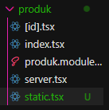
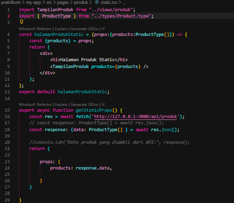
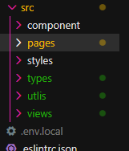
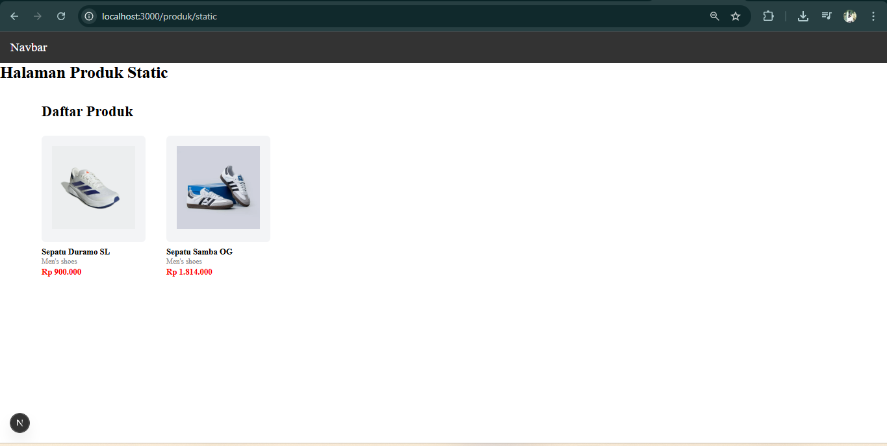
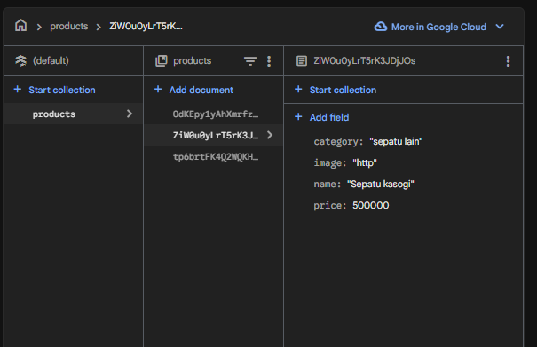
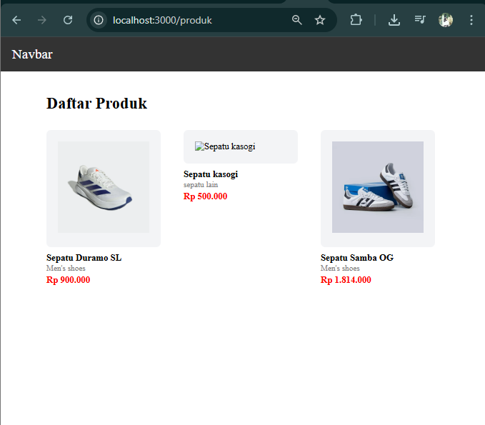
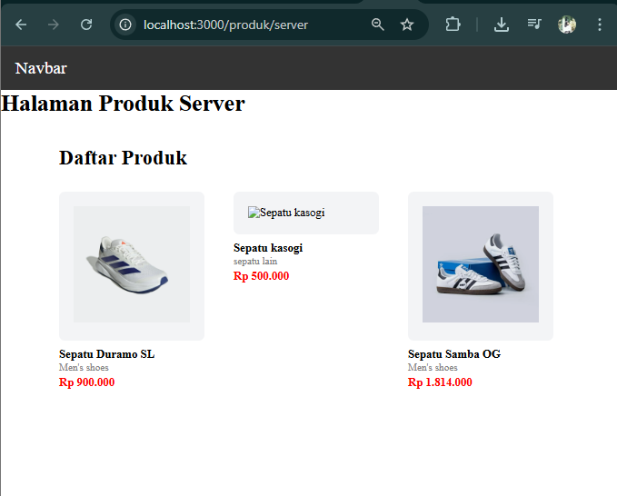
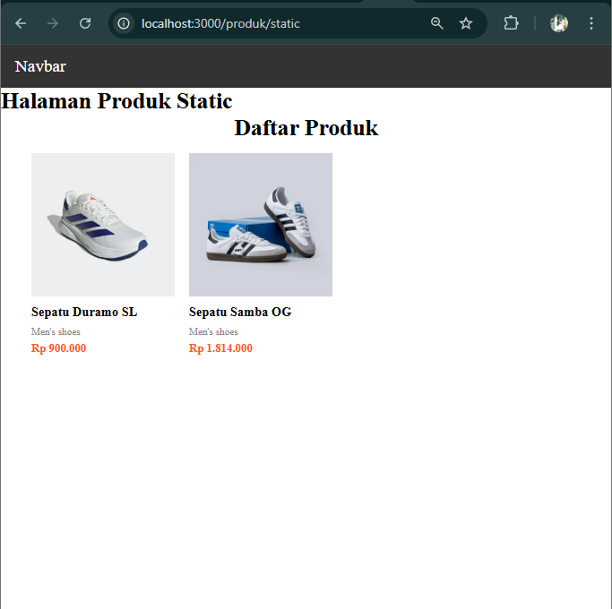
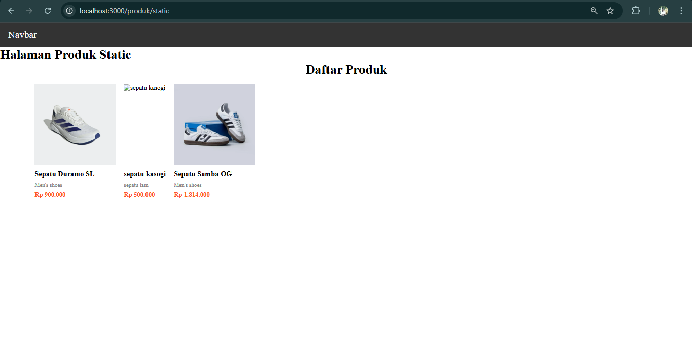

JOBSHEET PRAKTIKUM

Server Side Rendering (SSR)

Identitas

Nama: Nahdia Putri Safira

Kelas: TI3D

NIM: 2341720015

Program Studi: D4 Teknik Informatika

---

## Bagian 1 - Setup Halaman Static

1. Buat file pada pgaes/products/static.tsx

2. Modifikasi file static.tsx

---

## Bagian 3- Build Production Mode

Pindah beberapa folder diluar pages antara lain

Setelah struktur folder diperbaiki, tahap selanjutnya adalah menjalankan aplikasi menggunakan perintah npm run dev pada terminal pertama. Perintah ini digunakan untuk menjalankan aplikasi dalam mode development sehingga aplikasi dapat diakses melalui browser pada alamat http://localhost:3000. Mode development digunakan untuk memastikan bahwa aplikasi berjalan dengan normal sebelum dilakukan proses build.

Selanjutnya pada terminal kedua dijalankan perintah npm run build untuk membangun aplikasi ke dalam mode production. Pada tahap ini Next.js akan melakukan proses kompilasi kode, mengambil data dari API yang digunakan, serta menghasilkan file HTML statis untuk halaman yang menggunakan metode Static Site Generation. Jika proses build berhasil, maka akan muncul informasi mengenai route halaman yang telah berhasil dibuat.

Setelah proses build selesai, aplikasi kemudian dijalankan menggunakan perintah npm run start. Perintah ini digunakan untuk menjalankan aplikasi dalam mode production. Namun sebelum menjalankan perintah tersebut, proses npm run dev harus dihentikan terlebih dahulu agar tidak terjadi konflik pada port yang digunakan oleh aplikasi.

Setelah aplikasi berhasil dijalankan dalam mode production, halaman kemudian diakses melalui browser pada alamat http://localhost:3000/products/static. Hasil pengujian menunjukkan bahwa halaman dapat ditampilkan dengan baik dan data produk berhasil ditampilkan sesuai dengan data yang diambil saat proses build berlangsung.

Melalui tahap ini dapat disimpulkan bahwa proses build production mode pada Next.js berfungsi untuk menghasilkan aplikasi yang siap digunakan pada lingkungan production. Selain itu, proses ini juga menghasilkan file HTML statis yang dapat meningkatkan performa akses halaman karena server tidak perlu melakukan proses rendering ulang setiap kali halaman diakses.

---

## Bagian 4- Pengujian Perubahan Data

1. 

2. /products (CSR) → Data bertambah

/products/server (SSR) → Data bertambah

/products/static (SSG) → Data tidak berubah

Uji 2 - Build Ulang

---

## Tugas Praktikum

1. Pembuatan Halaman CSR, SSR, dan SSG

Pada praktikum ini dilakukan pembuatan tiga halaman yang menggunakan metode rendering yang berbeda, yaitu Client Side Rendering (CSR), Server Side Rendering (SSR), dan Static Site Generation (SSG). Ketiga metode tersebut digunakan untuk memahami perbedaan cara pengambilan data serta proses rendering halaman pada framework Next.js.

Halaman pertama yang dibuat adalah halaman CSR (Client Side Rendering). Pada metode ini, proses pengambilan data dilakukan langsung di sisi client atau browser pengguna. Ketika halaman diakses, browser akan menampilkan struktur halaman terlebih dahulu kemudian melakukan request data melalui API. Setelah data diterima, React akan melakukan proses rendering ulang untuk menampilkan data tersebut pada halaman. Metode CSR biasanya digunakan pada aplikasi yang membutuhkan interaksi pengguna yang tinggi, seperti dashboard atau aplikasi web yang bersifat dinamis.

Halaman kedua yang dibuat adalah halaman SSR (Server Side Rendering). Pada metode ini, data diambil oleh server setiap kali pengguna melakukan request ke halaman. Next.js akan menjalankan fungsi getServerSideProps() untuk mengambil data dari API atau database sebelum halaman dikirim ke browser pengguna. Setelah data berhasil diambil, server akan menghasilkan HTML lengkap yang berisi data tersebut dan kemudian mengirimkannya ke browser. Dengan cara ini, pengguna akan langsung menerima halaman yang sudah berisi data tanpa perlu menunggu proses fetch di sisi client.

Halaman ketiga yang dibuat adalah halaman SSG (Static Site Generation). Pada metode ini, data diambil pada saat proses build menggunakan fungsi getStaticProps(). Next.js akan mengambil data dari sumber eksternal dan menghasilkan file HTML statis yang disimpan pada server. File HTML tersebut akan dikirimkan kepada pengguna setiap kali halaman diakses tanpa perlu melakukan proses pengambilan data kembali. Metode ini sangat cocok digunakan untuk halaman yang jarang mengalami perubahan data seperti landing page, blog, atau halaman dokumentasi.

Dengan membuat tiga halaman tersebut, praktikan dapat memahami perbedaan cara kerja masing-masing metode rendering dalam Next.js serta mengetahui kelebihan dan kekurangan dari setiap metode.

2. Pengujian Sistem

Setelah halaman CSR, SSR, dan SSG berhasil dibuat, tahap berikutnya adalah melakukan pengujian terhadap perubahan data pada database. Pengujian ini dilakukan dengan dua skenario yaitu menambahkan data baru dan menghapus data yang sudah ada, kemudian mengamati perubahan yang terjadi pada setiap halaman.

Pengujian pertama dilakukan dengan menambahkan data produk baru ke dalam database. Setelah data berhasil ditambahkan, halaman CSR kemudian diakses kembali. Hasilnya menunjukkan bahwa data baru langsung muncul pada halaman tanpa perlu melakukan proses build ulang. Hal ini terjadi karena CSR mengambil data secara langsung dari API setiap kali halaman dijalankan di browser.

Selanjutnya pengujian dilakukan pada halaman SSR. Ketika halaman SSR di-refresh, data baru yang ditambahkan juga langsung muncul. Hal ini disebabkan karena SSR mengambil data dari server setiap kali pengguna melakukan request ke halaman tersebut. Dengan demikian, data yang ditampilkan selalu merupakan data terbaru dari database.

Berbeda dengan CSR dan SSR, hasil yang berbeda ditemukan pada halaman SSG. Setelah data baru ditambahkan ke database, halaman SSG tidak langsung menampilkan data tersebut. Halaman masih menampilkan data lama karena HTML yang digunakan merupakan hasil build sebelumnya. Data baru hanya akan muncul setelah aplikasi dijalankan kembali menggunakan perintah npm run build dan npm run start. Setelah proses build ulang dilakukan, halaman SSG kemudian menampilkan data terbaru.

Pengujian berikutnya dilakukan dengan menghapus salah satu data produk dari database. Hasil pengujian menunjukkan bahwa halaman CSR dan SSR langsung memperbarui data yang ditampilkan setelah halaman di-refresh. Namun pada halaman SSG, data yang dihapus masih tetap muncul karena halaman tersebut masih menggunakan file HTML statis yang dibuat saat proses build sebelumnya.

Berdasarkan hasil pengujian tersebut dapat disimpulkan bahwa setiap metode rendering memiliki cara kerja yang berbeda dalam menangani perubahan data.

3. Analisis Perbandingan CSR, SSR, dan SSG

Berdasarkan hasil implementasi dan pengujian yang telah dilakukan, terdapat beberapa perbedaan utama antara metode CSR, SSR, dan SSG. Perbedaan pertama terletak pada waktu pengambilan data. Pada metode CSR, data diambil oleh browser setelah halaman dimuat. Pada metode SSR, data diambil oleh server setiap kali pengguna melakukan request ke halaman. Sedangkan pada metode SSG, data diambil pada saat proses build aplikasi.

Perbedaan kedua terletak pada kecepatan akses halaman. Metode SSG biasanya memiliki performa yang lebih cepat karena halaman sudah tersedia dalam bentuk HTML statis sehingga server hanya perlu mengirimkan file tersebut ke browser. Sementara itu, SSR membutuhkan waktu tambahan karena server harus mengambil data terlebih dahulu sebelum menghasilkan halaman HTML. Pada metode CSR, waktu loading awal dapat terasa lebih lama karena browser harus mengambil data terlebih dahulu sebelum menampilkan konten secara lengkap.

Perbedaan ketiga adalah pada kemampuan menampilkan data terbaru. Metode CSR dan SSR dapat menampilkan data terbaru secara langsung karena proses pengambilan data dilakukan setiap kali halaman diakses. Sebaliknya, SSG tidak secara otomatis memperbarui data karena data hanya diambil pada saat build aplikasi. Oleh karena itu, jika terdapat perubahan data pada database maka diperlukan proses build ulang agar data terbaru dapat ditampilkan.

Dari analisis tersebut dapat disimpulkan bahwa pemilihan metode rendering harus disesuaikan dengan kebutuhan aplikasi. Metode CSR cocok digunakan untuk aplikasi yang membutuhkan interaksi pengguna secara intensif. Metode SSR cocok digunakan untuk aplikasi yang memerlukan data yang selalu diperbarui setiap kali halaman diakses. Sedangkan metode SSG sangat cocok digunakan untuk halaman yang jarang mengalami perubahan data namun membutuhkan performa akses yang cepat.

---

Analisis Praktikum Static Site Generation (SSG)
1. Mengapa SSG tidak menampilkan data terbaru?

Static Site Generation (SSG) tidak menampilkan data terbaru karena proses pengambilan data dilakukan pada saat build time atau saat aplikasi dibangun menggunakan perintah npm run build. Pada tahap ini Next.js akan mengambil data dari API atau database kemudian mengubahnya menjadi file HTML statis yang disimpan pada server. File HTML tersebut akan digunakan setiap kali pengguna mengakses halaman tersebut. Karena data hanya diambil saat proses build berlangsung, maka perubahan data yang terjadi setelah proses build tidak akan langsung terlihat pada halaman. Oleh karena itu, untuk menampilkan data terbaru diperlukan proses build ulang agar Next.js dapat mengambil kembali data yang telah diperbarui dari database.

2. Mengapa SSG lebih cepat?

SSG lebih cepat karena halaman sudah dibuat terlebih dahulu menjadi file HTML statis pada saat proses build aplikasi. Ketika pengguna mengakses halaman tersebut, server tidak perlu melakukan proses pengambilan data ataupun proses rendering ulang. Server hanya perlu mengirimkan file HTML yang sudah tersedia kepada browser pengguna. Hal ini membuat waktu respon menjadi lebih cepat dibandingkan metode lain seperti SSR yang harus mengambil data terlebih dahulu sebelum menampilkan halaman. Selain itu, file statis juga lebih mudah disimpan dalam cache atau Content Delivery Network (CDN) sehingga performa website dapat menjadi lebih optimal.

3. Kapan SSG tidak cocok digunakan?

SSG tidak cocok digunakan pada aplikasi yang memiliki data yang sering berubah atau membutuhkan pembaruan secara real-time. Hal ini karena SSG hanya mengambil data pada saat proses build aplikasi berlangsung. Jika terdapat perubahan data setelah proses build selesai, maka halaman tidak akan langsung menampilkan perubahan tersebut. Contoh aplikasi yang kurang cocok menggunakan SSG adalah dashboard monitoring, sistem transaksi, aplikasi chat, atau aplikasi yang menampilkan data yang selalu berubah secara cepat. Untuk kebutuhan tersebut biasanya lebih cocok menggunakan metode Server Side Rendering (SSR) atau Client Side Rendering (CSR).

4. Mengapa e-commerce tidak cocok menggunakan SSG murni?

Aplikasi e-commerce umumnya memiliki data yang sangat dinamis seperti stok barang, harga produk, dan jumlah transaksi yang dapat berubah setiap saat. Jika menggunakan SSG murni, data produk hanya akan diambil saat proses build sehingga perubahan data yang terjadi setelah build tidak akan langsung diperbarui pada halaman website. Hal ini dapat menyebabkan informasi yang ditampilkan menjadi tidak akurat, misalnya stok barang yang sebenarnya sudah habis tetapi masih terlihat tersedia pada halaman produk. Oleh karena itu, aplikasi e-commerce biasanya menggunakan kombinasi metode seperti SSR atau CSR agar data produk dapat selalu diperbarui sesuai dengan kondisi database yang terbaru.

5. Apa perbedaan build mode dan development mode?

Development mode adalah mode yang digunakan saat proses pengembangan aplikasi. Mode ini dijalankan menggunakan perintah npm run dev. Pada mode ini Next.js menyediakan berbagai fitur untuk memudahkan proses pengembangan seperti hot reload, sehingga setiap perubahan kode dapat langsung terlihat tanpa perlu menjalankan ulang aplikasi.

Sedangkan build mode atau production mode digunakan untuk mempersiapkan aplikasi agar siap digunakan pada lingkungan production. Proses ini dilakukan menggunakan perintah npm run build. Pada tahap ini Next.js akan melakukan proses kompilasi kode, optimasi performa, serta menghasilkan file yang siap dijalankan dalam mode production menggunakan perintah npm run start. Mode ini lebih stabil dan optimal karena aplikasi sudah melalui proses optimasi.