JOBSHEET PRAKTIKUM

Server Side Rendering (SSR)

Identitas

Nama: Nahdia Putri Safira

Kelas: TI3D

NIM: 2341720015

Program Studi: D4 Teknik Informatika

---

## Bagian 1 - Membuat Dynamic Route

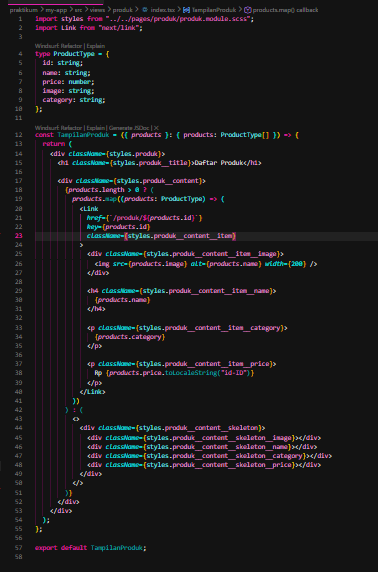

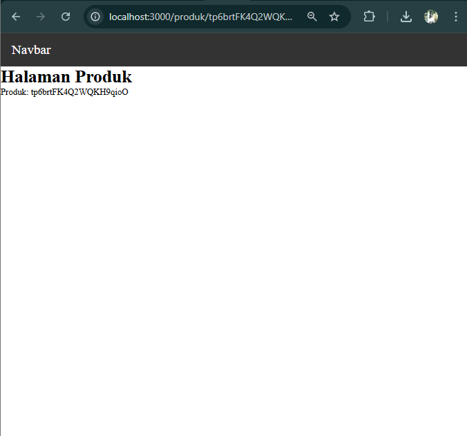

---

## Bagian 2 - Implementasi CSR

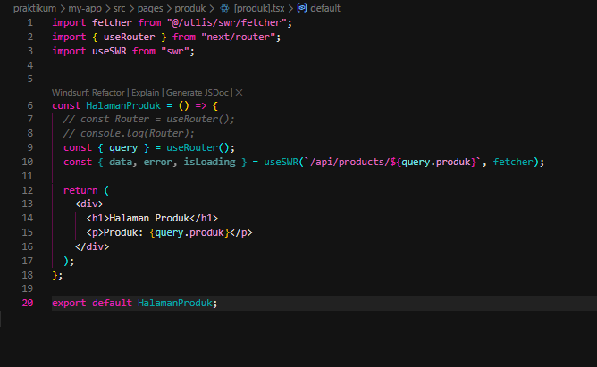

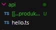

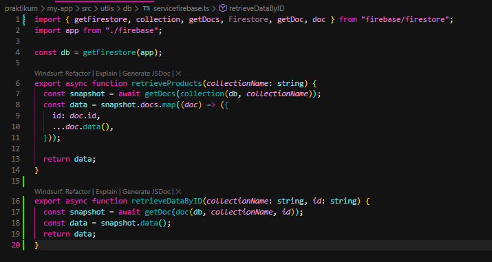

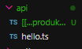

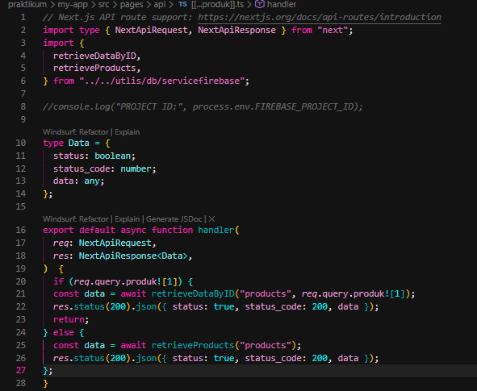

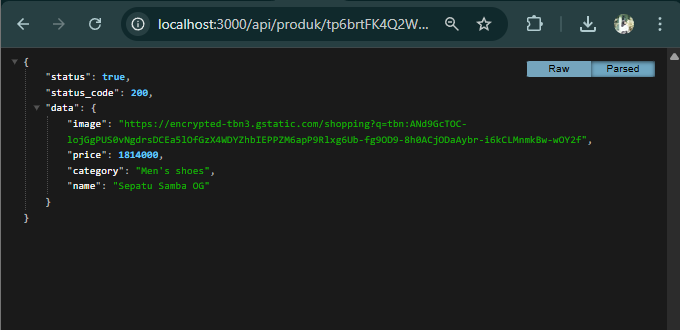

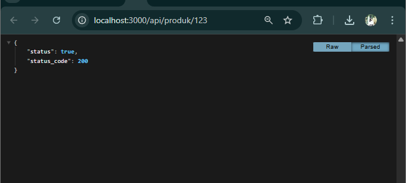

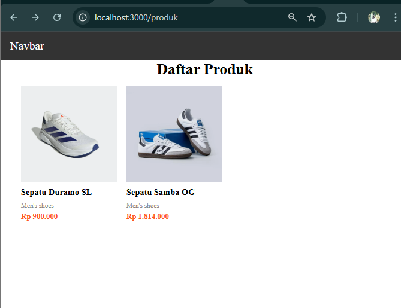

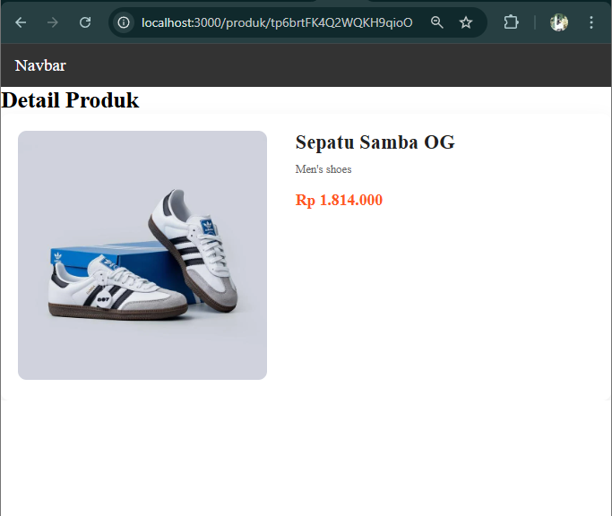

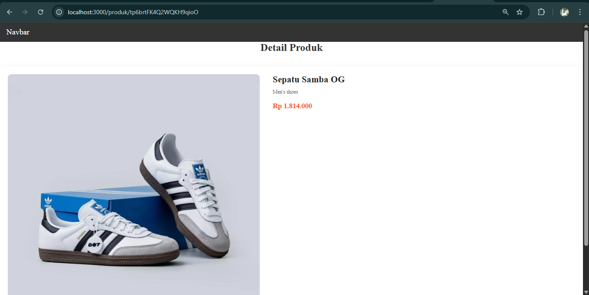

---

## Bagian 3 -Implementasi SSR

Pada tahapan praktikum Bagian 3, dilakukan implementasi metode Server Side Rendering (SSR) untuk menyajikan halaman detail produk. Berbeda dengan metode CSR yang memproses data di sisi browser, SSR memungkinkan server untuk melakukan pengambilan data (data fetching) dan merender halaman secara penuh sebelum dikirimkan ke perangkat pengguna.

Secara teknis, implementasi ini dilakukan dengan menggunakan fungsi bawaan Next.js, yaitu getServerSideProps. Fungsi ini berjalan di sisi server setiap kali ada permintaan (request) ke halaman terkait. Di dalam fungsi tersebut, parameter ID produk diambil melalui context.params untuk kemudian digunakan sebagai acuan dalam memanggil data dari database. Data yang berhasil diambil lalu dikirimkan sebagai props ke komponen utama halaman detail produk.

Berdasarkan hasil pengujian pada rute http://localhost:3000/produk/server, karakteristik utama dari metode SSR yang teramati adalah:

Peniadaan Loading State: Pengguna tidak lagi melihat tampilan loading atau skeleton saat halaman dibuka, karena konten sudah tersedia sepenuhnya saat dokumen HTML tiba di browser.

Keamanan & SEO: Karena proses fetching terjadi di server, detail pengambilan data tidak terlihat secara transparan melalui tab Network (XHR) pada browser, yang memberikan keuntungan dari sisi keamanan data serta optimalisasi mesin pencari (SEO) karena konten dapat langsung diindeks.

Data Up-to-Date: Halaman selalu menampilkan data terbaru dari database pada setiap kali refresh, karena proses rendering ulang terjadi di server pada setiap permintaan akses.

---

## Bagian 4 – Implementasi Static Site Generation (Dynamic SSG)

Pada bagian keempat, praktikum difokuskan pada implementasi Static Site Generation (SSG) dengan rute dinamis. Berbeda dengan metode sebelumnya, Dynamic SSG mengharuskan pengembang untuk mendaftarkan semua kemungkinan jalur (paths) yang akan dibuat menjadi halaman statis pada saat proses build.

Secara teknis, implementasi ini melibatkan dua fungsi utama Next.js:

getStaticPaths: Fungsi ini digunakan untuk mengambil seluruh data produk dari API atau database, kemudian memetakan setiap ID produk ke dalam array paths. Hal ini memberikan instruksi kepada Next.js mengenai halaman spesifik mana saja yang perlu dibuatkan file HTML statisnya sebelum aplikasi dijalankan.

getStaticProps: Setelah rute ditentukan, fungsi ini bertugas mengambil data detail untuk setiap produk berdasarkan parameter ID yang diterima, lalu mengirimkannya sebagai props ke komponen tampilan.

Berdasarkan hasil pengujian yang dilakukan melalui perintah npm run build dan npm run start, karakteristik Dynamic SSG yang teramati adalah:

Kecepatan Akses: Halaman detail produk terbuka secara instan karena browser langsung menerima file HTML yang sudah jadi dari server tanpa perlu proses rendering tambahan.

Perilaku terhadap Data Baru: Jika terdapat penambahan data produk baru di database setelah proses build selesai, halaman detail untuk produk tersebut tidak akan ditemukan (404). Hal ini membuktikan bahwa pada metode SSG murni, konten bersifat statis sesuai dengan kondisi data pada saat proses build terakhir dilakukan. Untuk memperbarui konten, diperlukan proses rebuild ulang pada aplikasi.

---

## Uji dan Tugas

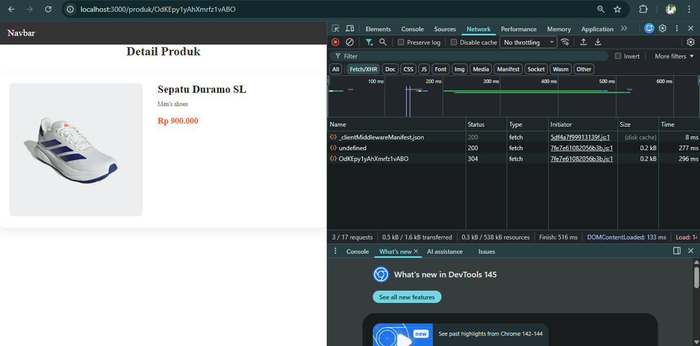

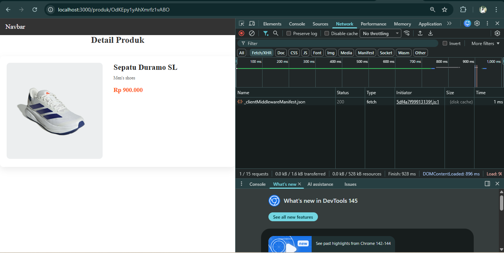

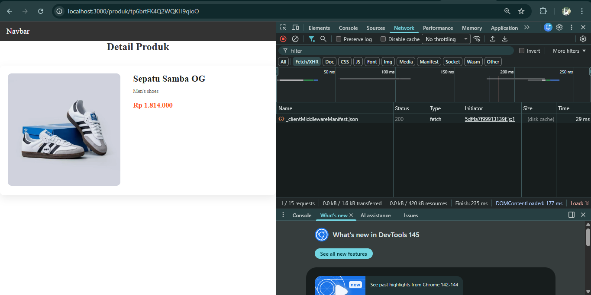

1. Aspek Loading (Proses Pemuatan)

CSR: Saat halaman dibuka atau di-refresh, pengguna akan melihat proses loading (seperti skeleton atau spinner) di sisi klien karena data baru diambil setelah komponen terpasang di browser.

SSR: Tidak ada proses loading di sisi klien. Halaman langsung ditampilkan secara utuh karena seluruh konten sudah dirender oleh server sebelum dikirim ke browser.

SSG: Proses pemuatan terasa sangat instan bagi pengguna karena browser langsung menerima file HTML statis yang sudah jadi dari server tanpa ada jeda proses rendering lagi.

2. Aspek Data (Sumber dan Keaktualan)

CSR: Data diambil secara dinamis di sisi browser menggunakan request API (seperti fetch atau SWR). Data selalu bersifat real-time dan mengikuti perubahan terbaru di database.

SSR: Data diambil di sisi server pada setiap permintaan (request). Hal ini memastikan data tetap aktual dan real-time setiap kali halaman diakses atau di-refresh.

SSG: Data bersifat statis karena diambil pada saat proses build aplikasi. Jika ada perubahan data di database, halaman tidak akan terperbarui secara otomatis kecuali dilakukan proses build ulang.

3. Aspek SEO (Search Engine Optimization)

CSR: Kurang optimal untuk SEO karena mesin pencari mungkin kesulitan mengindeks konten yang baru muncul setelah proses JavaScript di browser selesai.

SSR: Sangat baik untuk SEO karena server mengirimkan dokumen HTML yang sudah berisi konten lengkap, sehingga sangat mudah bagi mesin pencari untuk melakukan perayapan (crawling).

SSG: Sangat optimal untuk SEO karena konten sudah tersedia dalam bentuk file statis yang permanen, sehingga memberikan performa kecepatan dan kemudahan indeks yang maksimal bagi mesin pencari.

4. Aspek Keamanan & Network

CSR: Request API terlihat jelas pada tab Network di browser (XHR), sehingga detail pengambilan data dapat dilihat secara transparan oleh pengguna.

SSR: Lebih aman karena proses pengambilan data (fetching) terjadi di lingkungan server, sehingga tidak terlihat adanya aktivitas fetch detail produk di tab Network browser.

SSG: Sangat aman dan efisien karena tidak ada komunikasi ke database saat halaman diakses oleh pengguna; semua data sudah tertanam di dalam file statis hasil build.

---

## Pertanyaan Analisis

1. Mengapa getStaticPaths wajib pada dynamic SSG?

getStaticPaths wajib digunakan karena Next.js perlu mengetahui semua kemungkinan rute dinamis (seperti ID produk) pada saat proses build. Karena SSG bertujuan untuk menghasilkan file HTML statis sebelum aplikasi dijalankan, Next.js harus mendaftarkan ID mana saja yang akan dibuatkan halaman statisnya. Tanpa fungsi ini, server tidak akan tahu ID produk apa saja yang sah untuk dirender menjadi file fisik.

2. Mengapa CSR membutuhkan loading state?

CSR membutuhkan loading state karena proses pengambilan data (data fetching) baru terjadi setelah halaman dimuat di browser pengguna. Saat browser pertama kali menerima dokumen, konten data masih kosong. Selama aplikasi menunggu respon dari API atau database, loading state (seperti spinner atau skeleton) diperlukan untuk memberikan informasi visual kepada pengguna bahwa proses pengambilan data sedang berlangsung, sehingga halaman tidak terlihat rusak atau kosong.

3. Mengapa SSG tidak menampilkan produk baru tanpa build ulang?

Hal ini terjadi karena pada metode SSG murni, halaman dihasilkan menjadi file HTML statis hanya pada saat proses npm run build. Data yang ada di dalam file tersebut sudah "terkunci" sesuai kondisi database saat proses build berlangsung. Produk baru yang ditambahkan setelahnya tidak masuk dalam daftar rute yang dirender sebelumnya, sehingga server tidak memiliki file statis untuk produk baru tersebut sampai pengembang menjalankan proses build ulang untuk memperbarui seluruh file statis.

4. Mana metode terbaik untuk halaman detail e-commerce?

Metode terbaik biasanya adalah Incremental Static Regeneration (ISR) atau SSR (Server Side Rendering).

SSR sangat baik jika harga dan stok produk berubah sangat cepat (setiap detik) karena data selalu aktual.

ISR (pengembangan dari SSG) sering dianggap yang paling ideal untuk e-commerce skala besar karena memberikan kecepatan akses secepat SSG, namun tetap bisa memperbarui data di latar belakang secara berkala tanpa harus melakukan build ulang secara manual untuk seluruh aplikasi.

5. Apa risiko menggunakan SSG untuk produk yang sering berubah?

Risiko utamanya adalah inkonsistensi data (data basi). Jika harga atau stok produk berubah di database tetapi aplikasi tidak di-build ulang, pengguna akan melihat informasi yang salah (misalnya stok tertulis "tersedia" padahal sudah habis). Selain itu, untuk toko dengan ribuan produk, melakukan build ulang setiap kali ada satu perubahan kecil akan sangat memakan waktu dan sumber daya server, sehingga tidak efisien secara operasional.