JOBSHEET PRAKTIKUM

Incremental Static Regeneration (ISR)

Identitas

Nama: Nahdia Putri Safira

Kelas: TI3D

NIM: 2341720015

Program Studi: D4 Teknik Informatika

---

## C.Implementasi ISR Otomatis

## Bagian 1 - Tambahkan revalidate

- Buka halaman static.tsx pada folder src/pages/produk

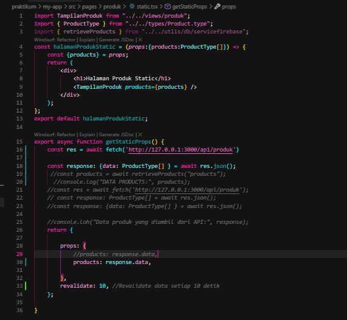

## Bagian 2 - Pengujian ISR

"Pada tahap Pengujian ISR, dilakukan proses build aplikasi menggunakan perintah npm run build. Berdasarkan hasil output terminal, terlihat bahwa rute /produk/static berhasil di-render sebagai SSG (ditandai dengan simbol ●) dengan durasi 848 ms. Halaman tersebut juga memiliki konfigurasi revalidate selama 10 detik, yang menunjukkan bahwa fitur Incremental Static Regeneration telah aktif dan siap memperbarui konten secara berkala di latar belakang."

- Tambahkan data baru di database pada firebase

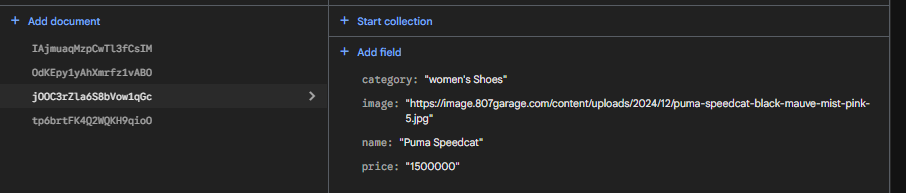
 
- Refresh halaman sebelum 10 detik
    - sebelum 10 detik data yang akan ditampilkan masi data lama
- Refresh setelah 10 detik = Data baru muncul

---

## D. On-Demand Revalidation
Jika tidak ingin  menunggu waktu revalidate, gunakan endpoint khusus

## Bagian 1 - Buat API Revalidate

- Buat file revalidate.ts pada folder pages/api/ dan modifikasi

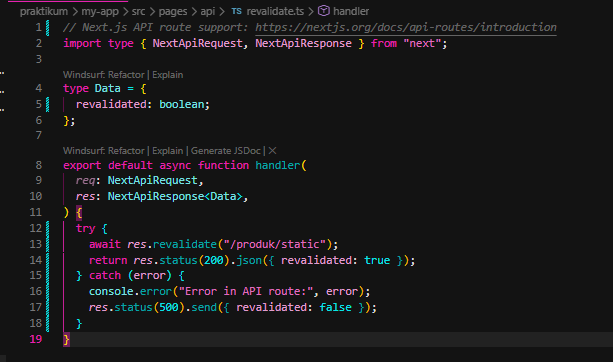

## Bagian 2 - Tambahkan Parameter Data

Untuk mengatasi hal tersebut ( pada bagian 1) maka suatu kondisi pada file revalidate.ts

- Modifikasi file revalidate.ts

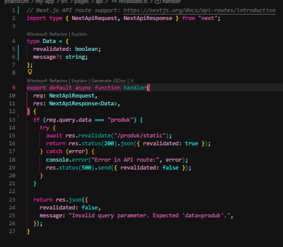

Uji coba menambahkan parameter dan value pada url
http://localhost:3000/api/revalidate?data=produk maka akan muncul true dan
sesuai dengan kondisi (req.query.data ===”produk”)

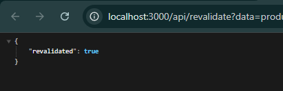

Uji coba dengan url http://localhost:3000/api/revalidate?data=

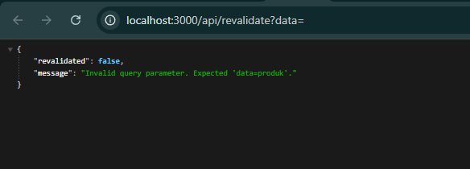

## Bagian 3 - Tambahkan Token Security

Perlu ditambahkan paramater agar user tidak merubah data melalui url

- Buka file .env dan modifikasi

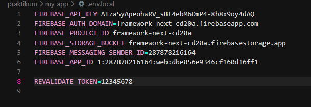

- Modifikasi file revalidate.ts tambahkan kondisi pada line 13 - 17

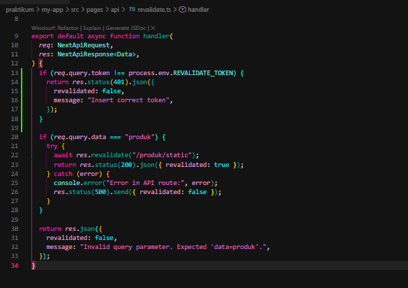

---

## E. Pengujian Manual Revalidation

Akses : http://localhost:3000/api/realidate?data=produk&token=12345678

Jika benar  :

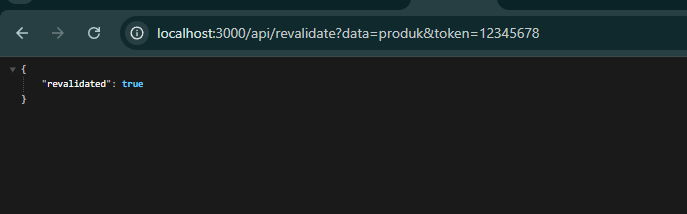

Jika Token Salah : 

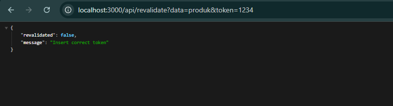

---

## G.Tugas Praktikum

1. Tambahkan lagi produk pada firebase

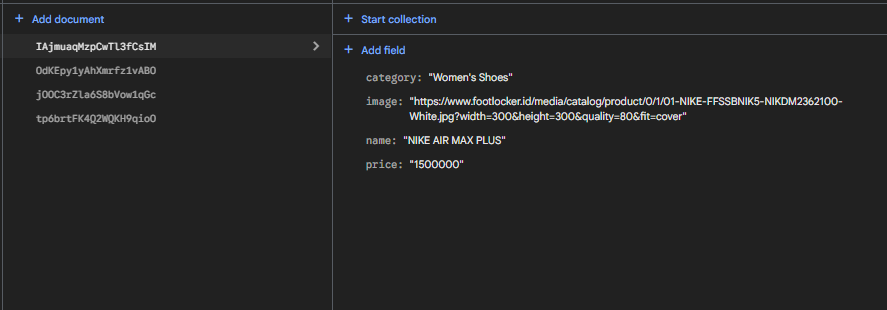

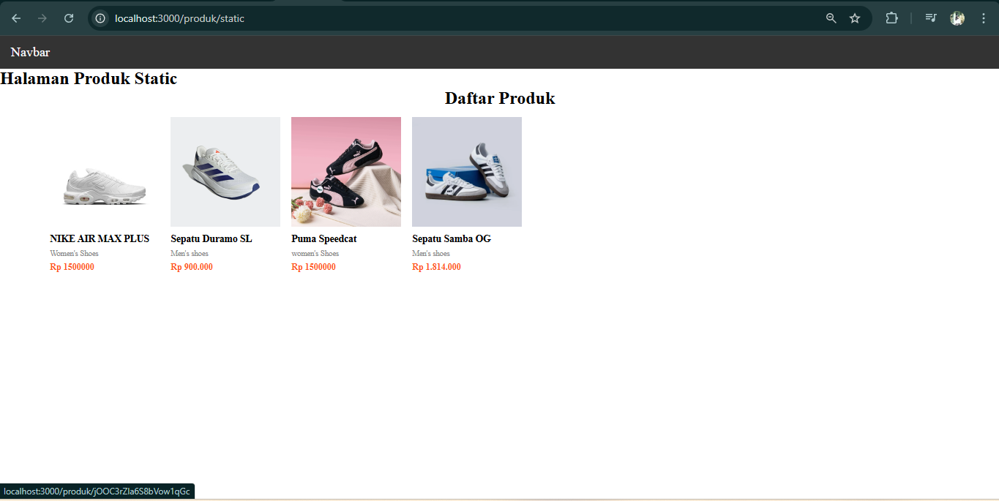

2. Implementasikan ISR dengan revalidate: 10.

Terdapat pada Bagian 1 di poin C yaitu implementasi ISR Otomatis

3. Tambahkan endpoint On-Demand Revalidation.

Terdapat pada bagian 1 di poin D yaitu On-Demand Revalidation

4. Tambahkan validasi token.

Terdapat pada bagian 3 di poin D yaitu On-Demand Revalidation

5. Uji dengan beberapa kondisi

- Token benar

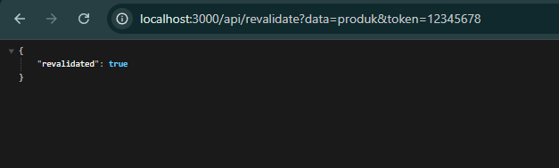

- Token salah

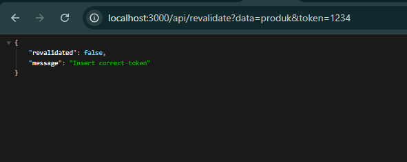

- Tanpa token

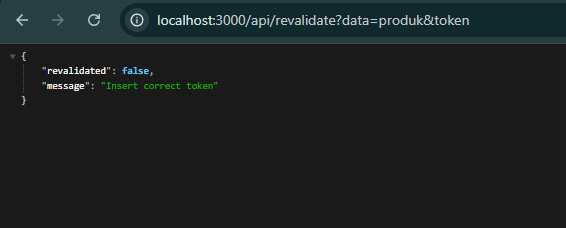

---

H. Pertanyaan Analisis

1. Mengapa ISR lebih fleksibel dibanding SSG?

Fungsi dari kode tersebut adalah untuk melakukan On-demand Revalidation. Secara spesifik, kode ini memerintahkan Next.js untuk memperbarui (regenerasi) secara manual halaman statis pada rute /produk/static di latar belakang tanpa harus menunggu waktu revalidate (interval detik) yang telah ditentukan sebelumnya habis.

2. Apa perbedaan revalidate waktu dan on-demand?

Revalidate Waktu: Pembaruan halaman terjadi secara otomatis berdasarkan interval detik yang ditentukan (misal: setiap 10 detik).

On-demand: Pembaruan halaman terjadi secara manual melalui panggilan API (kapan pun kita mau), sehingga data langsung update tanpa menunggu waktu habis.

3. Mengapa endpoint revalidation harus diamankan?

Endpoint revalidation harus diamankan karena proses ini bersifat resource-intensive (memakan sumber daya server). Setiap kali endpoint dipanggil, server Next.js harus:

Mengambil data terbaru dari database (misal: Firestore).

Melakukan render ulang komponen React menjadi HTML.

Memperbarui file statis di dalam sistem.

Jika tidak diamankan, siapa pun bisa memanggil URL tersebut secara berulang-ulang tanpa izin.

4. Apa risiko jika token tidak digunakan?

Risiko utamanya adalah serangan DoS (Denial of Service), di mana pihak luar bisa membombardir endpoint revalidate secara terus-menerus. Hal ini mengakibatkan beban server melonjak, biaya operasional membengkak, dan performa aplikasi menjadi sangat lambat karena proses rebuild yang dipaksa berulang kali.

5. Kapan ISR lebih cocok dibanding SSR?

ISR lebih cocok untuk halaman dengan trafik tinggi namun datanya jarang berubah (seperti blog atau katalog produk). ISR menyajikan halaman statis yang sangat cepat dari cache, sehingga jauh lebih ringan bagi server dan lebih hemat biaya dibandingkan SSR yang harus merender ulang halaman untuk setiap pengunjung.