JOBSHEET PRAKTIKUM

Middleware & Route Protection

Identitas

Nama: Nahdia Putri Safira

Kelas: TI3D

NIM: 2341720015

Program Studi: D4 Teknik Informatika

---

## Bagian 1 - Membuat Middleware

- Modifikasi file index.tsx pada folder src/pages/produk

-  Buat file: src/middleware.ts Sejajar dengan folder pages.

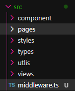

---

## Bagian 2 - Struktur Dasar Middleware

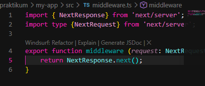

Jika menggunakan NextResponse.next() → tidak ada redirect.

Jadi masih bisa mengakses ke http://localhost:3000/produk

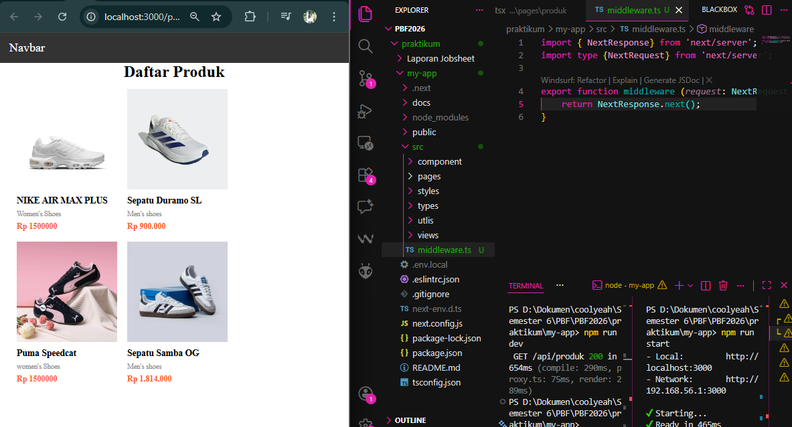

---

## Bagian 3 - Redirect Sederhana

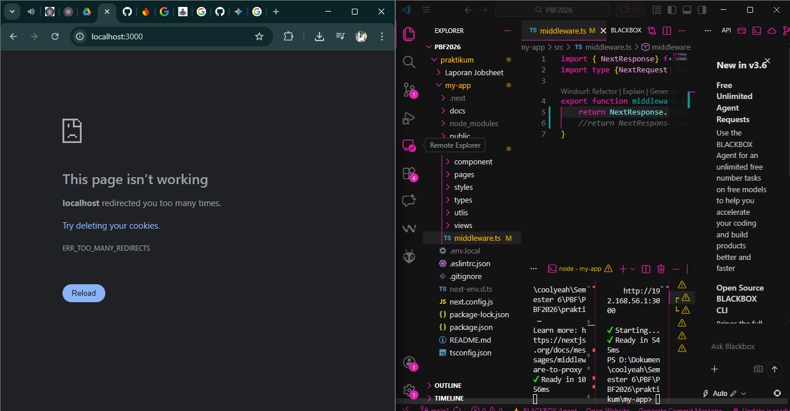

o Semua halaman akan redirect ke home dan error dikarenakan terus menerus loading

---

## Bagian 4 - Batasi Route Tertentu

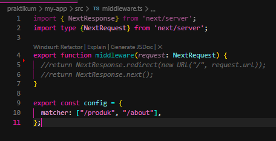

o Artinya:

• Middleware hanya berlaku untuk /products dan /about

• Halaman lain tetap normal

• Ketika user mengakses halaman produk dan about maka akan langsung redirect ke halaman home

---

## Bagian 5 - Simulasi Sistem Login

- Modifikasi file middleware.ts

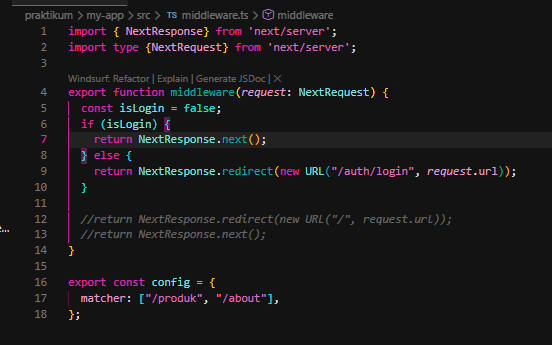

Jika user langsung mengakses ke alamat http://localhost:3000/produk tidak akan bisa
user akan diarahkan ke halaman login

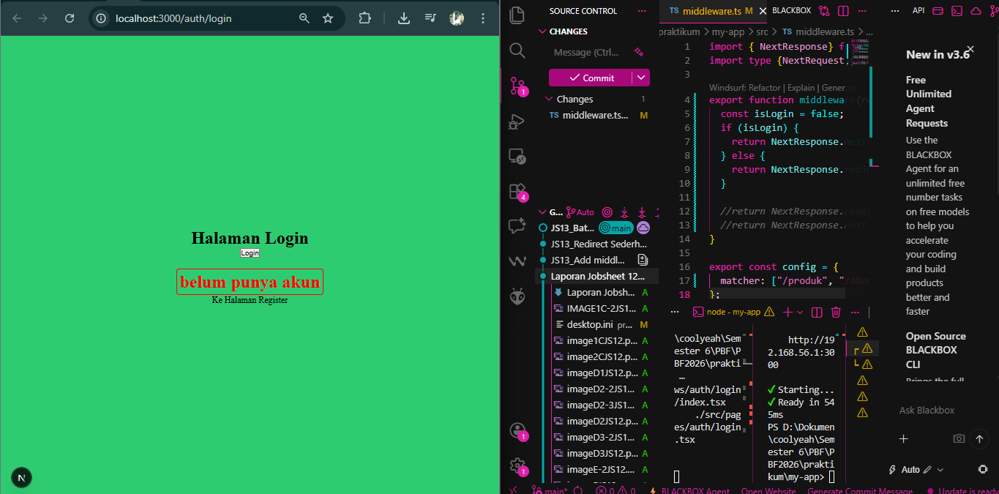

---

## Pengujian

Berdasarkan pengujian yang telah dilakukan terhadap implementasi middleware pada aplikasi, seluruh skenario pengujian menunjukkan hasil yang sesuai dengan yang diharapkan. Pada kondisi saat variabel isLogin bernilai false, sistem berhasil melakukan redirect ke halaman login ketika pengguna mencoba mengakses halaman yang diproteksi.

Sebaliknya, ketika variabel isLogin diubah menjadi true, pengguna dapat mengakses halaman yang dibatasi tanpa mengalami kendala. Selain itu, pengujian pada multiple route juga menunjukkan bahwa middleware hanya berjalan pada route yang telah ditentukan, yaitu /products dan /about, sementara halaman lainnya tetap dapat diakses secara normal.

Dengan demikian, dapat disimpulkan bahwa implementasi middleware untuk proteksi route telah berjalan dengan baik dan sesuai dengan skenario pengujian yang telah dirancang.

---

## Tugas Individu

1. Buat halaman:
o /products
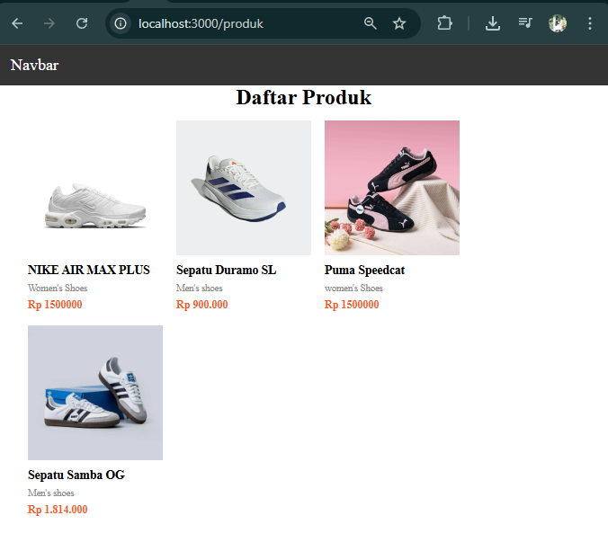
o /about
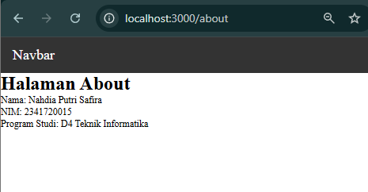
o /login
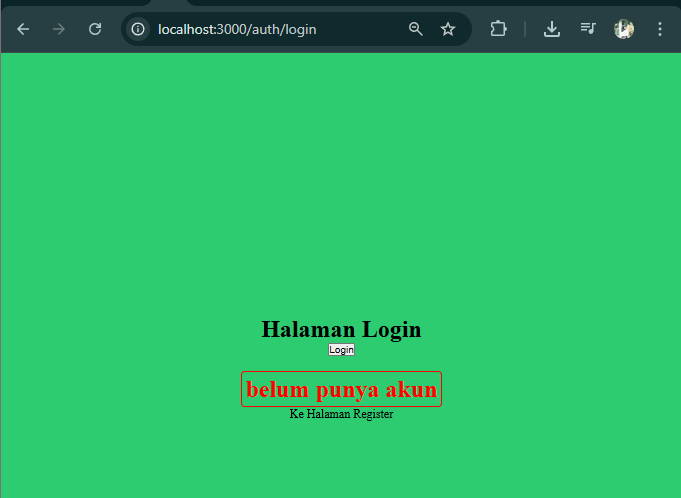

2. Implementasi Middleware

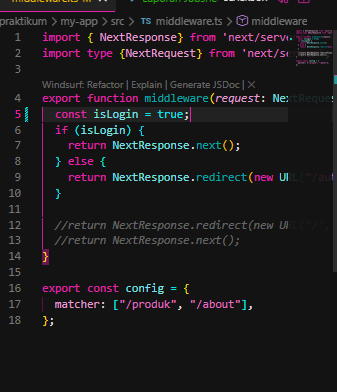

3. Tambahkan proteksi hanya untuk route tertentu

• /products dan /about butuh login

4. Dokumentasikan: 
o Screenshot sebelum dan sesudah redirect.

- sebelum redirect

sesudah redirect

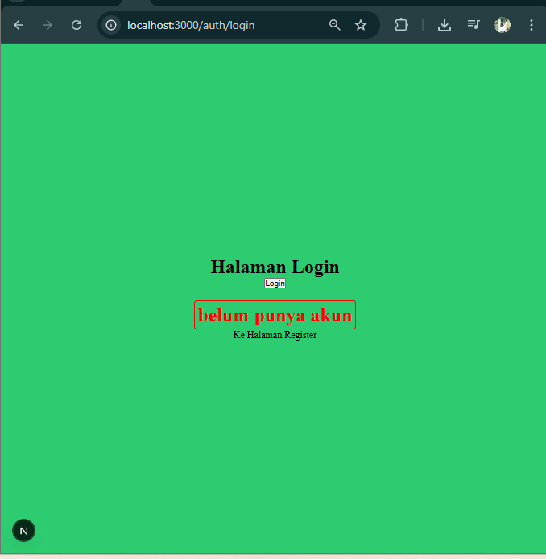

- Perbandingan dengan useEffect

Middleware lebih efektif dibandingkan useEffect karena melakukan redirect sebelum halaman dirender, sehingga tidak terjadi glitch. Selain itu, middleware lebih aman karena berjalan di sisi server, sedangkan useEffect berjalan di sisi klien setelah halaman ditampilkan. Oleh karena itu, middleware lebih direkomendasikan untuk proteksi route.

---
## Pertanyaan Analisis

1. Mengapa middleware lebih aman dibanding useEffect?

Middleware lebih aman karena berjalan di server/edge sebelum request diproses, jadi tidak bisa dimanipulasi dari client seperti useEffect.

2. Mengapa middleware tidak menimbulkan glitch?

Tidak menimbulkan glitch karena redirect dilakukan sebelum halaman dirender, jadi user tidak sempat melihat halaman yang salah.

3. Apa risiko jika semua halaman diproteksi tanpa pengecualian?

Risiko semua halaman diproteksi adalah bisa terjadi redirect loop dan halaman publik (seperti login) jadi tidak bisa diakses.

4. Kapan middleware tidak diperlukan?

Middleware tidak diperlukan jika halaman tidak butuh proteksi atau logika bisa ditangani langsung di client (misalnya tampilan UI sederhana).

5. Apa perbedaan middleware dan API route?

Perbedaan middleware dan API route:
Middleware: berjalan sebelum request, untuk validasi/redirect.
API route: endpoint backend untuk proses data (CRUD, logic server).