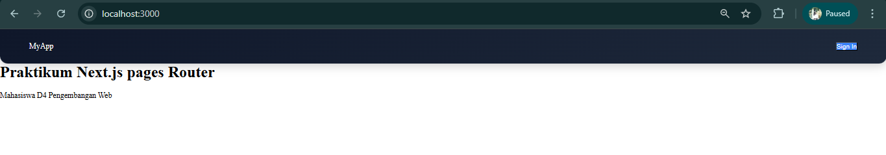
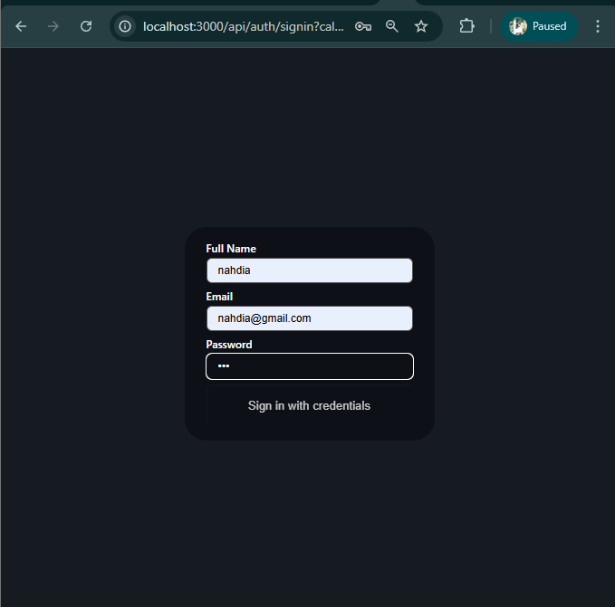
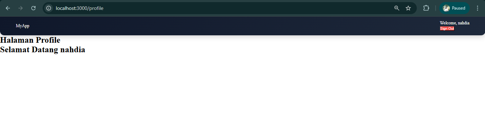
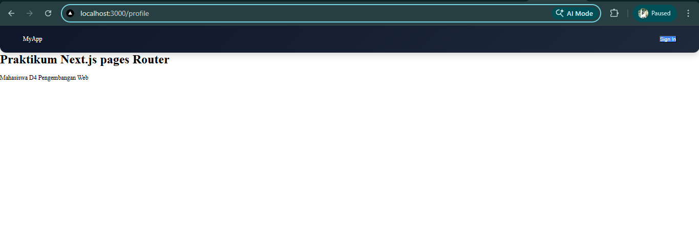

JOBSHEET PRAKTIKUM

Sistem Autentikasi & Proteksi Route 

Identitas

Nama: Nahdia Putri Safira

Kelas: TI3D

NIM: 2341720015

Program Studi: D4 Teknik Informatika

---

## Bagian 1 – Install NextAuth

npm install next-auth –force

Pada tahap ini dilakukan instalasi library NextAuth menggunakan perintah npm. Proses ini bertujuan untuk menambahkan dependensi autentikasi ke dalam proyek Next.js sehingga fitur login dapat digunakan.

## Bagian 2 – Konfigurasi API Auth

Pada tahap ini dibuat file konfigurasi NextAuth pada folder API. File ini berfungsi untuk mengatur provider autentikasi, termasuk penggunaan Credentials Provider yang memungkinkan login menggunakan email dan password.

## Bagian 3 – Menambahkan Secret

Pada tahap ini ditambahkan variabel lingkungan berupa NEXTAUTH_SECRET pada file .env.local. Secret ini digunakan untuk mengenkripsi token JWT agar lebih aman dan tidak mudah dimanipulasi oleh pihak yang tidak bertanggung jawab.

## Bagian 4 – Menambahkan SessionProvider

SessionProvider ditambahkan pada file _app.tsx untuk memungkinkan seluruh komponen dalam aplikasi dapat mengakses data session. Hal ini memudahkan dalam pengelolaan status login pengguna di sisi frontend.

## Bagian 5 – Menambahkan Tombol Login dan Logout

Pada tahap ini ditambahkan tombol login dan logout pada komponen navbar. Tombol ini digunakan untuk menguji proses autentikasi, dimana pengguna dapat melakukan login dan logout serta melihat perubahan status session secara langsung.

---
## D. Menambahkan Data Tambahan (Full Name)

Pada tahap ini dilakukan penambahan data tambahan berupa full name pada proses autentikasi. Data ini ditambahkan melalui konfigurasi callback pada NextAuth, sehingga informasi tersebut dapat disimpan di dalam token JWT dan ditampilkan pada frontend setelah pengguna berhasil login.

---

## E. Proteksi Halaman Profile

Membuat Halaman Profile

Halaman profile dibuat untuk menampilkan informasi pengguna yang telah login. Halaman ini hanya dapat diakses oleh pengguna yang sudah terautentikasi.

Membuat Middleware Authorization

Middleware dibuat untuk melindungi halaman profile dari akses pengguna yang belum login. Middleware akan memeriksa token JWT, dan jika tidak ditemukan maka pengguna akan diarahkan kembali ke halaman utama.

## F. Pengujian

Uji 1 – Belum Login

Pada pengujian ini, pengguna mencoba mengakses halaman profile tanpa melakukan login terlebih dahulu. Hasilnya, pengguna akan diarahkan kembali ke halaman utama sebagai bentuk proteksi.

Uji 2 – Sudah Login

Pada pengujian ini, pengguna melakukan login terlebih dahulu, kemudian mengakses halaman profile. Hasilnya, pengguna dapat mengakses halaman tersebut tanpa kendala.

Uji 3 – Logout

Pada pengujian ini, pengguna melakukan logout kemudian mencoba kembali mengakses halaman profile. Hasilnya, akses akan ditolak dan pengguna diarahkan kembali ke halaman utama.

---
## G. Alur Login NextAuth

Proses login dimulai ketika pengguna menekan tombol sign in. Selanjutnya, NextAuth menampilkan form login dan menjalankan fungsi authorize untuk memverifikasi data pengguna. Setelah berhasil, sistem akan membuat token JWT dan menyimpan session. Data session kemudian dapat diakses di frontend menggunakan hook useSession.

---

## H. Tugas Praktikum

Pada praktikum ini, diminta untuk mengimplementasikan login menggunakan Credentials Provider, menambahkan field full name, menampilkan data tersebut setelah login, membuat halaman profile, serta melindungi halaman tersebut menggunakan middleware. Selain itu, mahasiswa juga diminta untuk mendokumentasikan hasil implementasi.

---
## I. Pertanyaan Analisis
1. Mengapa session menggunakan JWT?

Session menggunakan JWT karena lebih ringan dan tidak memerlukan penyimpanan di server. Token dapat langsung digunakan untuk autentikasi tanpa perlu query ke database, sehingga meningkatkan performa aplikasi.

2. Apa perbedaan authorize() dan callback jwt()?

Fungsi authorize() digunakan untuk memvalidasi kredensial pengguna saat login. Sedangkan callback jwt() digunakan untuk memodifikasi atau menambahkan data ke dalam token JWT setelah proses autentikasi berhasil.

3. Mengapa middleware perlu getToken()?

Middleware menggunakan getToken() untuk mengambil token JWT dari request. Token ini digunakan untuk memverifikasi apakah pengguna sudah login atau belum sebelum mengakses halaman tertentu.

4. Apa risiko jika NEXTAUTH_SECRET tidak digunakan?

Tanpa NEXTAUTH_SECRET, token JWT menjadi tidak aman dan berpotensi dimanipulasi oleh pihak lain. Hal ini dapat menyebabkan kebocoran data atau akses ilegal ke sistem.

5. Apa perbedaan autentikasi dan otorisasi dalam sistem ini?

Autentikasi adalah proses verifikasi identitas pengguna saat login, sedangkan otorisasi adalah proses pemberian hak akses terhadap halaman atau fitur tertentu setelah pengguna berhasil login.