JOBSHEET PRAKTIKUM

Implementasi Sistem Registrasi (Database Integration)

Identitas

Nama: Nahdia Putri Safira

Kelas: TI3D

NIM: 2341720015

Program Studi: D4 Teknik Informatika

---

## Bagian 1 - Mmebuat Register View

- Buat folder pada views dengan nama register dan tambahkan 2 file yaitu index.tsx
dan register.module.scss

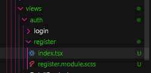

- Modifikasi file index.tsx ( pada folder views/auth/register/index.tsx)

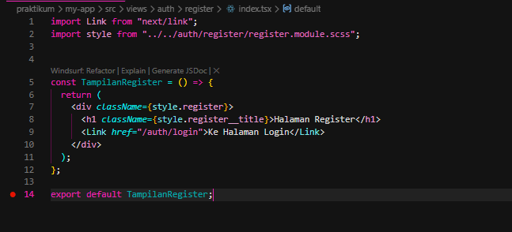

- Buka file register.tsx pada folder auth/register.tsx

- Modifikasi file register.tsx ( pada folder pages/auth/register.tsx )

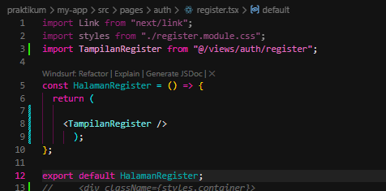

- Modifikasi register.module.scss

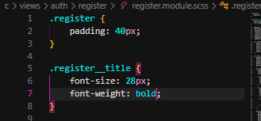

- Tambahkan form inputan pada file index.tsx ( pada folder views/auth/register/index.tsx)

    - email

    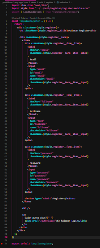

    - FullName

    

    
    - Password

    

    - Button Register

    

- Modifikasi register.module.scss

 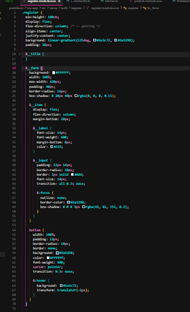

  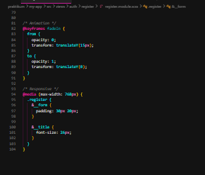

- Jalankan browsernya http://localhost:3000/auth/register sehingga tampilan sebagai
berikut

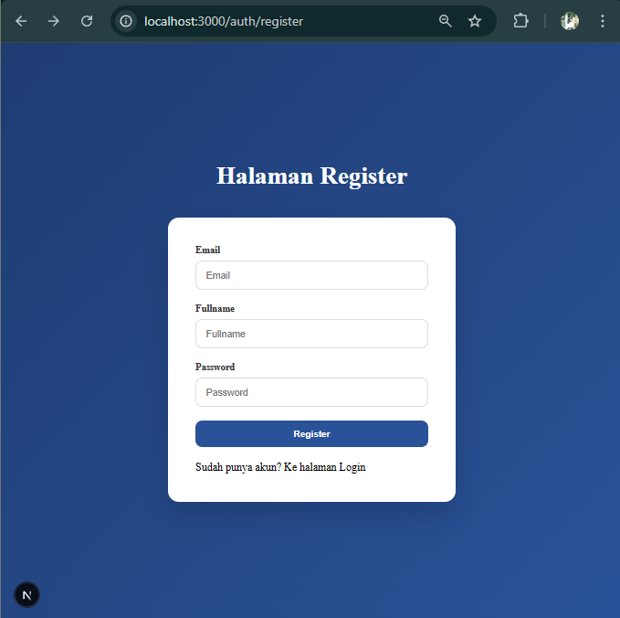

---

## Bagian 2 - Membuat API Register

- Buka file servicefirebase.ts pada folder src/utils/db dan modifikasi

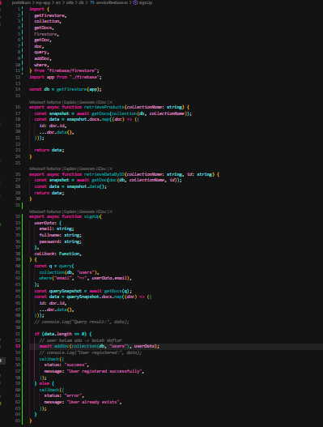

- Buat file register.ts pada folder api

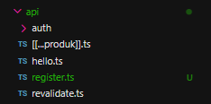

- Modifikasi file register.ts

- Modifikasi index.tsx pada folder register ( tambahkan beberapa code)

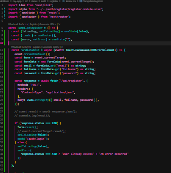

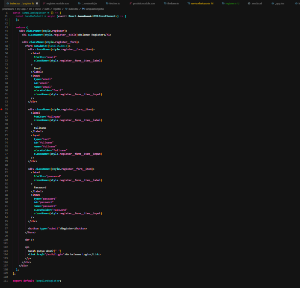

- Buka browser http://localhost:3000/auth/register isikan data dan klik register. Jika
berhasil maka akan masuk ke menu login

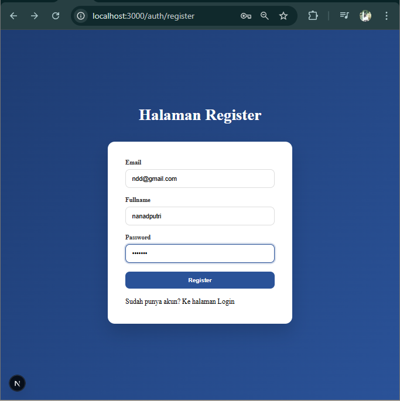

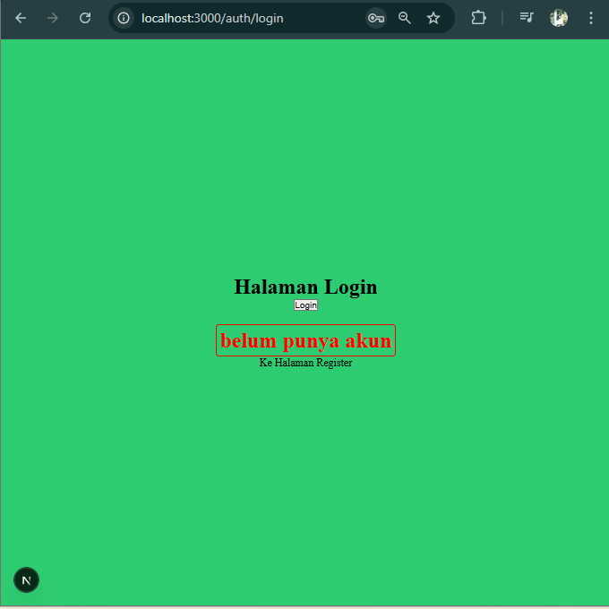

---

## Bagian 3 - Install bcrypt

- npm install bcrypt --force

- npm install --save-dev @types/bcrypt –force

- Buka file servicefirebase.ts pada folder src/utils/db dan modifikasi

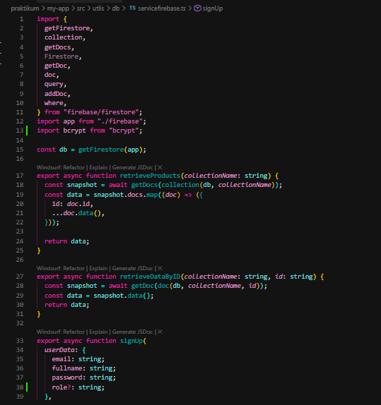

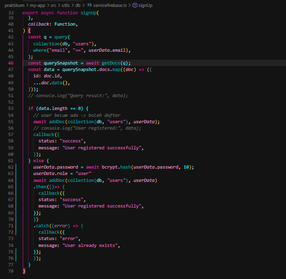

- Jalankan browser http://localhost:3000/auth/register dan input data setelah itu klik
register

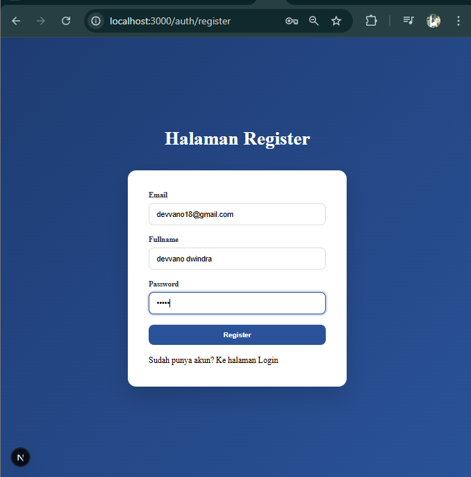

- Buka pada firebase jika berhasil maka data register akan masuk

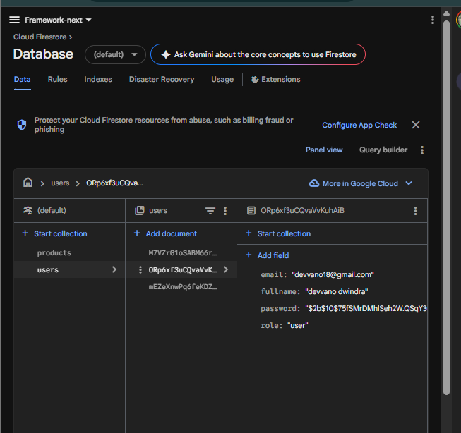

- Jika user memasukkan data yang sama sistem tidak akan memproses tetapi
permasalahannya user memasukkan data yang sama tidak ada pemberitahuan pada
layar maka dari itu perlu ada perubahan pada code index.tsx pada folder
views/auth/register

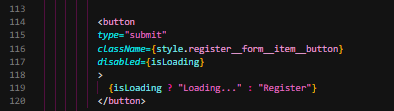

- Line 34 rubah menjadi email

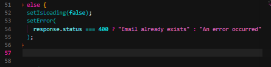

- Modifikasi juga pada register.module.scss

- Jika berhasil maka hasilnya seperti berikut

- Tambakan loading dengan menambahkan kode pada index.tsx

---

## Pengujian 

Uji 1 – Register Baru
Berdasarkan pengujian yang dilakukan, sistem berhasil menyimpan data pengguna baru ke dalam Firestore dengan password yang telah ter-hash. Selain itu, sistem juga melakukan redirect ke halaman login. Dengan demikian, hasil pengujian telah sesuai dengan output yang diharapkan.

Uji 2 – Email Sudah Ada
Pada pengujian menggunakan email yang sudah terdaftar, sistem berhasil menolak proses registrasi dan memberikan respon berupa error 400 dengan pesan “Email already exists”. Hal ini menunjukkan bahwa validasi berjalan dengan baik dan sesuai dengan output yang diharapkan.

Uji 3 – Method GET
Pada pengujian akses endpoint menggunakan method GET, sistem memberikan respon berupa status 405 Method Not Allowed. Hal ini menunjukkan bahwa pembatasan method telah diterapkan dengan benar dan hasil pengujian sesuai dengan output yang diharapkan.

---

## Tugas Praktikum 

1. Implementasi Register Terhubung Database
Fitur registrasi telah berhasil diimplementasikan dan terhubung dengan database Firestore, dimana data pengguna yang melakukan pendaftaran dapat tersimpan dengan baik di dalam sistem.

2. Penambahan Validasi
Validasi input pada form registrasi telah diterapkan, meliputi kewajiban pengisian email serta pembatasan minimal panjang password sebanyak 6 karakter. Validasi ini berjalan dengan baik dalam mencegah input yang tidak sesuai.

3. Penambahan Role Default "Member"
Sistem secara otomatis memberikan role default berupa "member" kepada setiap pengguna baru yang berhasil melakukan registrasi, sehingga memudahkan pengelolaan hak akses pengguna.

4. Penampilan Pesan Error di UI
Pesan error telah berhasil ditampilkan pada antarmuka pengguna (UI) ketika terjadi kesalahan, seperti email yang sudah terdaftar atau input yang tidak valid, sehingga memberikan feedback yang jelas kepada pengguna.

5. Dokumentasi Hasil (Screenshot)
Hasil pengujian telah didokumentasikan dalam bentuk screenshot yang meliputi proses registrasi berhasil, kondisi email sudah terdaftar, serta tampilan data pengguna pada database Firestore. Hal ini menunjukkan bahwa sistem telah berjalan sesuai dengan yang diharapkan.

---

## Pertanyaan Analisis

OHH wkwk ini soal 😭 oke aku bantu jawabin ya, tinggal kamu copas ke laporan:

1. Mengapa password harus di-hash?**
Password harus di-hash untuk menjaga keamanan data pengguna. Dengan proses hashing, password tidak disimpan dalam bentuk asli sehingga jika database bocor, password tidak dapat langsung diketahui oleh pihak yang tidak bertanggung jawab.

2. Apa perbedaan addDoc dan setDoc?**
`addDoc` digunakan untuk menambahkan data baru ke dalam collection dengan ID yang dibuat secara otomatis oleh Firestore. Sedangkan `setDoc` digunakan untuk menambahkan atau menimpa data pada dokumen dengan ID yang sudah ditentukan secara manual.

3. Mengapa perlu validasi method POST?**
Validasi method POST diperlukan untuk memastikan bahwa endpoint hanya menerima request yang sesuai, yaitu untuk proses pengiriman data. Hal ini bertujuan untuk meningkatkan keamanan dan mencegah akses yang tidak sesuai seperti penggunaan method GET.

4. Apa risiko jika email tidak dicek unik?**
Jika email tidak dicek keunikannya, maka memungkinkan terjadinya duplikasi akun dengan email yang sama. Hal ini dapat menyebabkan kebingungan dalam autentikasi, potensi penyalahgunaan akun, serta menurunkan integritas data dalam sistem.

5. Apa fungsi role pada user?**
Role pada user berfungsi untuk mengatur hak akses dan wewenang pengguna dalam sistem. Dengan adanya role, sistem dapat membedakan fitur atau akses yang dapat digunakan oleh masing-masing pengguna, seperti admin dan member.
