JOBSHEET PRAKTIKUM

Implementasi Login Database & Multi-Role 

Identitas

Nama: Nahdia Putri Safira

Kelas: TI3D

NIM: 2341720015

Program Studi: D4 Teknik Informatika

---

## Bagian 1 - Custom Login Page

- Tambahkan custom page di NextAuth line 55-57

- Jalankan browser http://localhost:3000/ dan klik sign in maka akan diarahkan ke login 

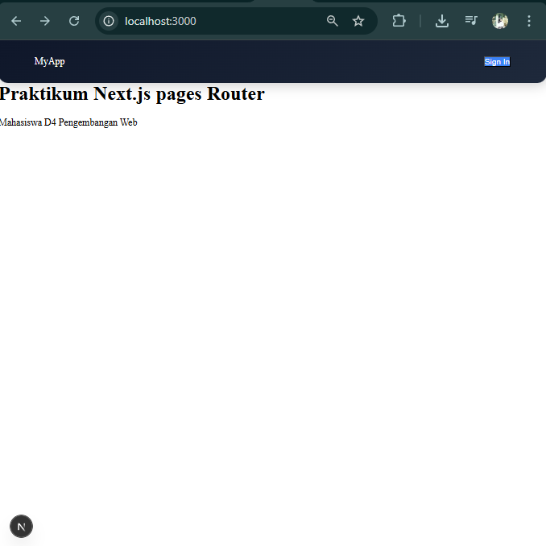

setelah di klik sign in

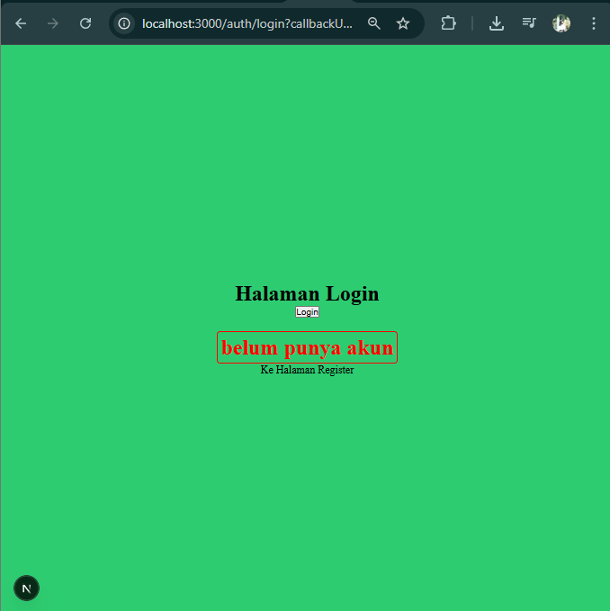

--- 

## Bagian 2 - Handle Login di Frontend 

- Copy paste isi dari register/index.tsx ke file login/index.tsx

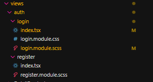

- Copy paste isi dari register/register.module.scss ke file login/login.module.scss

- Semua text register pada file index.tsx pada folder login diubah menjadi login

- Jangan lupa setting link hrefnya

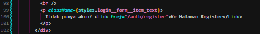

- Lakukan hal yang sama pada file login.module.scss rubah text register menjadi login

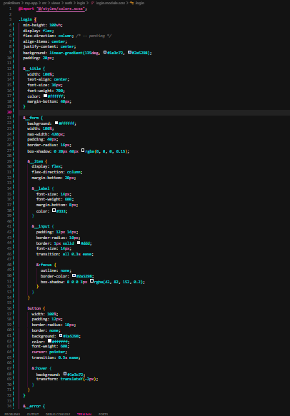

- Cek pada file login.tsx pada pages/auth

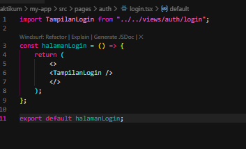

- Jalankan browser localhost:3000/auth/login. Tampilannya akan sama dengan register

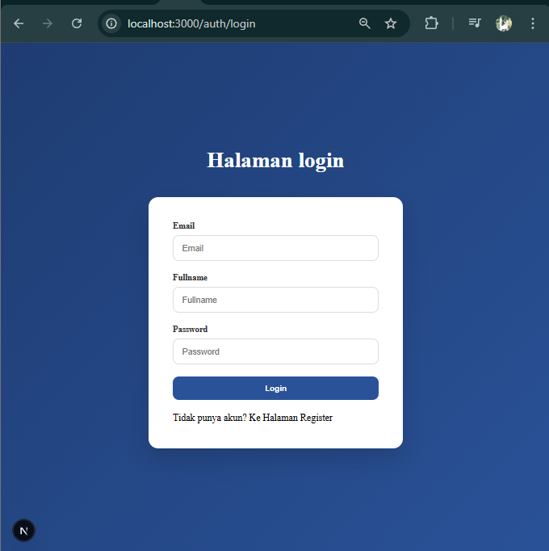

- Pada tampilan login kita tidak perlu hapus fullname jadi pada folder
views/auth/login/index.tsx hapus fullname

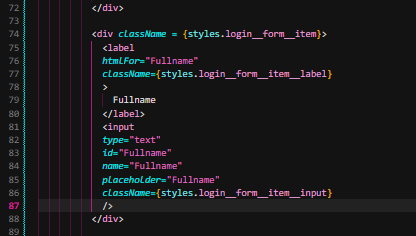

- Hasilnya

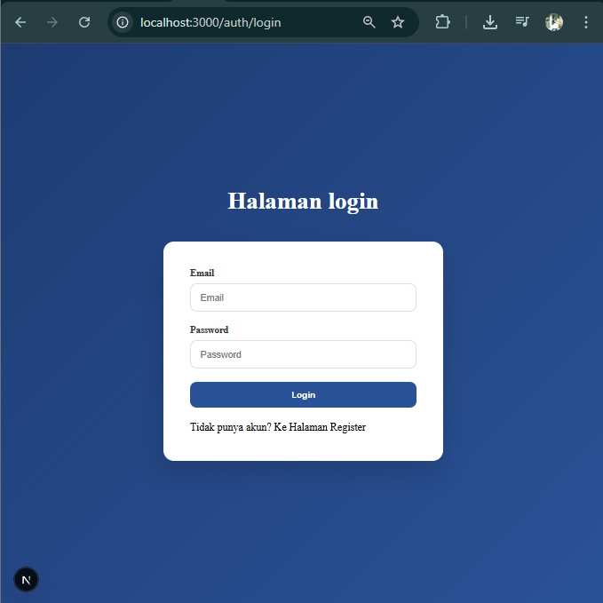

- Buka file index.tsx pada folder views/auth/login dan modifikasi codenya

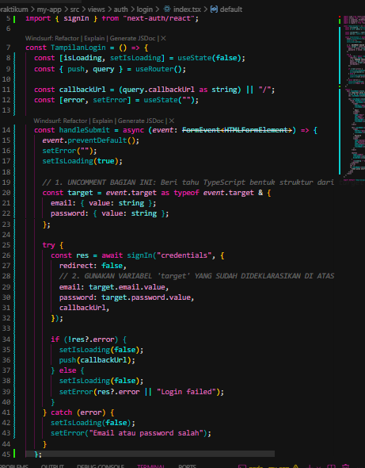

- Buka file servicefirebase.ts dan tambahkan code

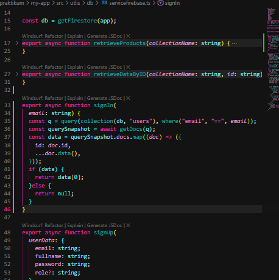

---

## Bagian 3 -  Authorize di NextAuth (Database Login)

- Buka file [...nextauth].ts modifikasi menjadi berikut ( pada bagian providers ) 

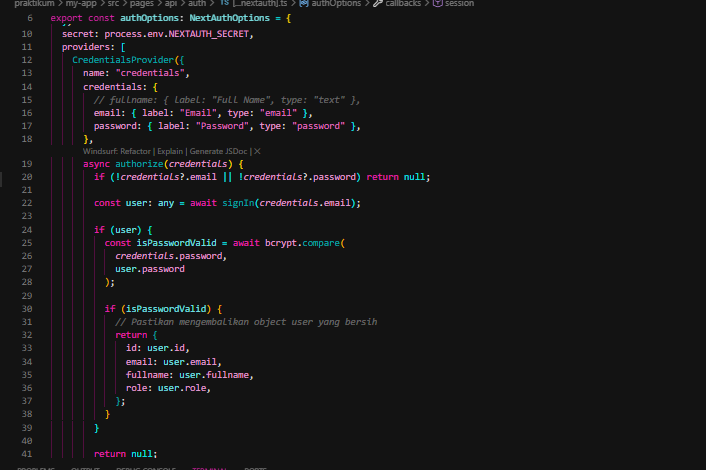

## Bagian 4 – Tambahkan Role ke Token

- JWT Callback pada file [...nextauth].ts Modifikasi menjadi

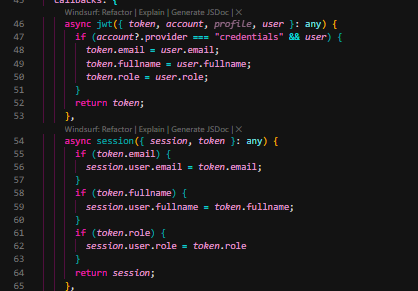

- Jalankan browser http://localhost:3000/auth/login

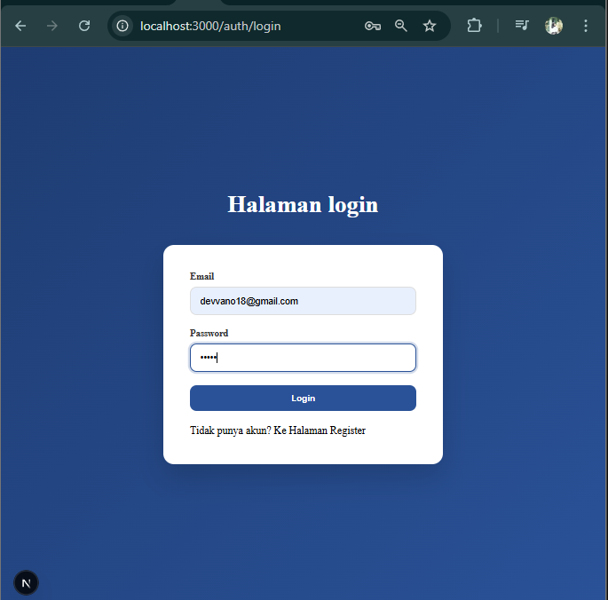

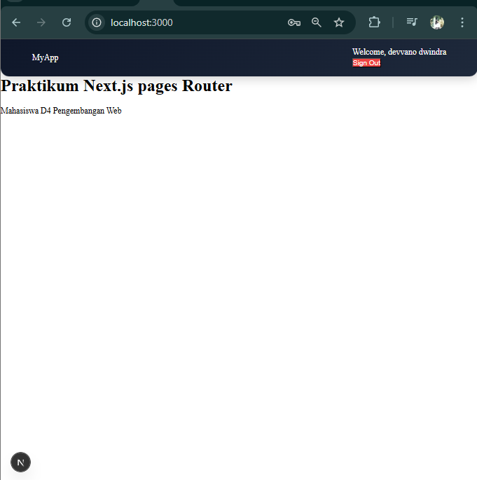

- JIKA TERDAPAT ERROR SEPERTI INI DISEBABKAN KARENA
In this case, the problem is that a <head> tag is being rendered inside a 
, which is
invalid HTML. The <head> element must be a direct child of <html>, not nested inside other
elements

SOLUSINYA BUKA FILE SRC/VIEWS/AUTH/LOGIN/INDEX.TSX

TAMBAHKAN <> </> SEPERTI PADA GAMBAR BERIKUT

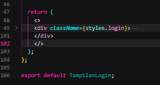

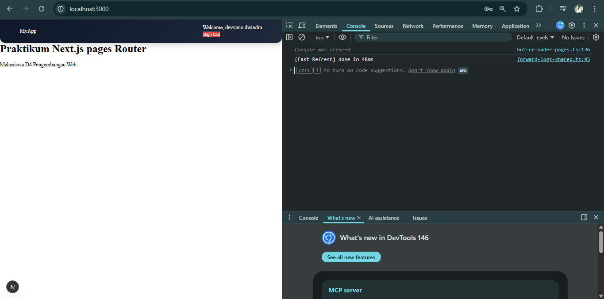

---

## Bagian 5 -  Callback URL Logic 

- Modifikasi withAuth.ts pada folder src/middleware

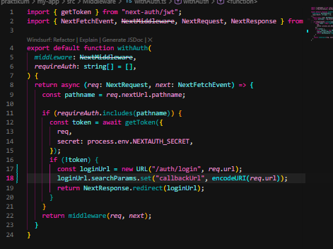

Tujuannya:
 Setelah login, user kembali ke halaman sebelumnya.

---

## Bagian 6 -  Membuat halaman Admin dan authoriz

- Buat halaman admin

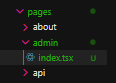

- Pada index.tsx tambahkan code berikut 

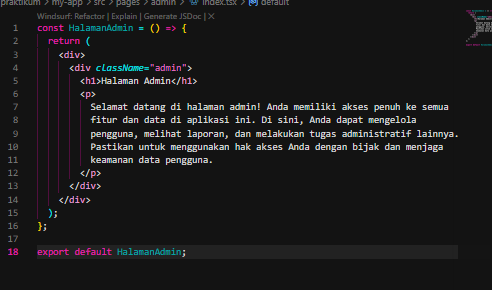

- Modifikasi withAuth.ts

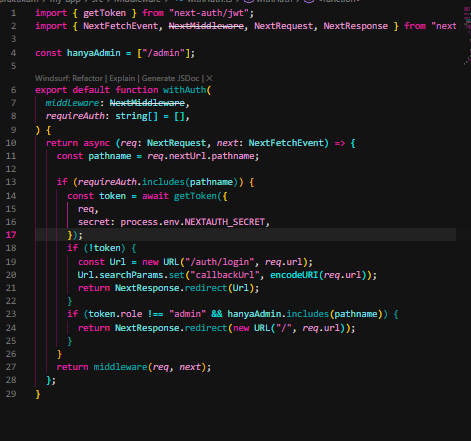

- Jalankan browser localhost:3000/produk dan pada status sudah login.

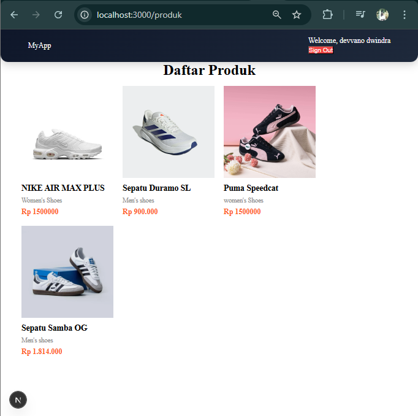

- Rubah urlnya menjadi http://localhost:3000/admin 

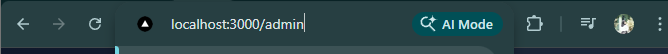

maka user akan diarahkan ke localhost. Pada
intinya role selain admin tidak bisa mengakses

- Untuk mencoba halaman admin rubah role pada firebas pada salah satu akun dan
jalankan http://localhost:3000/admin

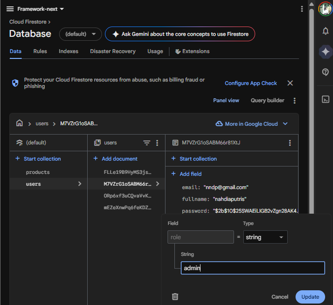

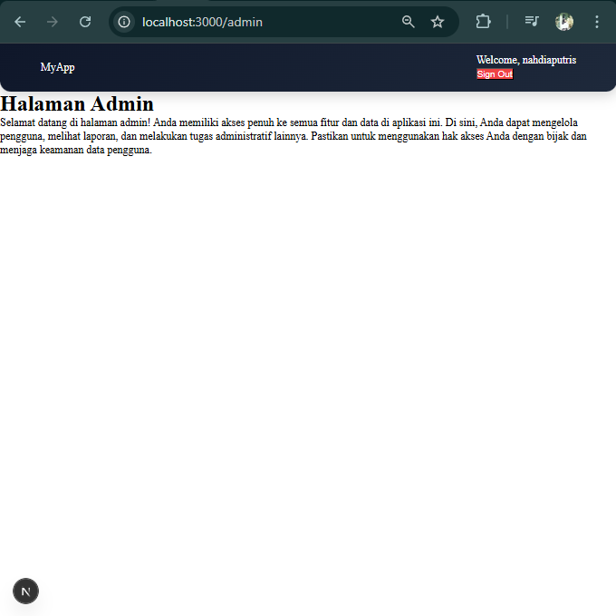

---

## Pengujian

Uji 1 – Login Valid
Pada pengujian ini dilakukan proses login menggunakan email dan password yang benar. Hasil yang diperoleh menunjukkan bahwa sistem berhasil melakukan autentikasi pengguna dengan baik, ditandai dengan keberhasilan login serta pengguna diarahkan (redirect) ke halaman sesuai dengan callbackUrl yang telah ditentukan.

Uji 2 – Password Salah
Pengujian dilakukan dengan memasukkan email yang benar namun password yang salah. Hasilnya sistem menolak proses login dan menampilkan pesan kesalahan (error message) kepada pengguna, sehingga pengguna tidak dapat mengakses sistem. Hal ini menunjukkan bahwa validasi autentikasi berjalan dengan baik.

Uji 3 – Akses Admin sebagai User
Pengujian ini dilakukan dengan login sebagai pengguna dengan role user kemudian mencoba mengakses halaman /admin. Hasil pengujian menunjukkan bahwa sistem berhasil membatasi hak akses, di mana pengguna dialihkan (redirect) ke halaman utama (home), sehingga tidak dapat mengakses halaman admin.

Uji 4 – Akses Admin sebagai Admin
Pada pengujian ini dilakukan login menggunakan akun dengan role admin dan mencoba mengakses halaman /admin. Hasilnya sistem memberikan akses penuh ke halaman admin, yang menunjukkan bahwa pengaturan otorisasi berdasarkan role telah berjalan sesuai dengan yang diharapkan.

---

## Tugas Praktikum

1. Implementasikan login database.

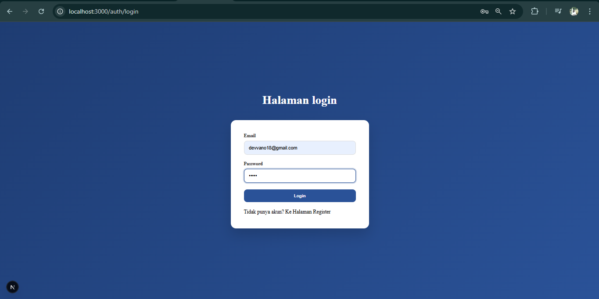

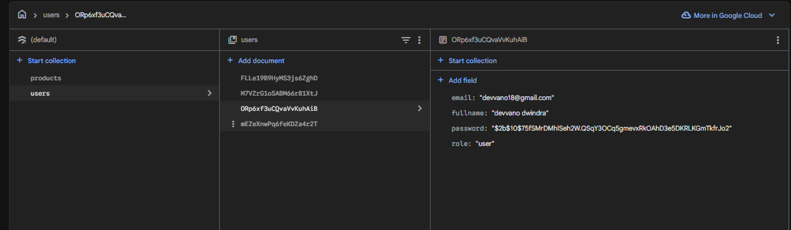

2. Tambahkan role pada user.

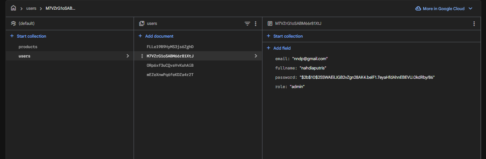

3. Buat halaman:

o /profile

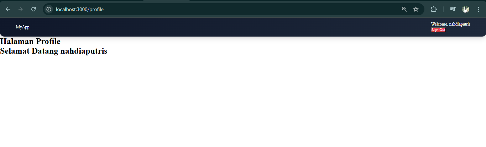

o /admin

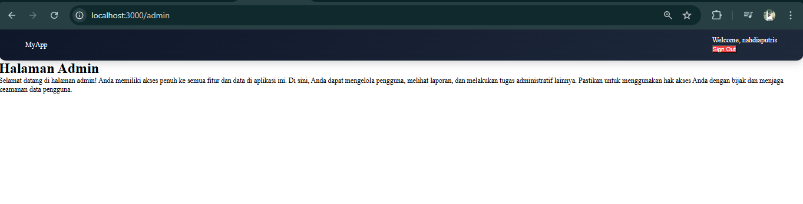

4. Proteksi /admin hanya untuk admin

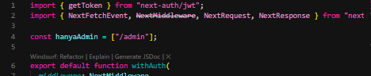

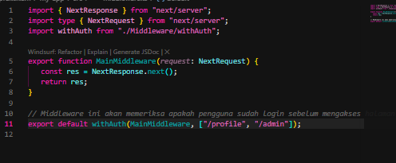

5. Implementasikan callback URL.

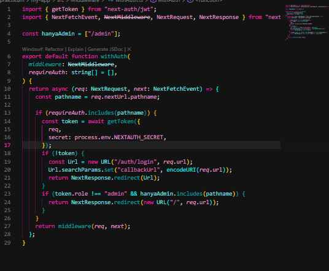

---

## Pertanyaan Analisis

1. Mengapa password harus diverifikasi dengan bcrypt.compare?
Password harus diverifikasi menggunakan bcrypt.compare karena password yang disimpan di database sudah dalam bentuk hash, bukan teks asli. Fungsi ini digunakan untuk mencocokkan password input dengan hash secara aman tanpa perlu mendekripsi. Selain itu, bcrypt juga melindungi dari serangan seperti rainbow table karena menggunakan salt.

2. Mengapa role disimpan di token?
Role disimpan di dalam token agar informasi hak akses pengguna dapat dibawa ke setiap request tanpa harus selalu melakukan query ke database. Hal ini membuat proses autentikasi dan otorisasi menjadi lebih efisien dan cepat. Selain itu, penyimpanan role di token juga memudahkan pengecekan akses di berbagai bagian aplikasi.

3. Apa fungsi callbackUrl?
callbackUrl berfungsi untuk menentukan halaman tujuan setelah proses login berhasil dilakukan. Dengan adanya callbackUrl, pengguna dapat langsung diarahkan ke halaman yang sebelumnya ingin diakses atau halaman tertentu sesuai kebutuhan sistem. Ini meningkatkan pengalaman pengguna karena alur navigasi menjadi lebih fleksibel.

4. Mengapa middleware penting untuk security?
Middleware penting karena berfungsi sebagai lapisan pengaman yang memeriksa setiap request sebelum mencapai halaman atau resource tertentu. Middleware dapat digunakan untuk mengecek apakah pengguna sudah login, memiliki hak akses yang sesuai, atau memenuhi syarat tertentu. Dengan demikian, akses yang tidak sah dapat dicegah sejak awal.

5. Apa risiko jika role tidak dicek di middleware?
Jika role tidak dicek di middleware, maka semua pengguna yang sudah login berpotensi mengakses halaman yang seharusnya dibatasi, seperti halaman admin. Hal ini dapat menyebabkan kebocoran data, penyalahgunaan fitur, bahkan manipulasi sistem. Oleh karena itu, pengecekan role sangat penting untuk menjaga keamanan dan integritas aplikasi.

