JOBSHEET PRAKTIKUM

Implementasi Login Google Provider dengan NextAuth.js + Firebase

Identitas

Nama: Nahdia Putri Safira

Kelas: TI3D

NIM: 2341720015

Program Studi: D4 Teknik Informatika

---

## Konfigurasi Google OAuth 

---

## Langkah 1 – Masuk ke Google Cloud Console Buka:
 https://console.cloud.google.com/apis/credentials

## Langkah 2 - Buat Project Baru
Setelah halaman Google Cloud Console berhasil dimuat, langkah berikutnya adalah membuat project baru dengan mencari dan mengklik opsi "New Project". Pada halaman pengisian detail project, masukkan nama "MyAppNext" ke dalam kolom "Project name". Untuk bagian Organization dan Location dapat dibiarkan sesuai pengaturan default atau disesuaikan dengan kebutuhan. Terakhir, klik tombol "Create"  dan tunggu beberapa saat hingga sistem selesai menginisiasi project baru tersebut. Pastikan project yang aktif di bagian atas dasbor sudah berubah menjadi "MyAppNext".

---

### Langkah 3 – Konfigurasi OAuth Consent Screen 

- Pilih OAuth consent screen

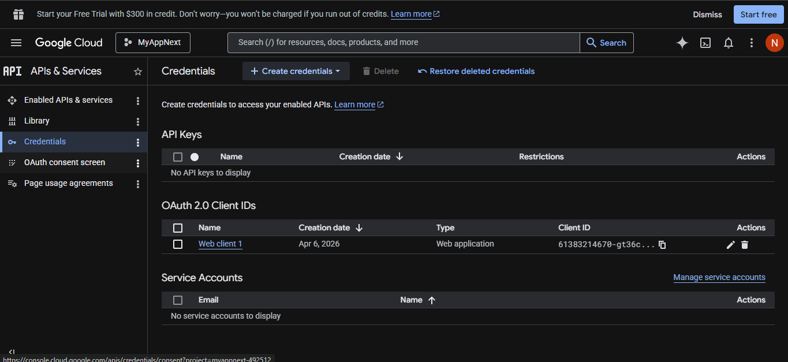

- Pilih Get Started

- Akan muncul seperti berikut

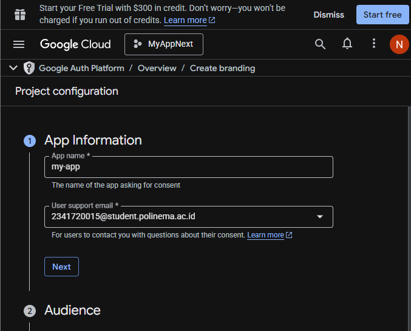

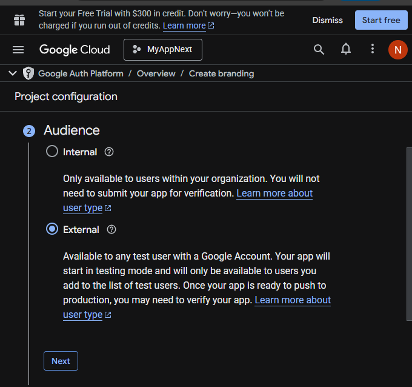

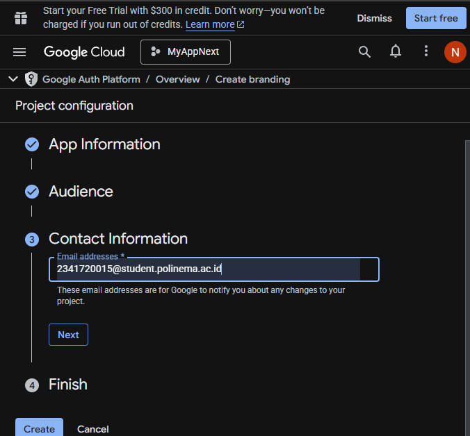

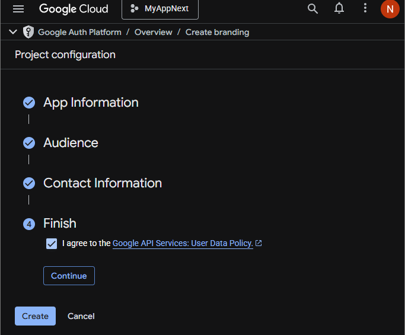

- Klik create

---

## Langkah 4 – Buat OAuth Credentials 

Tahap selanjutnya setelah mengonfigurasi consent screen adalah membuat kredensial OAuth. Pada halaman Clients atau Credentials, klik tombol "Create client" (atau Create OAuth client ID). Pada formulir pembuatan kredensial, pilih "Web application" pada bagian Application type. Selanjutnya, gulir ke bagian "Authorized JavaScript origins" dan tambahkan URI asal aplikasi yaitu http://localhost:3000. Setelah itu, pada bagian "Authorized redirect URIs", masukkan endpoint callback dari NextAuth yaitu http://localhost:3000/api/auth/callback/google. Pastikan kedua URL tersebut sudah diketik dengan benar, lalu klik tombol "Create" di bagian bawah halaman untuk menyelesaikan proses. Sistem akan memproses data tersebut dan menampilkan Client ID beserta Client Secret yang nantinya akan digunakan di dalam kode proyek.

---

## Tambahkan Environment Variables

- Copy dan paste client ID dan Client secret ke .env

---

## Konfigurasi Google Provider di NextAuth dan Handle Callback JWT & Session

---

- Buka file [...nextauth].ts pada folder api/auth dan modifikasi menjadi berikut

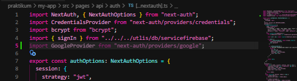

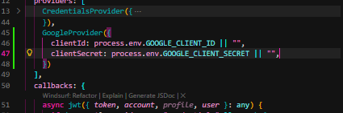

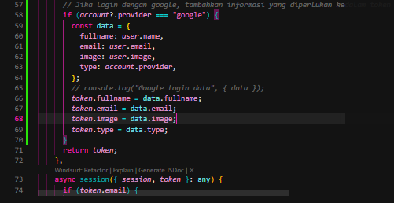

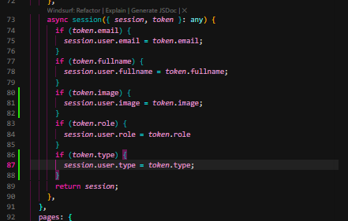

---

## Tambahkan Button Login Google 

- Modifikasi file index.tsx pada folder views/auth/login

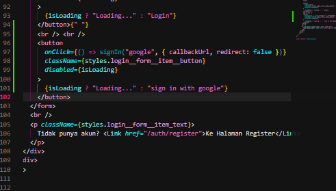

- Jalankan browser localhost:3000/auth/login masuk melalui sign in with google.Jika berhasil maka akan terhubung dengan akun google

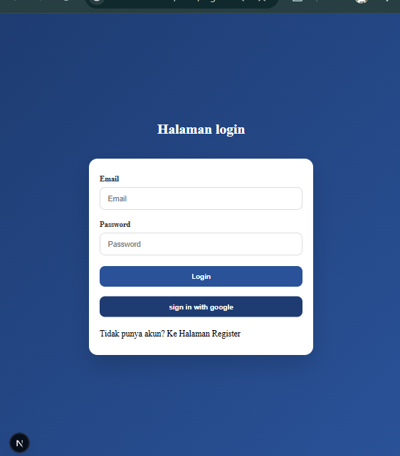

- Menampilkan image dari google 
- Buka file index.tsx dan tambahkan code berikut

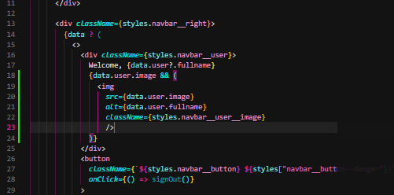

- Buka file navbar.module.css dan tambahkan code berikut

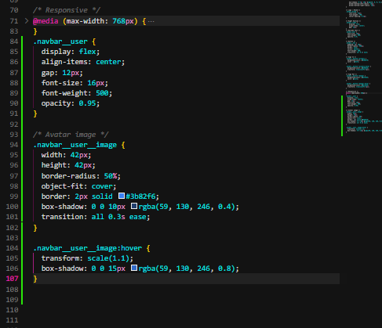

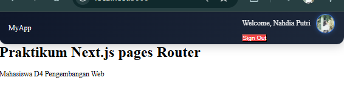

---
## Simpan Data Google ke Database
---

- Buka file servicefirebase.ts pada folder src/utils/db/ dan tambahkan beberapa
kode berikut

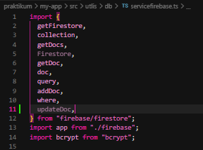

- Tambahkan juga code berikut

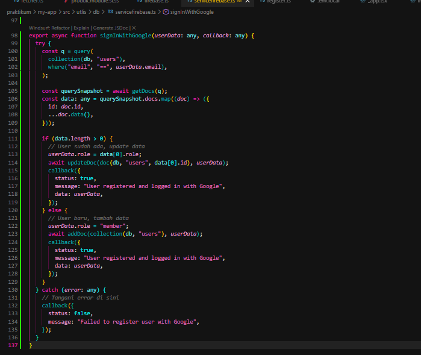

- Panggil Service di JWT Callback buka file […nextAuth].ts

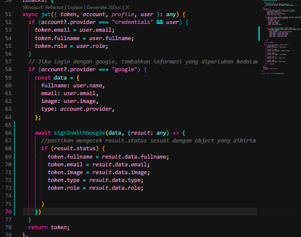

-  Jalankan browser dan login menggunakan akun google setelah cek di firebase, jika
data akun googlenya masuk ke database maka anda telah berhasil

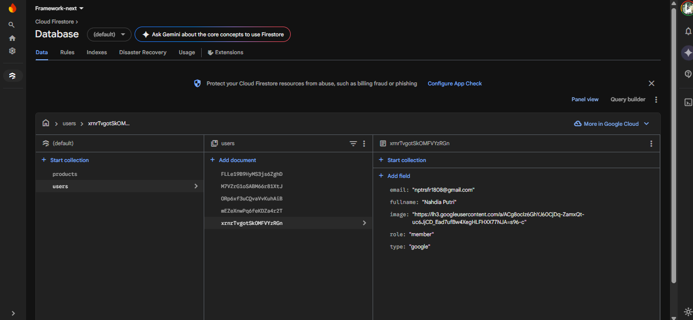

---
## Analisis & Diskusi 

1. Apa perbedaan login credential dan login Google?

Login Credential: Pengguna mendaftar dan masuk menggunakan kombinasi email dan password yang dikelola langsung oleh aplikasi kita. Aplikasi bertanggung jawab penuh untuk mengenkripsi (misalnya menggunakan bcrypt) dan menyimpan password tersebut di database dengan aman.

Login Google (OAuth): Proses verifikasi identitas dilakukan oleh pihak ketiga (Google). Aplikasi kita tidak pernah melihat atau menyimpan password pengguna. Saat pengguna masuk melalui Google, aplikasi kita hanya menerima token autentikasi dan profil dasar (seperti nama, email, dan foto profil) dari Google yang menandakan bahwa pengguna tersebut sah.

2. Mengapa data Google tetap perlu disimpan ke database?
Meskipun Google menangani proses login (autentikasi), kita tetap perlu menyimpan data pengguna ke database lokal (seperti Firestore) agar kita bisa:

Menambahkan atribut tambahan yang tidak dimiliki oleh Google, seperti Role (admin, member) atau status akun.

Mengaitkan pengguna tersebut dengan data lain di dalam aplikasi kita (misalnya riwayat transaksi, postingan, atau keranjang belanja).

Mengelola akses dan izin pengguna secara mandiri di dalam sistem kita.

3. Apa fungsi JWT callback?
Dalam NextAuth.js, JWT (JSON Web Token) callback berfungsi untuk mencegat dan memodifikasi isi token sebelum token tersebut diteruskan ke session klien. Fungsinya sangat krusial untuk menyisipkan data tambahan dari database ke dalam token, seperti menambahkan informasi role (hak akses) atau user ID dari Firestore, sehingga informasi tersebut bisa dibaca di sisi frontend tanpa harus melakukan pemanggilan ke database berulang kali.

4. Mengapa perlu multi-role?
Multi-role (seperti admin, member, editor) diperlukan untuk Otorisasi (Authorization), yaitu membatasi apa saja yang bisa dilihat atau dilakukan oleh pengguna setelah mereka berhasil login. Dengan multi-role, kita bisa melindungi halaman atau fungsi sensitif. Contohnya, hanya pengguna dengan role admin yang bisa mengakses rute /admin atau menghapus data, sedangkan pengguna biasa (member) akan dialihkan (redirect) jika mencoba mengaksesnya.

5. Apa risiko jika tidak menyimpan user ke database?
Jika pengguna dari Google Provider tidak disimpan ke database aplikasi kita, ada beberapa risiko:

Tidak bisa mengelola otorisasi: Kita tidak bisa memberikan hak akses khusus (seperti role admin) karena data tersebut tidak ada tempat penyimpanannya.

Kehilangan integritas data relasional: Jika pengguna melakukan aktivitas di aplikasi (misalnya membuat pesanan), sistem tidak memiliki "ID Pengguna lokal" yang tetap untuk dikaitkan dengan pesanan tersebut.

Ketergantungan penuh pada data session: Setiap kali aplikasi membutuhkan informasi detail tentang interaksi pengguna di sistem kita, data tersebut tidak tersedia karena aplikasi hanya mengandalkan profil mentah yang dikirim oleh Google saat session aktif.

---

## Tugas Mandiri 

1. Tambahkan role editor

Pada tahap ini dilakukan penambahan role baru yaitu editor ke dalam sistem. Role editor berfungsi sebagai pengguna yang memiliki hak akses tertentu, biasanya berada di antara user biasa dan admin. Editor umumnya dapat mengelola konten seperti menambah, mengedit, dan menghapus data, tetapi tidak memiliki akses penuh seperti admin.

Implementasi dilakukan dengan menambahkan field role pada data user, kemudian melakukan pengecekan role saat user mengakses fitur tertentu.

2. Buat halaman khusus editor

Setelah role editor ditambahkan, dibuat halaman khusus yang hanya dapat diakses oleh user dengan role editor. Halaman ini berisi fitur-fitur yang sesuai dengan hak akses editor, seperti manajemen konten.

Proteksi halaman dilakukan dengan cara:

Mengecek role user saat halaman diakses
Jika bukan editor, maka akan diarahkan (redirect) ke halaman lain (misalnya login atau unauthorized)

Tujuannya adalah untuk menjaga keamanan dan membatasi akses sesuai peran pengguna.

3. Tambahkan provider GitHub

Pada bagian ini ditambahkan metode login menggunakan akun GitHub melalui autentikasi pihak ketiga. Biasanya menggunakan library seperti NextAuth.

Langkah umumnya:

Membuat OAuth App di GitHub
Mendapatkan Client ID dan Client Secret
Menambahkan konfigurasi provider GitHub di NextAuth

Dengan adanya fitur ini, pengguna bisa login tanpa perlu membuat akun baru, cukup menggunakan akun GitHub mereka.

4. Refactor service agar reusable

Refactor dilakukan untuk memperbaiki struktur kode agar lebih rapi, efisien, dan dapat digunakan kembali (reusable). Biasanya service yang sebelumnya ditulis berulang-ulang dipindahkan ke satu file khusus (misalnya services/ atau lib/).

Manfaat refactor:

Mengurangi duplikasi kode
Memudahkan maintenance
Kode lebih terstruktur dan scalable

Contoh: fungsi fetch API dibuat satu kali lalu digunakan di berbagai halaman.

5. Gunakan next/image untuk optimasi avatar

Pada tahap ini, komponen gambar diganti menggunakan next/image dari Next.js. Komponen ini memiliki keunggulan seperti:

Optimasi ukuran gambar otomatis
Lazy loading (memuat gambar saat dibutuhkan)
Performa lebih cepat dibanding  biasa

Penggunaan ini sangat cocok untuk menampilkan avatar user agar aplikasi lebih ringan dan cepat diakses.

Seluruh kode implementasi tugas ini telah dibuat dan dapat dilihat pada repositori GitHub pribadi.