JOBSHEET PRAKTIKUM

Optimasi Performa Aplikasi Menggunakan Fitur Next.js 

Identitas

Nama: Nahdia Putri Safira

Kelas: TI3D

NIM: 2341720015

Program Studi: D4 Teknik Informatika

---

## Praktikum 1 - Image Optimization

---

## A. Optimasi Gambar Lokal (Public Folder)

- Buka file src/pages/404.tsx

- Modifikasi line 7 menjadi line 8-11

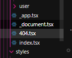

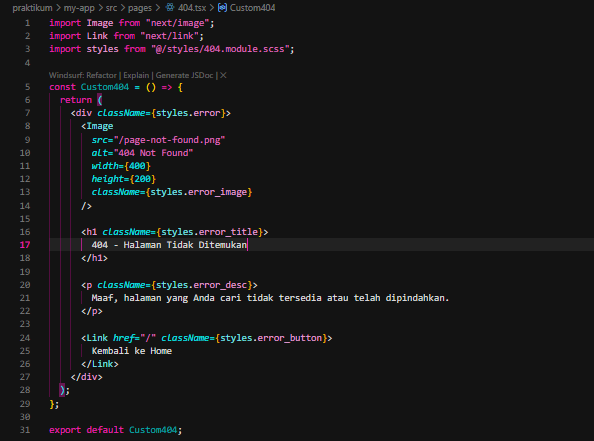

Hasil:
• Warning hilang
• Image dioptimasi otomatis
• Mengurangi bandwidth
• Mendukung lazy loading otomatis

---

## B. Optimasi Gambar Remote (External URL) 

- Buka file views/product/index.tsx 

- Modifikasi file index.tsx 

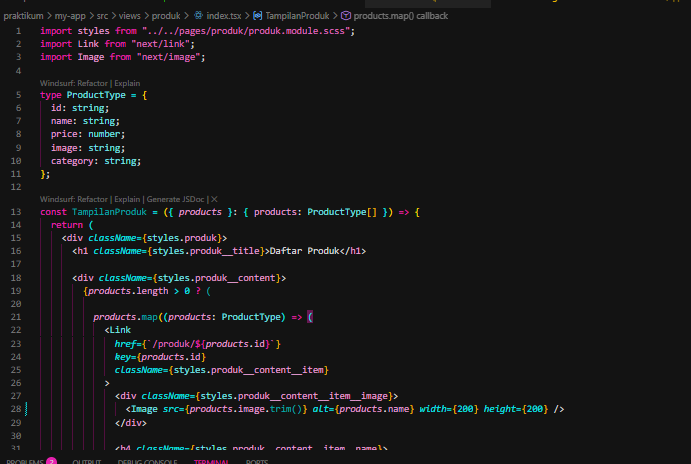

- Buka file next.config.js

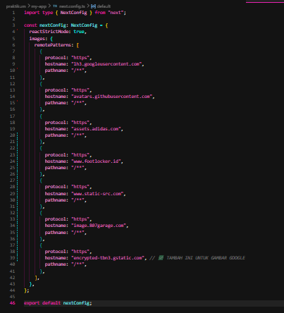

---

## PRAKTIKUM 2 – Font Optimization

---

## A. Menggunakan next/font

- Buka file index.tsx pada folder Appshell/index.tsx dan modifkasi 

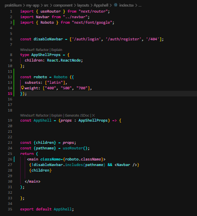

- Jalankan browser localhost:3000/produk maka font akan berubah menjadi roboto
untuk mengecek fontnya bisa menggunakan extension FontFinder

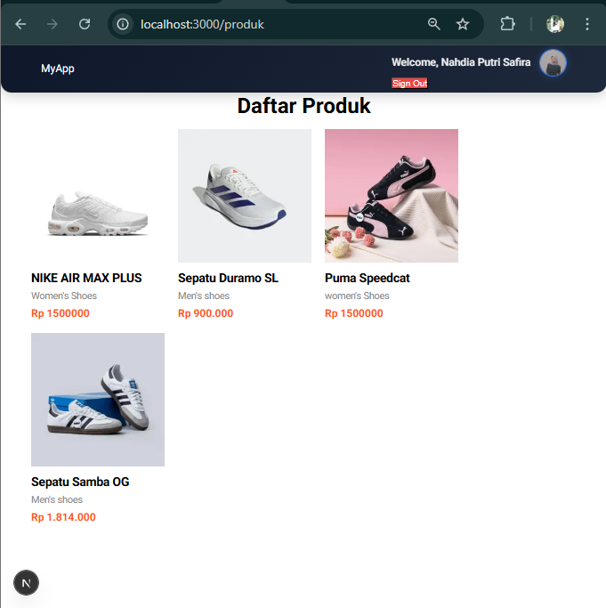

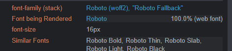

Hasil:
• Tidak perlu load dari CDN manual
• Tidak blocking render
• Performance meningkat
• Tidak terjadi FOUT (Flash of Unstyled Text)

---

## PRAKTIKUM 3 – Script Optimization 

---

## B. Menggunakan next/script 

-Buka file index.tsx pada folder layouts/Navbar dan modifikasi 

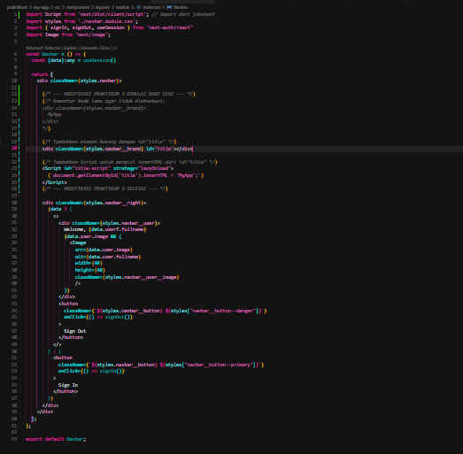

"Pada Praktikum 3, dilakukan optimasi penggunaan skrip eksternal menggunakan komponen next/script. Dengan menerapkan strategi lazyOnload, eksekusi skrip dilakukan setelah seluruh resource utama selesai dimuat, sehingga skrip tidak memblokir proses render halaman dan membuat performa aplikasi menjadi lebih ringan."

---

## PRAKTIKUM 4 – Optimasi Avatar dengan next/imag

---

- Buka file index.tsx pada folder layouts/navbar dan modifikasi :

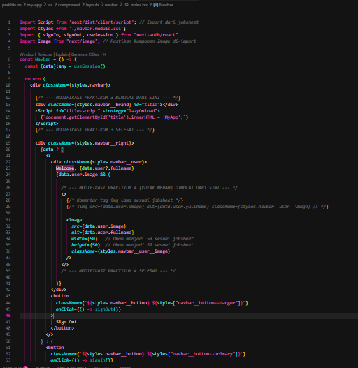

-Tambahkan hostname Google:

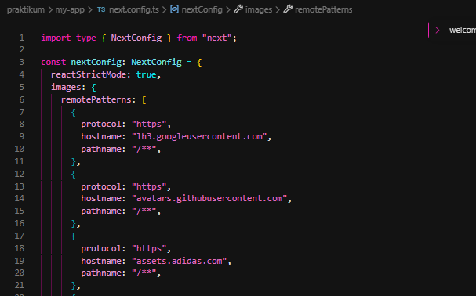

---

## Tugas Praktikum

1. Optimasi semua image di project menggunakan next/image

Pada tahap ini, seluruh penggunaan tag HTML standar  telah digantikan dengan komponen next/image. Implementasi ini bertujuan untuk memanfaatkan fitur optimasi otomatis dari Next.js, seperti lazy loading, penyesuaian ukuran gambar otomatis (responsive), serta pencegahan Cumulative Layout Shift (CLS) dengan mendefinisikan atribut width dan height pada gambar.

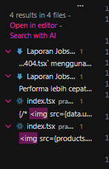
2. Gunakan minimal 1 font dari next/font

Penggunaan next/font dalam project ini telah diimplementasikan sejak praktikum sebelumnya pada file src/components/layouts/Appshell/index.tsx. Font yang digunakan adalah Roboto dari Google Fonts yang dipanggil melalui paket @next/font/google. Hal ini dilakukan untuk mengoptimalkan pemuatan aset tipografi secara self-hosted oleh Next.js, sehingga aplikasi tidak lagi bergantung pada pemuatan eksternal yang dapat memperlambat performa render halaman

3. Tambahkan script Google Analytics menggunakan next/script

Penambahan script eksternal Google Analytics dilakukan menggunakan komponen next/script pada file _app.tsx. Dengan menggunakan strategi afterInteractive, script Google Analytics akan dimuat segera setelah halaman menjadi interaktif tanpa menghambat proses rendering utama, sehingga menjaga performa aplikasi tetap optimal di sisi pengguna

4. Terapkan dynamic import pada minimal 1 komponen

Optimasi pemuatan komponen dilakukan dengan menerapkan Dynamic Import pada komponen Navbar menggunakan fungsi dynamic() dari Next.js. Teknik lazy loading ini memungkinkan browser untuk hanya mengunduh kode JavaScript komponen tersebut saat benar-benar dibutuhkan, yang berdampak pada pengurangan ukuran bundle awal dan mempercepat waktu load halaman utama

5. Dokumentasikan perubahan performa (screenshot Lighthouse)

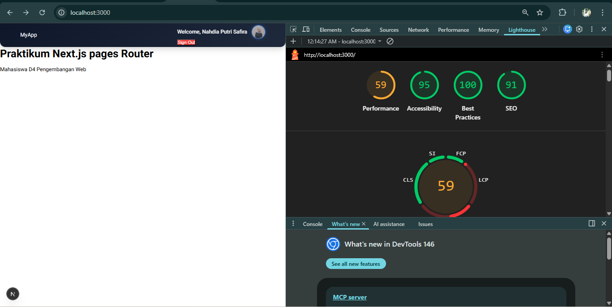

Pengujian performa dilakukan menggunakan Google Lighthouse untuk mengukur efektivitas optimasi yang telah diterapkan. Berdasarkan hasil audit pada lingkungan development, aplikasi memperoleh skor yang sangat memuaskan pada aspek Best Practices (100) dan Accessibility (95). Hal ini menunjukkan bahwa penggunaan komponen bawaan Next.js seperti next/image dan next/font tidak hanya mempercepat pemuatan aset, tetapi juga menjaga struktur kode tetap sesuai dengan standar aksesibilitas web.

Skor Performance (59) dipengaruhi oleh penggunaan mode development yang masih memuat banyak resource tambahan untuk keperluan debugging. Namun, hasil metrik Core Web Vitals menunjukkan kestabilan yang baik berkat penerapan Dynamic Import pada komponen Navbar, yang berhasil memecah beban JavaScript awal (bundle size), serta penggunaan next/script yang memastikan script pihak ketiga (Google Analytics) tidak menghambat proses render utama halaman

---

## Refleksi & Diskusi

1. Mengapa tag  biasa tidak optimal?
Tag  HTML standar tidak memiliki fitur optimasi bawaan. Masalah utamanya meliputi:

Ukuran File:  akan memuat ukuran asli gambar meskipun layar pengguna kecil (misal: memuat gambar 2MB di layar HP).

Layout Shift: Jika tidak diberi ukuran tetap, gambar yang baru muncul akan "mendorong" konten di bawahnya, menyebabkan pengalaman pengguna yang buruk (CLS).

Lazy Loading:  standar akan memuat semua gambar di halaman secara bersamaan, bahkan gambar yang ada di posisi paling bawah (belum terlihat), sehingga menghabiskan kuota data dan memperlambat loading awal.

2. Apa perbedaan Font CDN dan next/font?
Font CDN (seperti Google Fonts link): Browser harus melakukan permintaan (request) tambahan ke server Google saat halaman dimuat. Jika server CDN lambat atau internet bermasalah, teks akan terlihat menggunakan font sistem dulu sebelum berubah tiba-tiba (FOUT - Flash of Unstyled Text).

next/font: Next.js akan mengunduh font tersebut pada saat proses build dan menyimpannya secara lokal bersama aset aplikasi lainnya. Font dimuat secara self-hosted, sehingga tidak ada permintaan jaringan tambahan ke server pihak ketiga, yang membuat pemuatan font jauh lebih cepat dan privasi lebih terjaga.

3. Mengapa script bisa membuat website lambat?
Script pihak ketiga (seperti Google Analytics atau Iklan) bersifat render-blocking. Artinya, browser akan berhenti memproses tampilan (HTML/CSS) untuk mengunduh dan menjalankan file JavaScript tersebut terlebih dahulu. Jika script-nya besar atau servernya lambat, pengguna hanya akan melihat layar putih atau elemen yang tidak bisa diklik untuk waktu yang lama.

4. Kapan harus menggunakan Dynamic Import?
Dynamic import sebaiknya digunakan pada:

Komponen Besar: Komponen yang memiliki banyak kode atau library berat (misal: Grafik/Charts, Maps, atau Editor teks).

Komponen yang Jarang Digunakan: Elemen yang hanya muncul berdasarkan aksi pengguna (misal: Modal, Pop-up, atau menu yang tersembunyi).

Komponen di bawah lipatan (Below the Fold): Komponen yang posisinya sangat di bawah sehingga tidak perlu dimuat di awal.

5. Apa dampak Bundle Size terhadap UX?
Bundle size adalah total ukuran file JavaScript yang harus diunduh browser agar website bisa berjalan.

Waktu Tunggu: Semakin besar bundle size, semakin lama waktu yang dibutuhkan pengguna (terutama pengguna HP dengan sinyal lemah) untuk melihat konten pertama kali.

Interaktivitas: Meskipun halaman sudah terlihat, website mungkin terasa "lag" atau tidak bisa diklik jika browser masih sibuk memproses JavaScript yang besar (TBT - Total Blocking Time).

Baterai & Performa: Memproses JavaScript yang besar memakan daya CPU dan baterai perangkat pengguna secara lebih intensif.
