# JOBSHEET PRAKTIKUM
Setup Project Next.js menggunakan Pages Router

## Identitas
Nama: Nahdia Putri Safira

Kelas: TI3D

NIM: 2341720015

Program Studi: D4 Teknik Informatika

---

## Langkah 1 – Pengecekan Lingkungan
Melakukan pengecekan versi Node.js dan npm untuk memastikan environment sudah siap digunakan dalam pembuatan project Next.js.
1. Buka terminal/command prompt
2. Jalankan Perintah berikut : 

    node -v dan npm -v
        
    
    git -v
        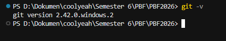
 
---

## Langkah 2 - Membuat Project Next.js
Membuat project menggunakan perintah npx create-next-app@13.4.7 sesuai instruksi jobsheet.
1. Buat direktori baru dan masuk ke direktori kerja
    
2. Jalankan perintah:
    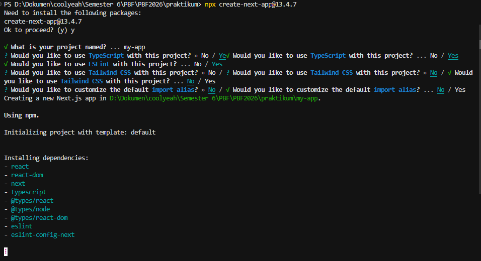
3. Masuk ke folder projectnya
    

---

## Langkah 3 -  Menjalankan Server Development
Menjalankan server menggunakan perintah npm run dev, kemudian membuka http://localhost:3000 di browser.
1. Masuk ke folder project dan jalankan aplikasinya
    
2. Buka Browser dan akses http://localhost:3000 
    

---

## Langkah 4 - Mengenal Struktur Folder

Pada tahap ini, dilakukan pengamatan terhadap struktur folder utama yang terdapat pada project Next.js yang telah dibuat. Struktur folder ini berfungsi untuk mengatur dan memisahkan bagian-bagian penting dalam pengembangan aplikasi agar lebih terorganisir.
Folder pages/ merupakan folder utama yang digunakan untuk routing berbasis file. Setiap file yang dibuat didalam folder ini secara otomatis akan menjadi halaman (route) pada aplikasi.
Folder public/ digunakan untuk menyimpan aset statis seperti gambar, ikon atau file lainnya yang dapat diakses secara langsung melalui URL. File yang diletakkan di dalam folder ini tidak perlu melalui proses import untuk digunakan
Folder styles/ berisi file CSS yang digunakan untuk mengatur tampilan atau desain antarmuka aplikasi. Styling dapat diterapkan secara global maupun per komponen.
File package.json merupakan file konfigurasi utama project yang berisi informasi terkait nama project, versi, dependencies, serta script yang dapat dijalankan seperti npm run dev dan npm run build.
File .gitignore berfungsi untuk menentukan file atau folder yang tidak perlu di-track oleh Git, seperti folder node_modules/, sehingga repository tetap bersih dan tidak menyimpan file yang tidak diperlukan.

---

## Langkah 5 - Modifikasi Halaman Utama

1. Buka file pages/index.js, ubah isi halamannya misalnya
    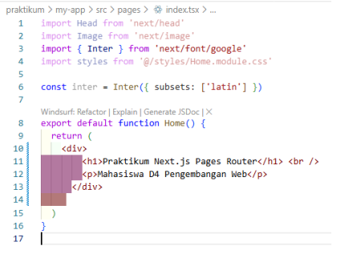
2. Simpan dan lihat perubahannya di browser
    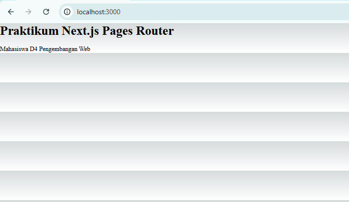

---

## Langkah 6 - Modifikasi API
Pada langkah ini, dilakukan modifikasi pada API bawaan yang terdapat dalam project Next.js. Folder pages/api/ digunakan untuk membuat API route yang berjalan di sisi server (server-side). API ini memungkinkan aplikasi menyediakan endpoint backend tanpa perlu membuat server terpisah.
File yang dimodifikasi adalah hello.ts yang berada di dalam folder pages/api/. File tersebut berisi fungsi handler yang akan merespons setiap request yang masuk ke endpoint /api/hello.

1. Buka Folder api, modifikasi hello.ts
    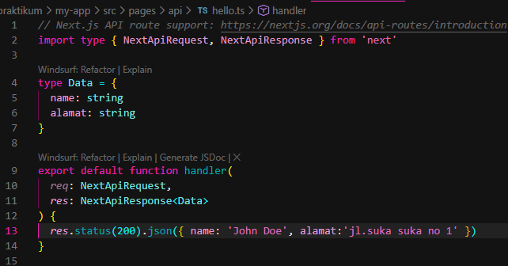
2. Jalankan browser dengan alamat http://localhost:3000/api/hello
    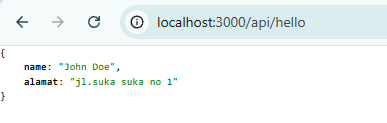
3. Tambahkan extension chrome
Pada tahap ini juga dapat ditambahkan extension pada browser (seperti JSON viewer) untuk mempermudah pembacaan response API.
    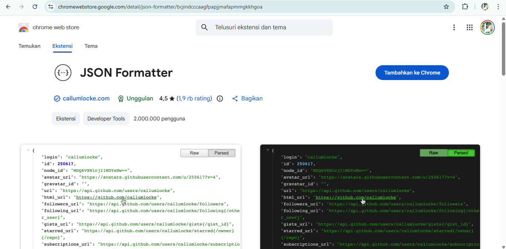
4. Jalankan kembali browser chrome
    

---

## Langkah 7 - Modifikasi Background
Pada langkah ini dilakukan modifikasi terhadap file _app.tsx yang berfungsi sebagai komponen utama (root component) dalam aplikasi Next.js. File ini digunakan untuk membungkus seluruh halaman sehingga setiap perubahan yang dilakukan di dalamnya akan berlaku secara global.

1. Buka file _app.tsx dan Modifikasi
    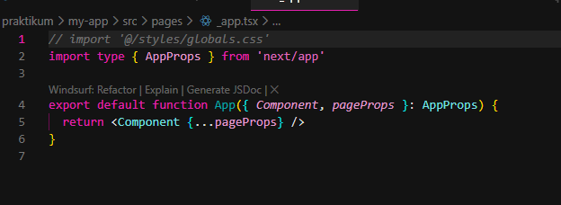
Perubahan dilakukan dengan menambahkan pengaturan styling untuk mengubah tampilan background aplikasi.
2.	Jalankan localhost
    
Hasil yang diperoleh menunjukkan bahwa background pada halaman utama dan halaman lainnya berhasil berubah sesuai dengan konfigurasi yang telah ditambahkan.

---

## Tugas 1 - Buat halaman baru about.js di folder pages, Tampilkan Nama Mahasiswa, NIM, dan Program Studi
1. 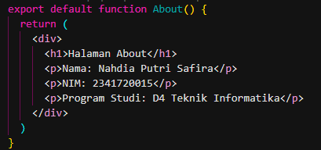
2. Hasilnya setelah dijalankan

## Tugas 2 - Tambahkan minimal 1 link navigasi dari halaman utama ke halaman about

Pada tugas ini ditambahkan minimal satu link navigasi dari halaman utama (index.js) menuju halaman About (about.js). Penambahan navigasi dilakukan menggunakan komponen Link yang disediakan oleh Next.js untuk berpindah halaman tanpa melakukan reload penuh (client-side navigation).

1. 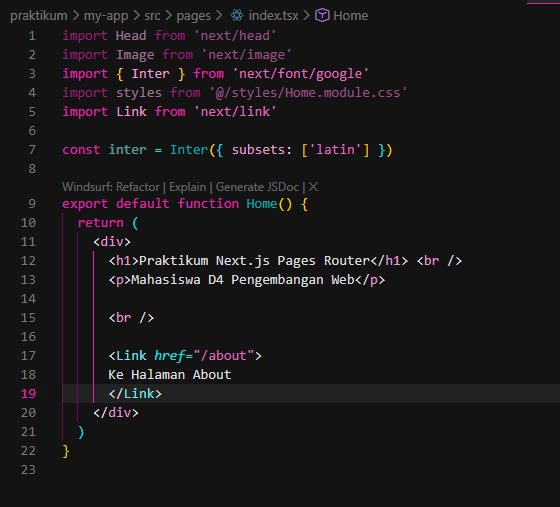
Link ditambahkan dengan properti href="/about" yang mengarah ke route halaman About. Setelah kode disimpan dan aplikasi dijalankan, pada halaman utama muncul tautan "Ke Halaman About" yang dapat diklik.
Saat tautan tersebut dipilih, pengguna akan diarahkan ke halaman About tanpa melakukan reload penuh pada browser. Hal ini menunjukkan bahwa fitur client-side routing pada Next.js berjalan dengan baik.
2. Hasilnya
    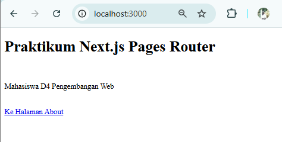
Saat aplikasi dijalankan dan diakses melalui http://localhost:3000, halaman utama berhasil ditampilkan dengan judul "Praktikum Next.js Pages Router" serta terdapat tautan navigasi bertuliskan "Ke Halaman About".
Ketika tautan tersebut diklik, pengguna diarahkan ke halaman About dengan route /about. Halaman About menampilkan informasi berupa nama, NIM, dan program studi sesuai dengan kode yang telah dibuat.
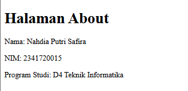

---

## Pertanyaan Refleksi

1. Mengapa Pages Router disebut sebagai routing berbasis file?
Jawaban : Karena pada Pages Router di Next.js, sistem routing ditentukan berdasarkan struktur file di dalam folder pages/.
Setiap file yang dibuat di dalam folder tersebut otomatis menjadi sebuah route (URL), Jadi tidak perlu konfigurasi routing manual seperti di React biasa.

2. Apa perbedaan Next.js dengan React standar (CRA)?
Jawaban : React standar seperti Create React App hanya menyediakan library untuk membangun UI dan membutuhkan konfigurasi tambahan untuk routing, SEO, dan optimasi. Sedangkan Next.js Sudah memiliki routing otomatis (file-based routing), Mendukung Server-Side Rendering (SSR), Mendukung Static Site Generation (SSG), Optimasi performa dan SEO lebih baik, Sudah terkonfigurasi lebih lengkap sejak awal. Jadi Next.js lebih siap untuk pengembangan aplikasi skala produksi.

3. Apa fungsi perintah npm run dev?
Jawaban : Perintah npm run dev digunakan untuk menjalankan aplikasi dalam mode development (server pengembangan).

4. Apa perbedaan npm run dev dan run build ?
Jawaban : Perintah npm run dev digunakan untuk menjalankan aplikasi dalam mode development, yaitu saat proses pengembangan sedang berlangsung. Pada mode ini, aplikasi dijalankan di server lokal dan mendukung fitur hot reload sehingga setiap perubahan kode dapat langsung terlihat tanpa perlu me-restart server. Sedangkan npm run build digunakan untuk membangun (build) aplikasi dalam mode production. Perintah ini akan mengoptimasi dan menghasilkan file siap deploy yang memiliki performa lebih baik dan ukuran yang lebih efisien. Jadi, npm run dev digunakan saat proses pengembangan, sedangkan npm run build digunakan sebelum aplikasi dipublikasikan.
