# JOBSHEET PRAKTIKUM
Routing, Nested Routing, Dynamic Routing, dan Layouting pada Next.js (Pages Router)

## Identitas
Nama: Nahdia Putri Safira

Kelas: TI3D

NIM: 2341720015

Program Studi: D4 Teknik Informatika

---

## Langkah 1 - Routing Dasar
Pada langkah pertama, dilakukan implementasi routing dasar menggunakan konsep file-based routing pada Next.js (Pages Router). Dalam Next.js, setiap file yang berada di dalam folder pages akan secara otomatis menjadi sebuah route tanpa memerlukan konfigurasi tambahan.

Awalnya, proyek hanya memiliki file index.tsx di dalam folder pages, yang secara otomatis menjadi halaman utama dengan URL /.

Selanjutnya, dibuat halaman baru bernama about. Dengan menambahkan file about.tsx di dalam folder pages, Next.js secara otomatis menghasilkan route baru dengan alamat /about.

Pengujian dilakukan dengan menjalankan aplikasi menggunakan perintah npm run dev, kemudian mengakses URL /about melalui browser. Halaman berhasil ditampilkan tanpa perlu menambahkan konfigurasi routing manual.

Hal ini membuktikan bahwa Next.js menerapkan sistem routing berbasis file yang sederhana dan efisien.

---

## Langkah 2 - Routing Menggunakan Folder
Pada langkah kedua, dilakukan perapihan struktur routing dengan memanfaatkan folder sebagai representasi route.

File about.tsx yang sebelumnya berada langsung di dalam folder pages dipindahkan ke dalam folder about dan diubah namanya menjadi index.tsx. Dengan demikian, struktur menjadi lebih terorganisir.

Konsep ini menunjukkan bahwa file index.tsx di dalam sebuah folder akan merepresentasikan root route dari folder tersebut. Meskipun struktur folder diubah, URL yang diakses tetap sama, yaitu /about.

Pendekatan ini memberikan keuntungan dalam pengelolaan project berskala besar, karena struktur folder menjadi lebih rapi dan memudahkan penambahan nested routing di dalamnya.

---

## Langkah 3 - Nested Routing
a. Buat Folder Setting

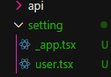

Modifikasi Kodenya
- user.tsx
    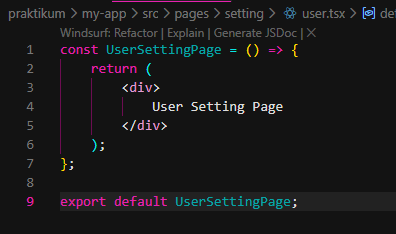
    Akses : 
    
- app.tsx
    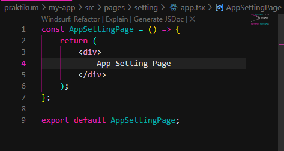
    Akses : 
    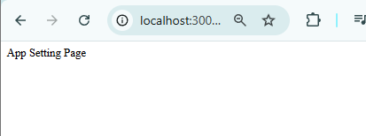
Modifikasi struktur folder pages dengan menambahkan folder user dan user.tsx pada setting dipindah ke folder user dan rubah file user.tsx menjadi index.tsx
    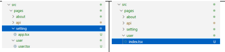
    Jalankan pada browser
    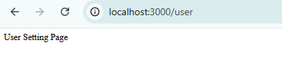

b. Nested Lebih Dalam

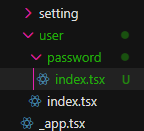

Akses :
    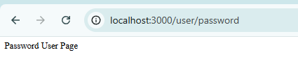

---
## Langkah 4 - Dynamic Routing

Pada langkah keempat, dilakukan implementasi dynamic routing pada Next.js menggunakan fitur Pages Router. Dynamic routing digunakan untuk menangani URL yang memiliki parameter dinamis, sehingga satu file dapat digunakan untuk mengakses berbagai data berdasarkan nilai parameter pada URL.

a. Buat halaman produk
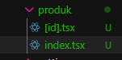
- Modifikasi index.tsx
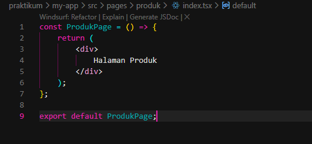
Hasil Modifikasi
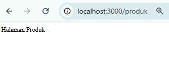
- Modifikasi [id].tsx
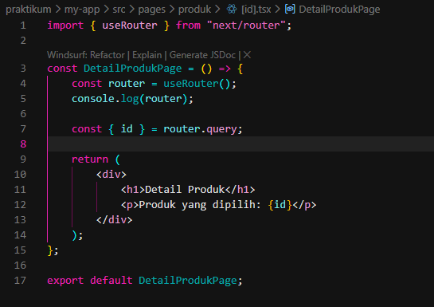
Hasil Modifikasi
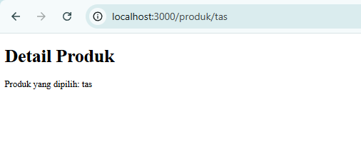
- Cek menggunakan console.log
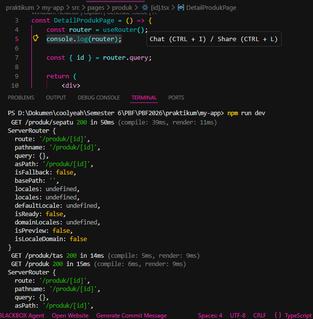
jika berhasil maka pada console.log dapat terlihat pada id terdapat nilai sepatu.
- Modifikasi [id].tsx agar dapat mengambil nilai dari id
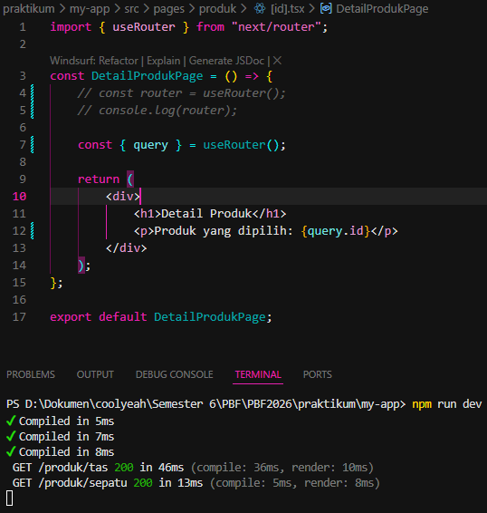
- Buka Browser
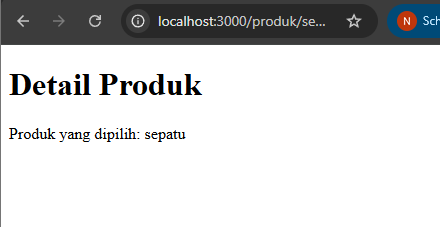
b. Uji di Browser
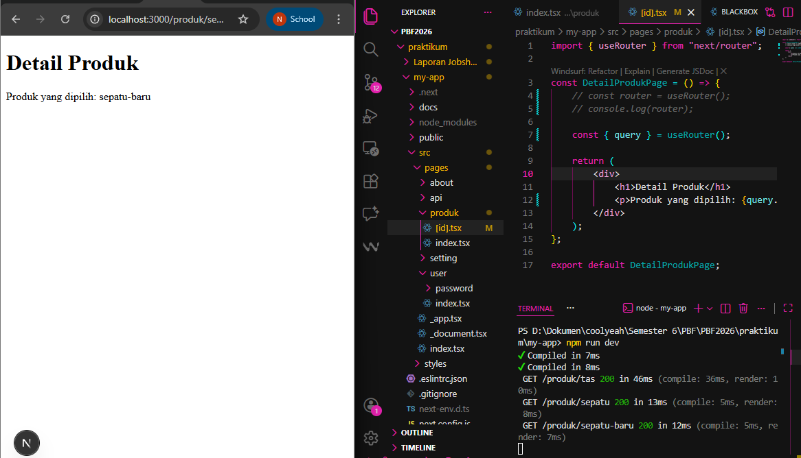
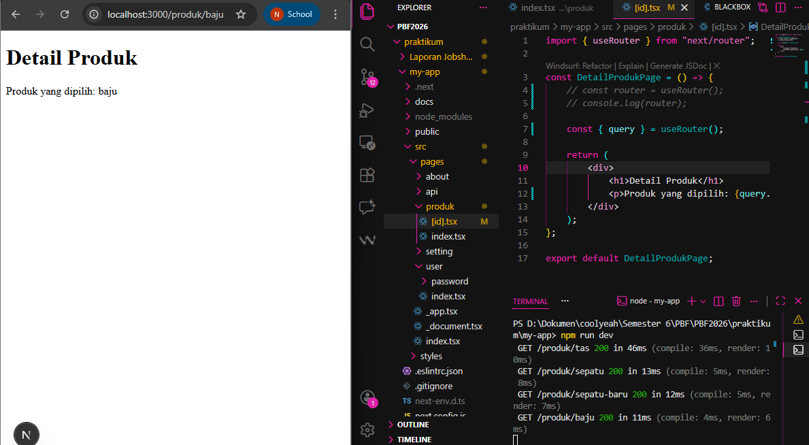

---
## Langkah 5 - Membuat Komponen Navbar
a. Struktur Komponen
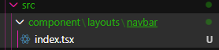
- Modifikasi index.tsx
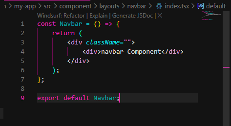
- Buka global.css untuk nantinya digunakan pada style navbar
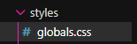
Modifikasi : 
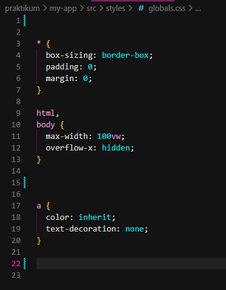
- Modifikasi index.tsx dengan menambahkan classname untuk style navbar
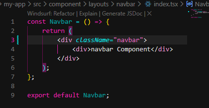
- Modifikasi globals.css

- Modifikasi index.tsx pada folder pages
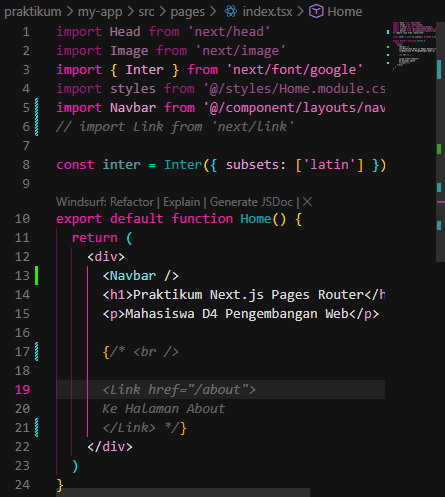
- Modifikasi _app.tsx ( pastikan import styles dalam keadaan aktif)
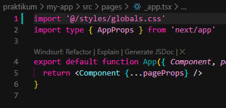
- Jalankan di browser
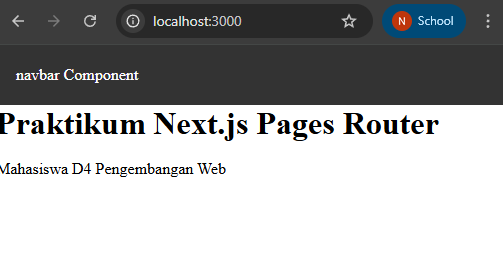
- Modifikasi navbar agar tampil di semua page
    - Modifikasi index.tsx pada folder page ( hapus navbar )
    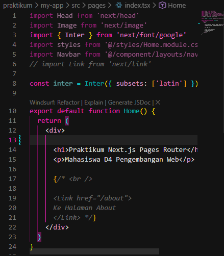
    - Modifikasi _app.tsx ( Menambahkan navbar )
    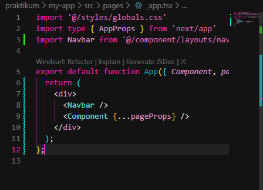
- Jalankan di browser
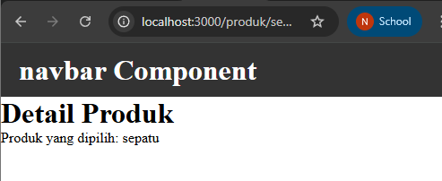
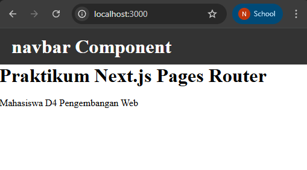

---
## Langkah 6 - Membuat Layout Global (App Shell)
a. Buat AppShell
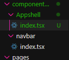
- Modifikasi index.tsx pada AppShell
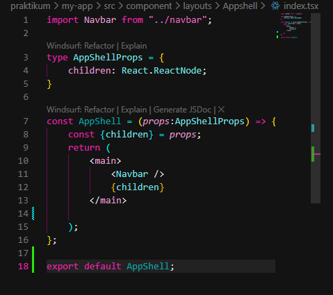

---
## Langkah 7 -  Implementasi Layout di _app.tsx
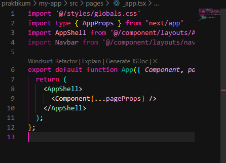
- Modifikasi pada _app.tsx tambahkan footer seperti pada gambar dan amati hasilnya
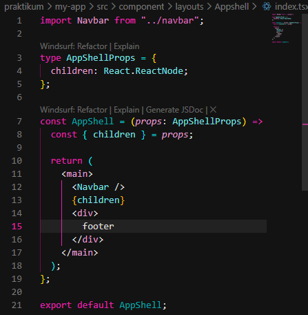
    - Hasilnya
    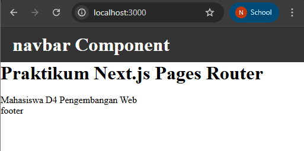
    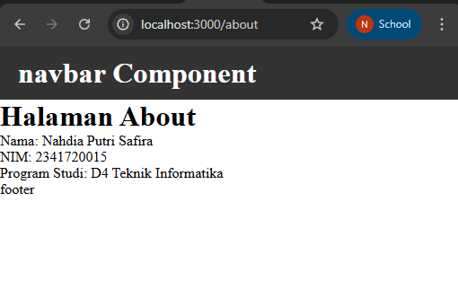

---
## Tugas Praktikum

1. Routing
- Buat halaman :
    - /profile

        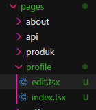
        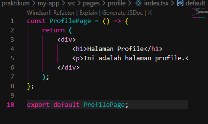
        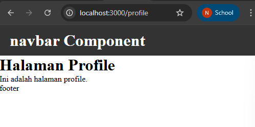
    - /profile/edit

        
        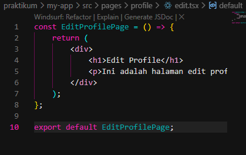
        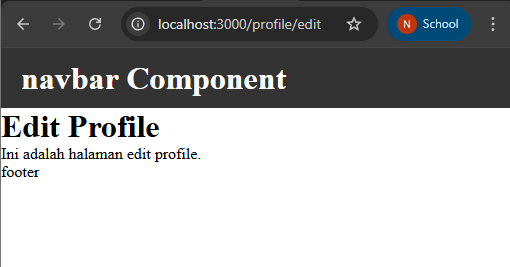
2. Dynamic Routing
    - Buat routing: /blog/[slug]
        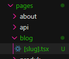
        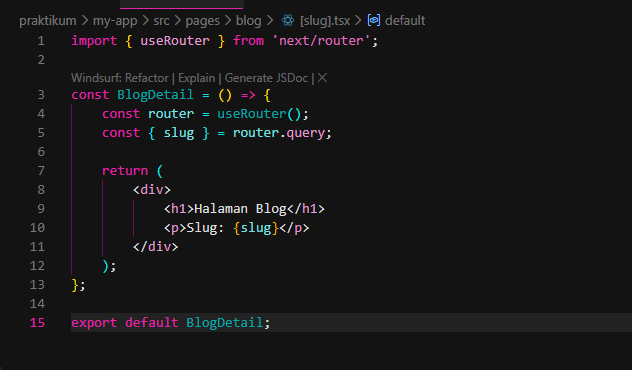
        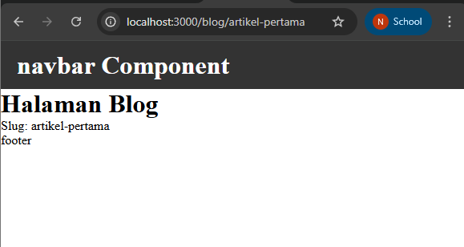
3. Layout
    - Tambahkan Footer pada AppShel
        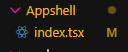
        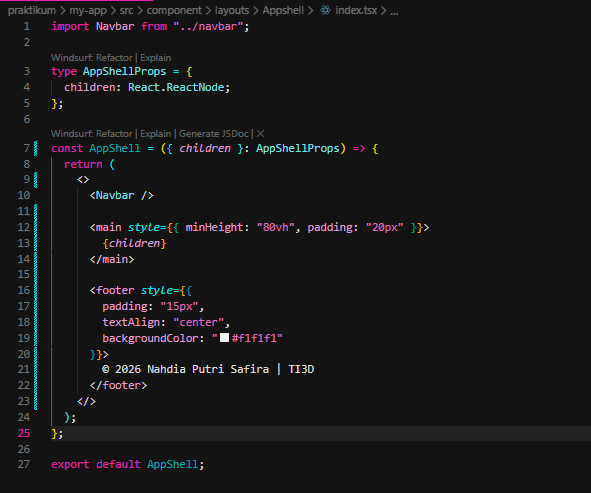
        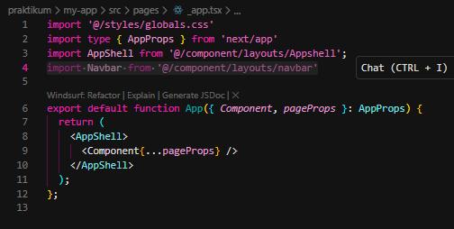
    - Footer tampil di semua halaman 
        Berikut 3 contohnya
        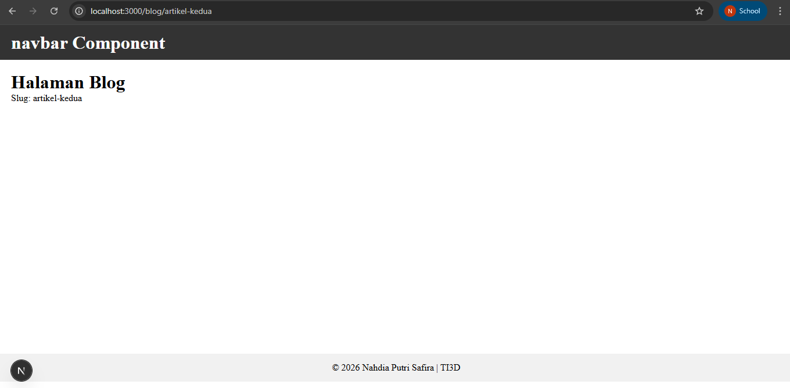
        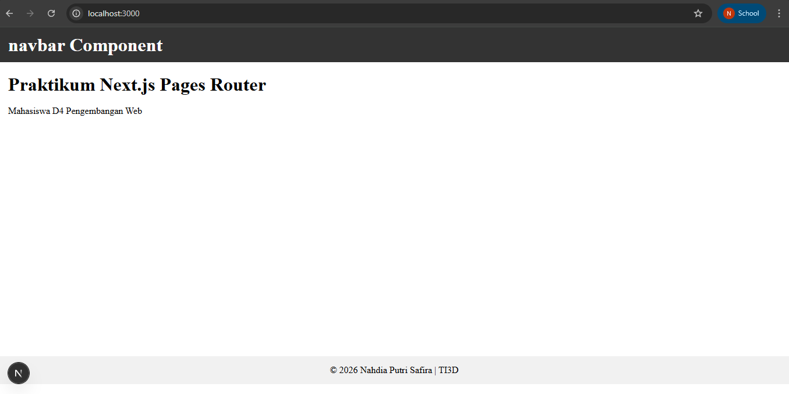
        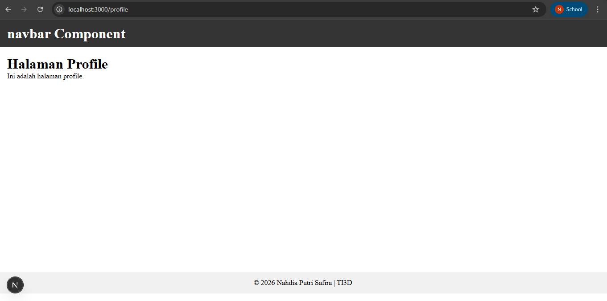

---
## Pertanyaan Refleksi
1. Apa perbedaan routing berbasis file dan routing manual?
Routing berbasis file otomatis dibuat berdasarkan struktur folder dan file di dalam pages/, sehingga tidak perlu konfigurasi tambahan. Sedangkan routing manual harus ditentukan satu per satu melalui konfigurasi seperti pada React Router.
2. Mengapa dynamic routing penting dalam aplikasi web?
Dynamic routing memungkinkan satu halaman menangani banyak URL berbeda menggunakan parameter. Hal ini membuat aplikasi lebih fleksibel dan efisien, terutama untuk halaman seperti blog atau produk.
3. Apa keuntungan menggunakan layout global dibanding memanggil komponen satu per satu?
Layout global membuat komponen seperti Navbar dan Footer tampil di semua halaman tanpa dipanggil berulang. Ini membuat kode lebih rapi, efisien, dan mudah dikelola.