# JOBSHEET PRAKTIKUM
Catch-All Routing, Optional Catch-All, Linking & Navigating pada Next.js Pages
Router

## Identitas
Nama: Nahdia Putri Safira

Kelas: TI3D

NIM: 2341720015

Program Studi: D4 Teknik Informatika

---

## Langkah 1 – Menjalankan Project

1. Buka folder project Next.js

2. Jalankan server: npm run dev

3. Akses : http://localhost:3000

    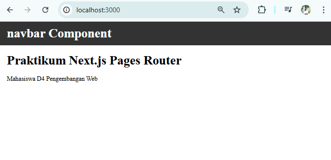

---

## Langkah 2 - Membuat Catch All Route

1. Masuk ke folder pages

2. Buat folder shop dan file[...slug].tsx

    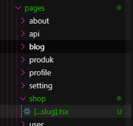

3. Modifikasi isi file [...slug].tsx

    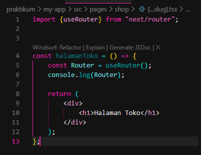

    - Jalankan browser menggunakan url localhost:3000/shop/baju/tshirt/pria

    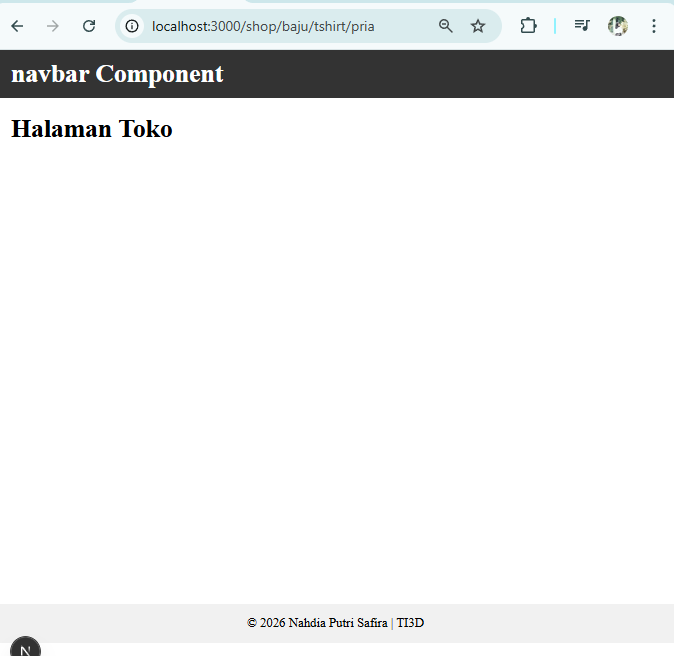

    - Cek console.log menampilkan nilai querynya

    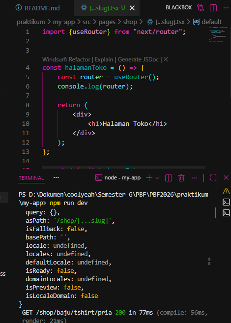

    - Modifikasi [...slug].tsx untuk menampilkan nilai query

    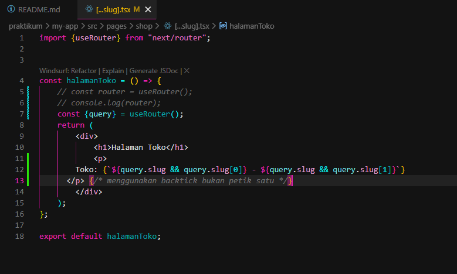

    Setelah dilakukan perubahan, halaman tidak hanya menampilkan judul, tetapi juga menampilkan nilai slug sesuai dengan URL yang diakses. Hasil pengujian menunjukkan bahwa setiap segmen URL berhasil ditangkap dan ditampilkan dalam bentuk array.

---

## Langkah 3 -  Pengujian Catch-All Route

1. Akses URL 

    - /shop/clothes

    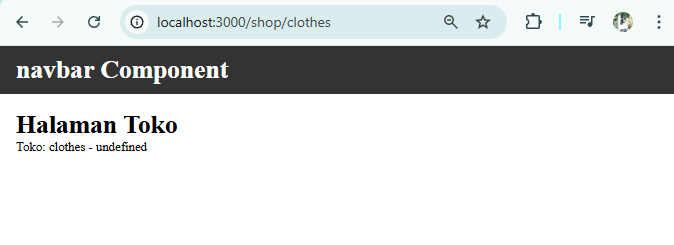

    - /shop/clothes/tops

    

    - /shop/clothes/tops/t-shirt

    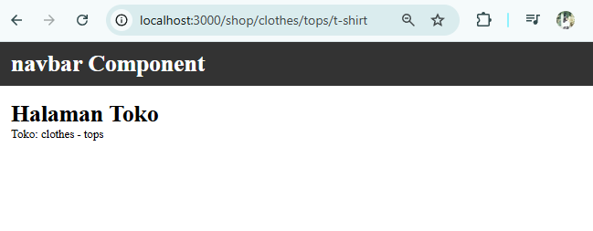

    Pada saat dilakukan pengujian, ditemukan bahwa beberapa segmen URL terbaca sebagai undefined. Hal ini terjadi karena pada kode sebelumnya hanya menampilkan slug[0] dan slug[1], sehingga hanya dua segmen pertama yang dapat ditampilkan. Jika jumlah segmen URL lebih dari dua, maka segmen berikutnya tidak akan terbaca dan dapat menyebabkan nilai undefined.
    Permasalahan tersebut terjadi karena parameter slug berbentuk array dengan jumlah elemen yang dinamis, tergantung pada panjang URL yang diakses.
    Untuk mengatasi permasalahan tersebut, dilakukan perubahan kode dengan menampilkan seluruh isi array slug menggunakan metode yang dapat membaca semua elemen array, seperti map() atau join(). Dengan cara ini, berapapun jumlah segmen pada URL, seluruhnya dapat ditampilkan tanpa menghasilkan nilai undefined.

2. Modifikasi […slug].tsx

    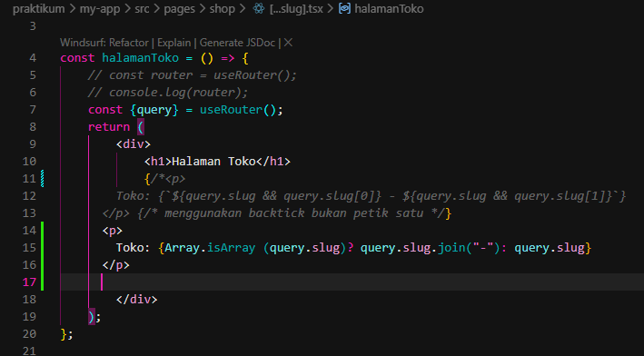

3. Jalankan Browser

    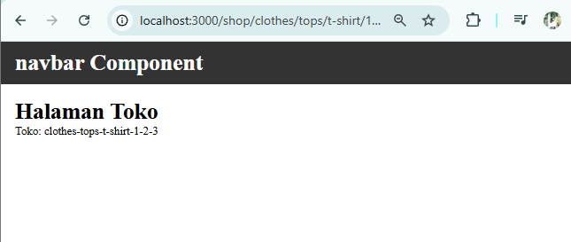

Tapi untuk saat ini menggunakan

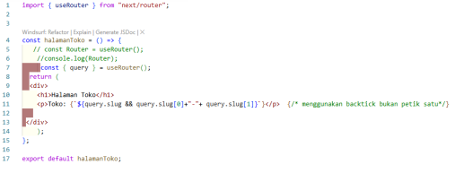

---

## Langkah 4 -  Optional Catch-All Route

1. Jika menggunakan [...slug].js maka ketika mengakses shop akan terjadi error

    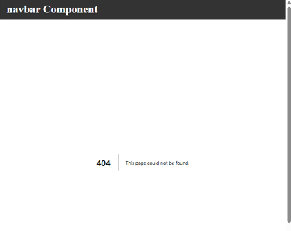

2. Solusinya dengan Rename file: [...slug].js → [[...slug]].js

    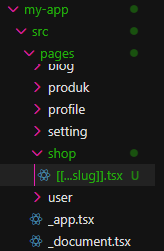

3. Akses /shop

    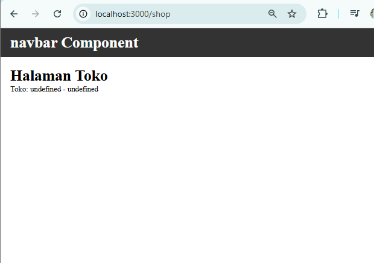

4. Halaman dapat diakses meskipun tanpa parameter.

---

## Langkah 5 - Validasi Parameter

Tambahkan validasi agar tidak error saat slug kosong:

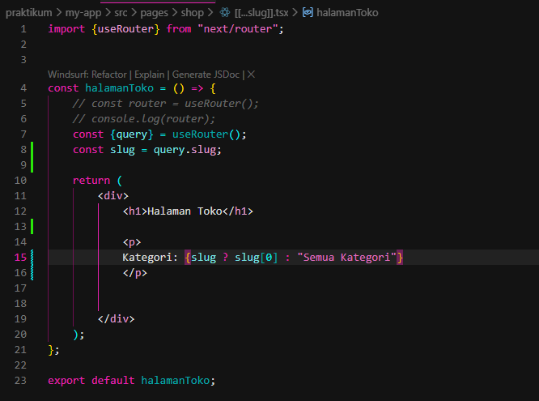

---

## Langkah 6 - Membuat Halaman Login & Register

1. Buat folder pages/auth

    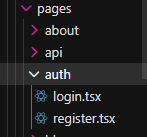

2. Buat File login.tsx dan register.tsx

    - Modifikasi login.jsx:

    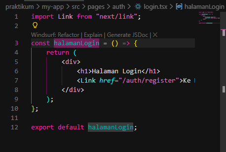

    - Modifikasi register.jsx:

    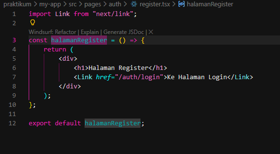

---

## Langkah 7 -  Navigasi Imperatif (router.push)

1. Tambahkan button login:

    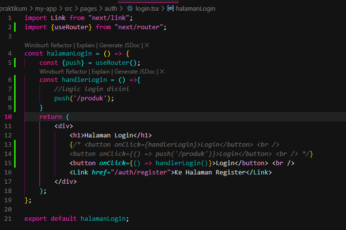

2. Klik Tombol, perhatikan perpindahan halaman tanpa reload

    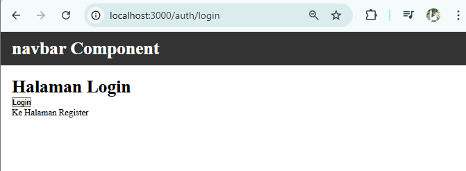

3. Jika di klik button login makan akan menuju /produk

    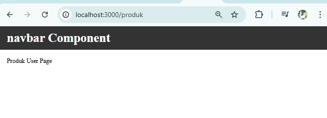

    - Pastikan code untuk redirect tidak aktif , jika aktif maka ketika masuk ke produk akan lansung redirect ke login

    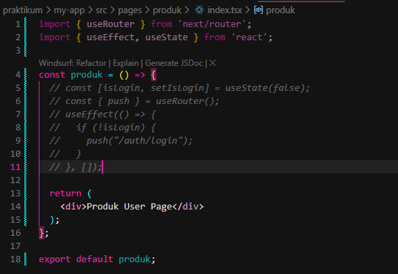

---

## Langkah 8 -  Simulasi Redirect (Belum Login)

1. Di halaman product, pada index.tsx tambahkan beberapa cod

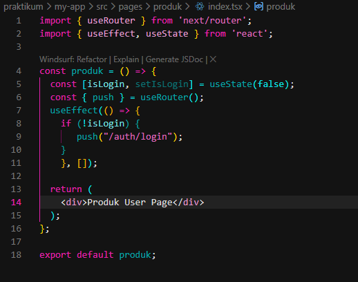

2. Jika Akses /product → otomatis diarahkan ke login.

---

## Tugas Praktikum

1. Buat catch-all route: /category/[...slug].js

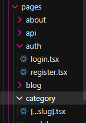

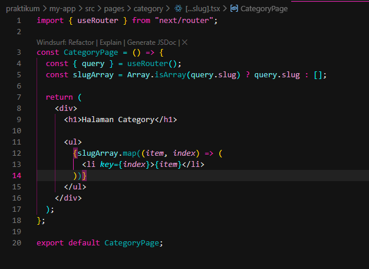

Hasilnya menampilkan seluruh parameter URL dalam bentuk list.

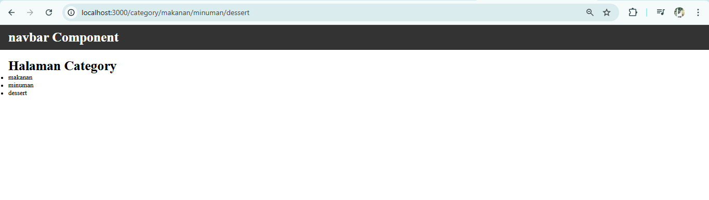

2. Implementasi Navigasi

Pada tugas ini dilakukan implementasi navigasi menggunakan dua metode, yaitu navigasi imperatif dan deklaratif.
Navigasi imperatif diterapkan pada halaman Login menggunakan router.push('/produk') yang dipanggil melalui event onClick pada tombol Login. Ketika tombol diklik, pengguna diarahkan ke halaman Produk tanpa melakukan reload.
Selain itu, digunakan komponen Link untuk navigasi deklaratif antara halaman Login dan Register. Dengan demikian, perpindahan halaman dapat dilakukan dua arah tanpa refresh browser.
Berdasarkan pengujian, seluruh navigasi berjalan dengan baik sesuai dengan konsep routing pada Next.js.

- Login -> Produk

    - Buka browser dengan akses /auth/login

    - Klik tombol login

    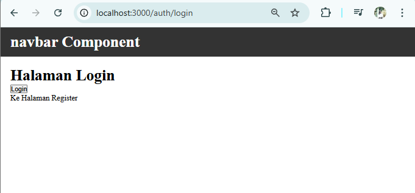

    - Yang harus terjadi adalah URL berubah jadi /produk dan tampilan berubah menjadi produk user page

    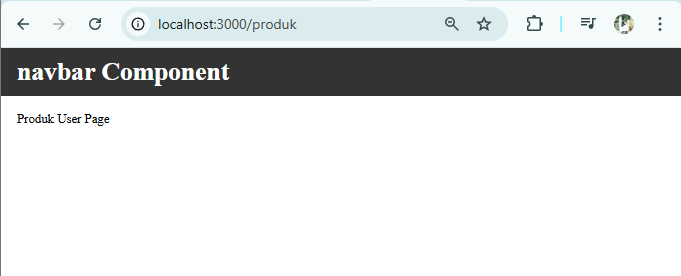

- login -> register

    - Dari halaman login klik "Ke Halaman Register"

    

    - Harus pindah ke /auth/register

    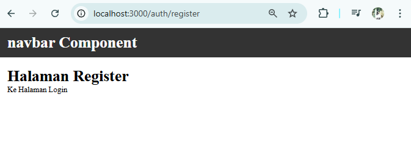

- Register -> login

    - Dari halaman register klik "ke halaman login"

    

    - Harus balik ke /auth/login

    

3. Terapkan redirect otomatis ke login jika user belum login.

Pada tugas ini diterapkan fitur redirect otomatis pada halaman Produk jika pengguna belum login. Implementasi dilakukan menggunakan useEffect dan router.push() dari next/router.
Variabel isLogin diset bernilai false untuk mensimulasikan kondisi pengguna belum login. Ketika halaman /produk diakses,

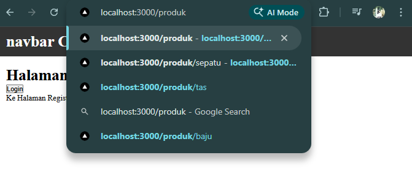

sistem secara otomatis mengarahkan pengguna kembali ke halaman /auth/login.

Berdasarkan hasil pengujian, redirect berjalan dengan baik dan halaman Produk tidak dapat diakses sebelum login, sesuai dengan tujuan simulasi autentikasi sederhana.

---
Pertanyaan Evaluasi

1. Apa perbedaan [id].js dan [...slug].js?

Perbedaan [id].js dan [...slug].js adalah pada jumlah segmen URL yang dapat ditangkap. File [id].js digunakan untuk menangkap satu parameter atau satu segmen URL saja sehingga nilai yang diterima berbentuk string. Sedangkan [...slug].js merupakan catch-all route yang digunakan untuk menangkap lebih dari satu segmen URL sekaligus, sehingga parameter yang diterima berbentuk array sesuai jumlah segmen yang diakses.

2. Mengapa slug berbentuk array?

Slug berbentuk array karena catch-all route dirancang untuk menangkap banyak segmen URL yang dipisahkan oleh tanda garis miring (/). Setiap segmen akan disimpan sebagai satu elemen di dalam array, sehingga jika URL memiliki tiga segmen tambahan maka slug akan berisi tiga indeks array.

3. Kapan sebaiknya menggunakan Link dan router.push()?

Link sebaiknya digunakan untuk navigasi deklaratif seperti berpindah antar halaman melalui menu atau tombol yang mengarah langsung ke halaman tertentu. Sedangkan router.push() digunakan untuk navigasi imperatif, yaitu perpindahan halaman yang terjadi karena suatu aksi atau kondisi tertentu, misalnya setelah login berhasil atau saat melakukan redirect berdasarkan validasi.

4. Mengapa navigasi Next.js tidak me-refresh halaman?

Navigasi Next.js tidak me-refresh halaman karena Next.js menggunakan client-side navigation. Ketika berpindah halaman menggunakan Link atau router.push(), hanya komponen yang berubah yang dirender ulang tanpa memuat ulang seluruh halaman, sehingga perpindahan terasa lebih cepat dan seperti aplikasi single page application (SPA).

