# JOBSHEET PRAKTIKUM
Styling pada Next.js (Global CSS, CSS Module, Inline Style, SCSS, dan Tailwind CSS)

## Identitas
Nama: Nahdia Putri Safira

Kelas: TI3D

NIM: 2341720015

Program Studi: D4 Teknik Informatika

---

## Langkah 1 - Global CSS

a. File Global

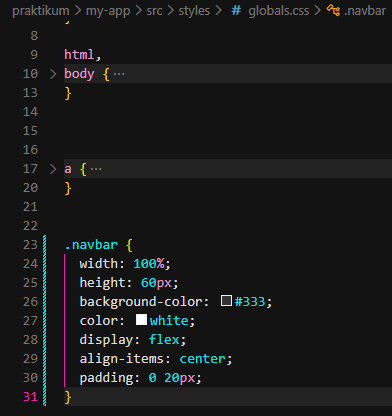

b. Import Global CSS

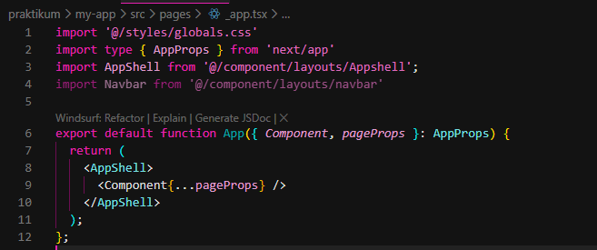

---

## Langkah 2 - CSS Module (Local Scope)

a. Struktur Komponen Navbar

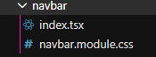

b. File CSS Module

- Modifikasi global.css

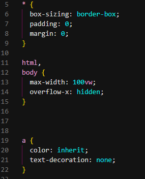

- Modifikasi navbar.module.css

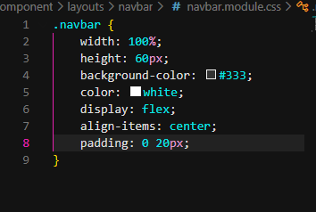

c. Pemanggilan di Komponen

- Modifikasi kode pada index.tsx pada folder navbar

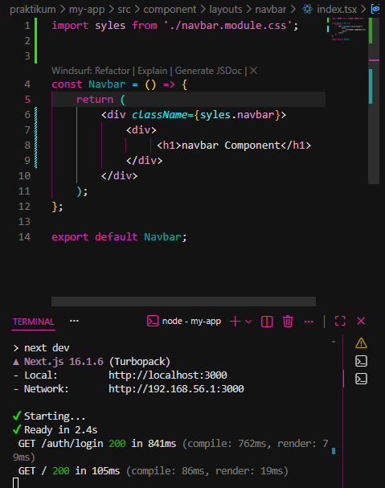

- Jalankan pada browser

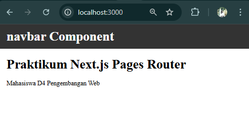

---

## Langkah 3 - Styling untuk Pages (CSS Module)

a. Contoh Login Page

- Tambahkan login.module.css pada folder auth

- Modifikasi login.module.css

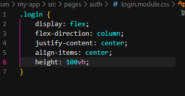

- Modifikasi login.tsx
    
    - Tambahkan import styles

    - Tambahkan classname = {styles.login}

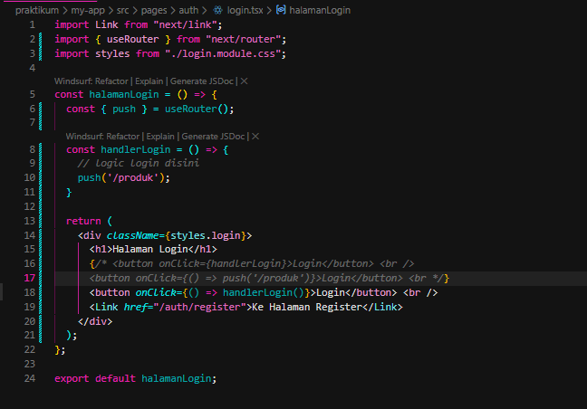

- Jalankan browser

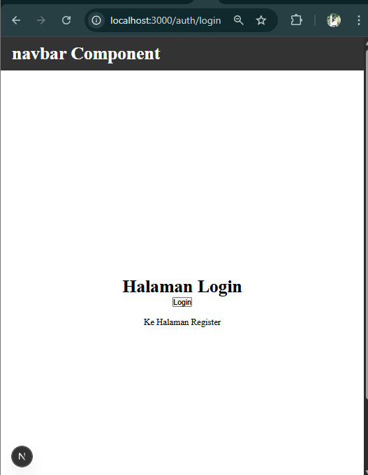

---

## Langkah 4 - Conditional Rendering Navbar (Tanpa Navbar di Login)

- Modifikasi index.tsx pada folder Appsheel

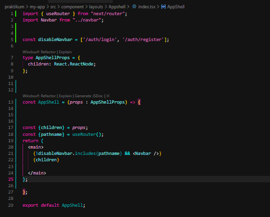

- Jalankan browser

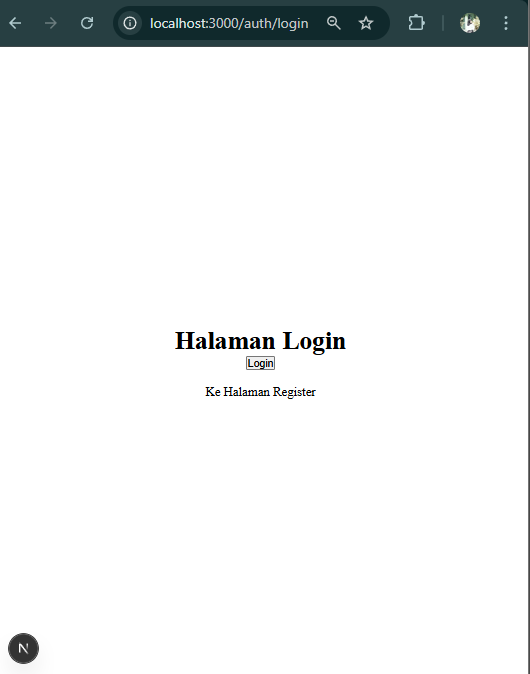

---

## Langkah 5 - Refactoring Struktur Project (Best Practice)

Pada langkah ini, praktikan melakukan refactoring struktur project agar lebih rapi dan sesuai dengan best practice pengembangan Next.js. File halaman login dipindahkan dari pages/login.tsx ke pages/auth/login.tsx untuk menjaga kebersihan routing. Selanjutnya, praktikan membuat folder src/views/auth/Login/ dan memindahkan file index.tsx serta Login.module.css ke dalam folder tersebut agar logic dan tampilan terpisah.

Praktikan kemudian memperbarui import path pada file login.tsx dan menghapus file styling lama yang berada di folder pages untuk menghindari duplikasi. Setelah proses refactoring selesai, aplikasi dijalankan kembali dan halaman login berhasil ditampilkan tanpa error. Dengan demikian, struktur project menjadi lebih terorganisir dan mudah dikembangkan.

---

## Langkah 6 - Inline Styling (CSS-in-JS)

- Modifikasi index.tsx pada folder views/auth/login

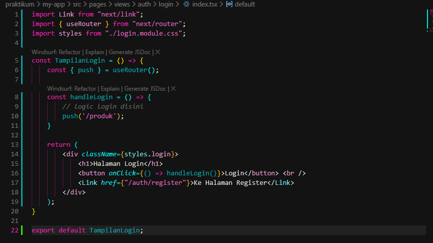

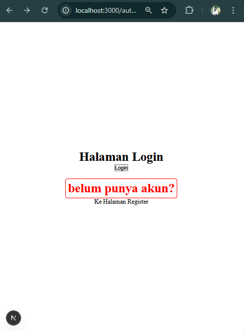

---

## Langkah 7 - Kombinasi Global CSS + CSS Module

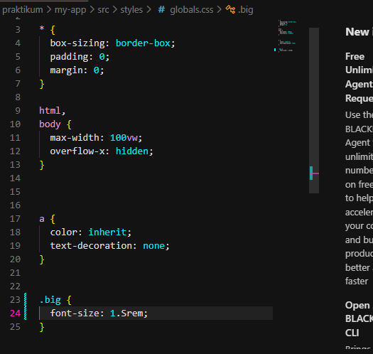

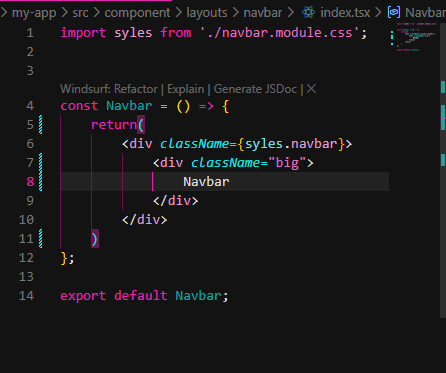

## Langkah 8 - SCSS (SASS)

a. install SASS

Pada langkah ini, praktikan menginstal SASS dengan menjalankan perintah npm install sass pada terminal. Setelah instalasi berhasil, praktikan membuat file colors.scss untuk menyimpan variabel global dan membuat login.module.scss pada folder views/auth/login/. File styling pada komponen login kemudian diubah dari .css menjadi .scss dan import pada index.tsx diperbarui.

Setelah aplikasi dijalankan kembali, hasil menunjukkan bahwa styling SCSS berhasil diterapkan dengan baik. Dengan demikian, penggunaan SCSS dapat membantu pengelolaan style yang lebih terstruktur dan fleksibel.

b. Global Variable
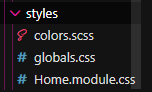

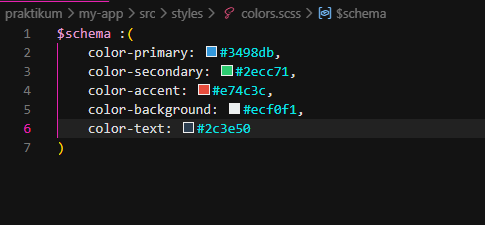

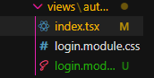

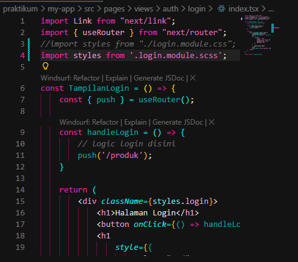

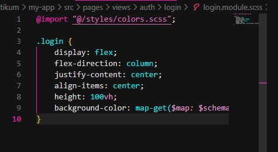

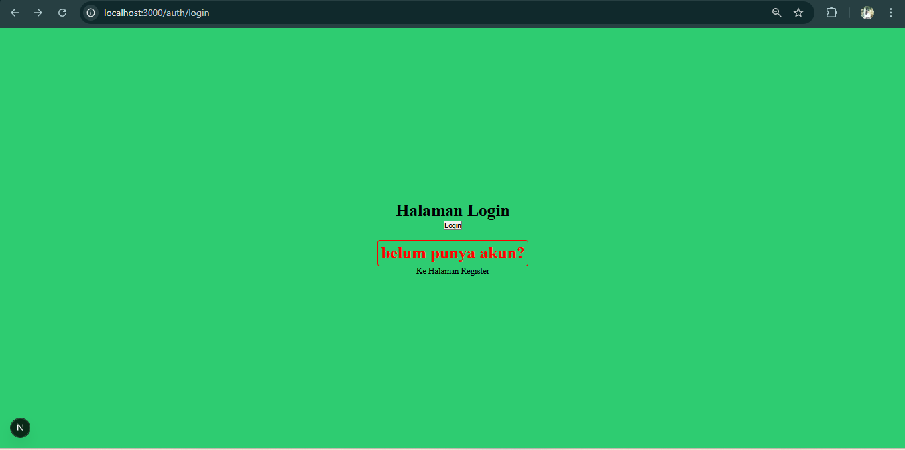

---

## Langkah 9 - Tailwind CSS

Pada langkah ini, praktikan melakukan instalasi Tailwind CSS pada project Next.js. Praktikan menjalankan perintah npm install -D tailwindcss postcss autoprefixer untuk menambahkan dependency yang dibutuhkan. Selanjutnya, praktikan menjalankan perintah npx tailwindcss init -p untuk menghasilkan file konfigurasi tailwind.config.js dan postcss.config.js.

Setelah proses instalasi selesai, praktikan memastikan bahwa konfigurasi berhasil dibuat dan tidak terjadi error pada terminal. Dengan demikian, Tailwind CSS berhasil terpasang dan siap digunakan dalam project.

---

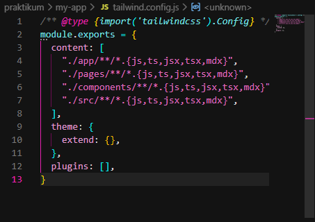

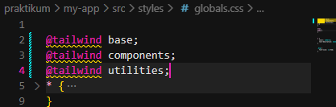

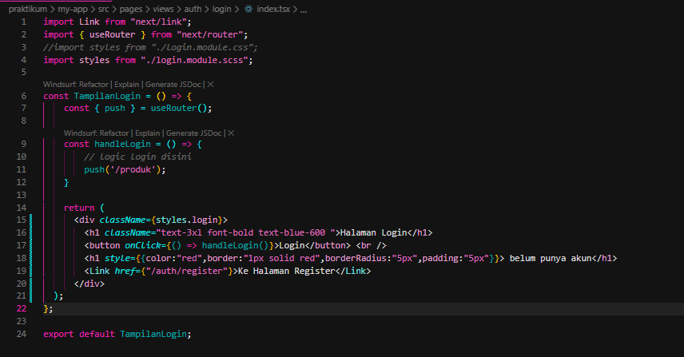

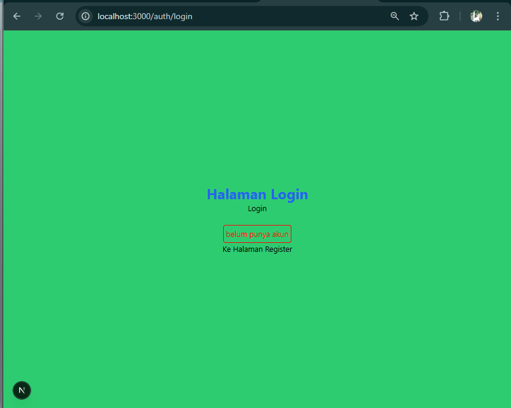

---

## Tugas Praktikum

1.  Buat halaman Register, Gunakan CSS Module

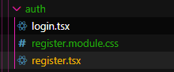

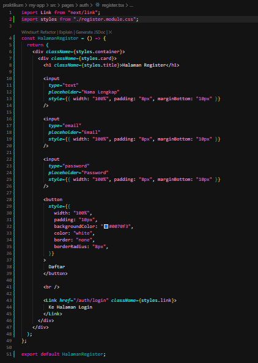

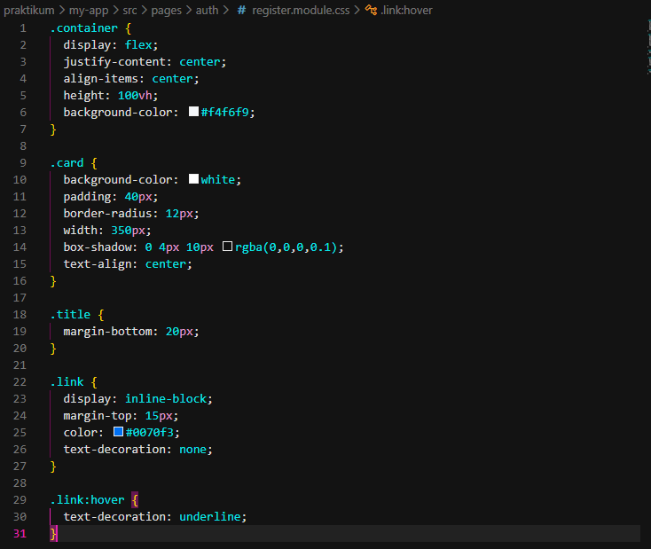

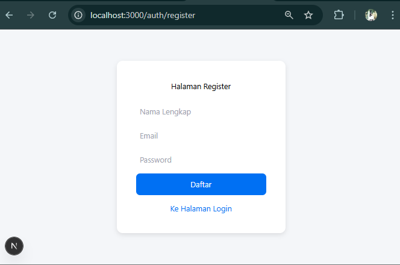

2. Refactor halaman Produk ke folder views Pisahkan Hero Section dan Main Section

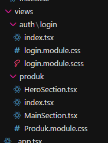

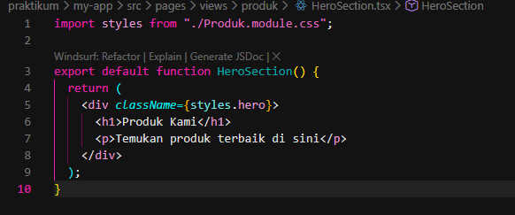

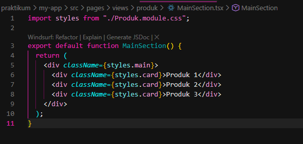

3. Terapkan Tailwind CSS Gunakan minimal 5 utility class

Pada tugas ini, saya menerapkan Tailwind CSS pada project Next.js yang telah dibuat. Proses instalasi dilakukan menggunakan perintah npm install -D tailwindcss postcss autoprefixer dan dilanjutkan dengan konfigurasi pada file tailwind.config.js. Selanjutnya, saya menambahkan directive @tailwind base, @tailwind components, dan @tailwind utilities pada file global.css agar Tailwind dapat digunakan secara global. Setelah konfigurasi selesai, Tailwind CSS berhasil diterapkan pada halaman Produk.

Saya menggunakan Tailwind CSS pada file HeroSection.tsx yang berada di dalam folder views/produk. Pada bagian tersebut, saya menerapkan beberapa utility class seperti bg-blue-600, text-white, text-center, py-12, text-4xl, dan font-bold untuk mengatur tampilan halaman. Utility class tersebut digunakan untuk mengatur warna latar, warna teks, perataan teks, jarak padding, serta ukuran dan ketebalan font. Dengan menggunakan Tailwind CSS, proses styling menjadi lebih cepat, ringkas, dan tidak memerlukan penulisan CSS tambahan secara manual.

