# JOBSHEET PRAKTIKUM
Custom Document dan Custom Error Page pada Next.js

## Identitas
Nama: Nahdia Putri Safira

Kelas: TI3D

NIM: 2341720015

Program Studi: D4 Teknik Informatika

---

## Langkah 1 - Menjalankan Project
Pada langkah ini, praktikan membuka folder project dan menjalankan perintah `npm run dev` pada terminal untuk memastikan aplikasi berjalan di `http://localhost:3000`. Jika terdapat kendala tampilan akibat Tailwind lama, praktikan melakukan uninstall tailwindcss dan menghapus file konfigurasi terkait.

---

## Langkah 2 - Membuat Custom Document
Praktikan melakukan modifikasi pada file `src/pages/_document.tsx` untuk mengatur struktur dasar HTML global, seperti mengubah atribut bahasa menjadi `lang="id"`.

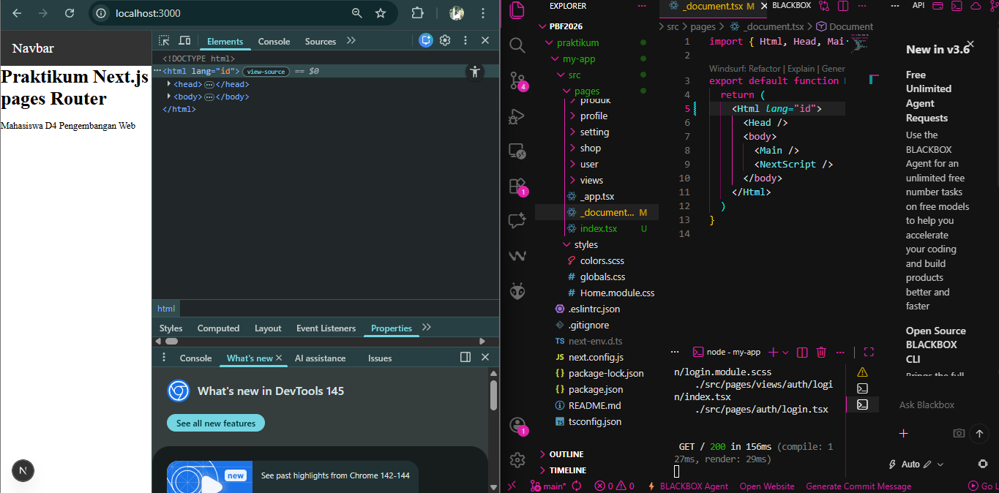

---

## Langkah 3 - Pengaturan Title per Halaman
Meskipun struktur dasar diatur di `_document.tsx`, pengaturan judul halaman (`<title>`) dilakukan di masing-masing komponen halaman. Praktikan menambahkan tag `<Head>` pada file `pages/index.js`.

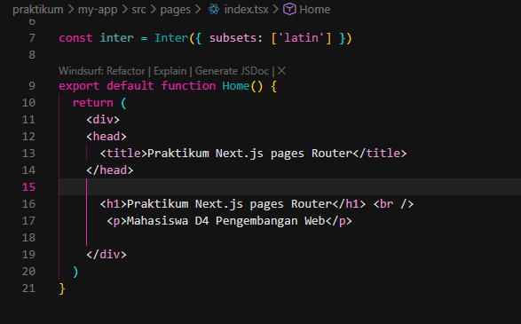

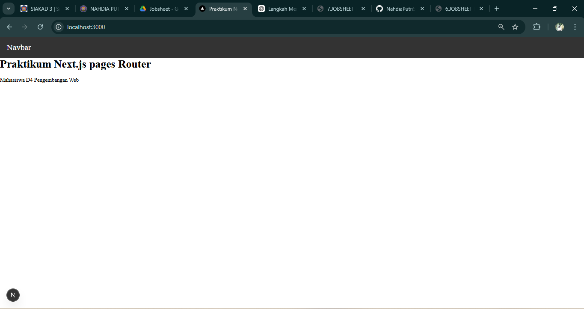

---

## Langkah 4 - Membuat Custom Error Page (404)
Praktikan membuat file baru `pages/404.tsx` untuk menangani route yang tidak ditemukan. Secara default, Next.js akan mengarahkan user ke halaman ini jika mengakses URL yang salah.

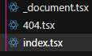

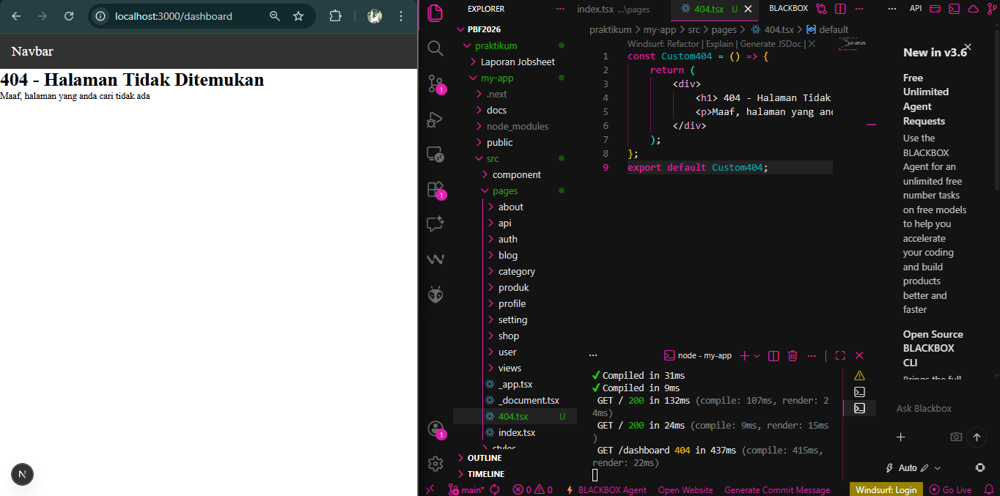

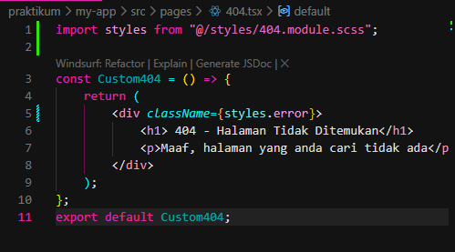

---

## Langkah 5 - Styling Halaman 404
Untuk mempercantik tampilan, praktikan membuat file `styles/404.module.scss` dan menerapkan styling Flexbox agar konten berada di tengah layar. Selain itu, dilakukan handling pada `AppShell` agar Navbar tidak muncul pada halaman error ini dengan menambahkan route `/404` ke dalam `disableNavbar`.

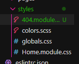

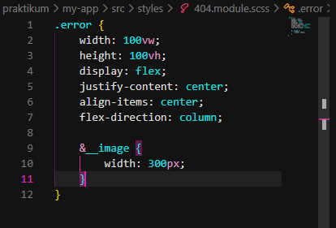

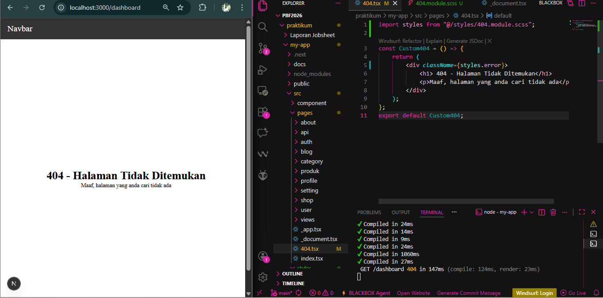

---

## Langkah 6 - Menampilkan Gambar dari Folder Public
Praktikan mengunduh gambar ilustrasi dari unDraw, menyimpannya di folder `public/` dengan nama `page-not-found.png`, dan memanggilnya di dalam komponen `404.tsx` menggunakan tag ``.

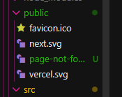

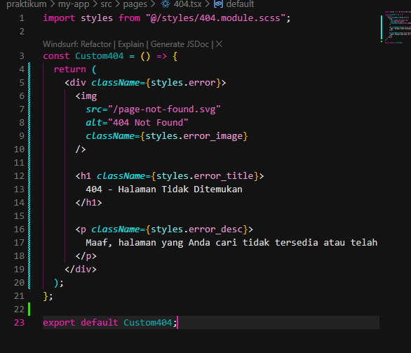

---

## Tugas Praktikum

### Tugas 1 & 2: Custom Halaman 404 (Wajib)
Saya telah melakukan kustomisasi pada halaman 404 dengan menambahkan judul yang lebih menarik, deskripsi singkat, dan memastikan layout tetap responsif serta Navbar tidak muncul.

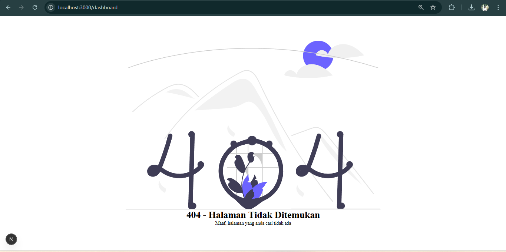

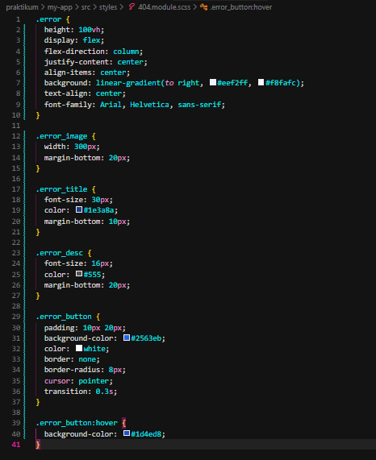

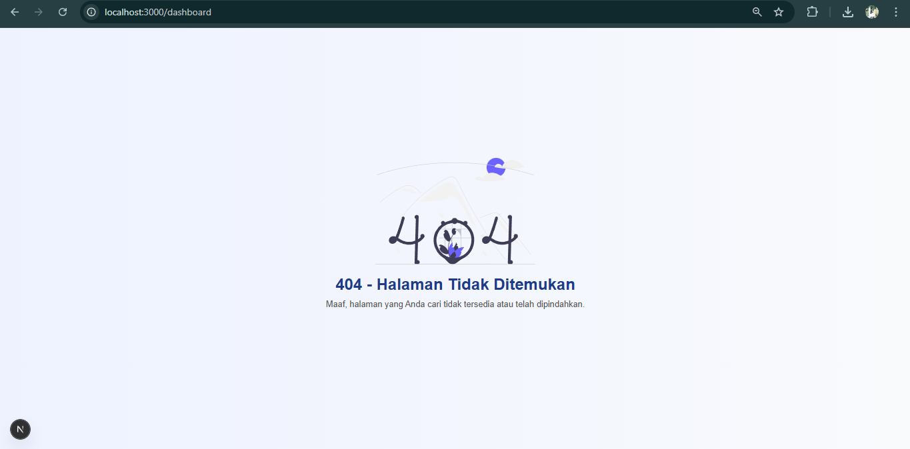

### Tugas 3: Navigasi Kembali ke Home (Pengayaan)
Saya menambahkan tombol "Kembali ke Home" menggunakan komponen `Link` dari `next/link` agar pengguna dapat kembali ke halaman utama dengan mudah tanpa reload halaman.

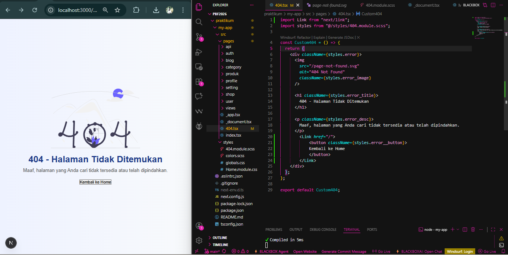

---

## Pertanyaan Evaluasi

1. **Apa fungsi utama _document.js?**
   Digunakan untuk memodifikasi struktur dasar HTML (`<html>`, `<body>`) dan menambahkan meta tag atau script external (CDN) secara global.

2. **Mengapa <title> tidak disarankan di _document.js?**
   Karena `<title>` yang diletakkan di sana bersifat statis. Agar SEO lebih baik dan judul tab berubah sesuai konten halaman, `<title>` harus diletakkan di masing-masing halaman menggunakan komponen `<Head>`.

3. **Apa perbedaan halaman biasa dan halaman 404.js?**
   Halaman biasa diakses melalui route tertentu, sedangkan `404.js` adalah halaman khusus yang otomatis dipicu oleh sistem Next.js ketika user mengakses route yang tidak terdaftar.

4. **Mengapa folder public tidak perlu di-import?**
   Karena Next.js secara otomatis menyajikan file di dalam folder `public` sebagai aset statis di root path (`/`). Kita cukup menuliskan `/nama-file.png` untuk mengaksesnya.