# JOBSHEET PRAKTIKUM
API Routes di Next.js dan Integrasi Firebase (Bagian 1)

## Identitas
Nama: Nahdia Putri Safira
Kelas: TI3D
NIM: 2341720015
Program Studi: D4 Teknik Informatika

---

## Langkah 2 - Membuat API Route Sederhana

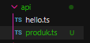

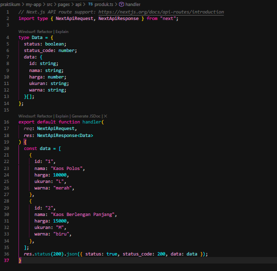

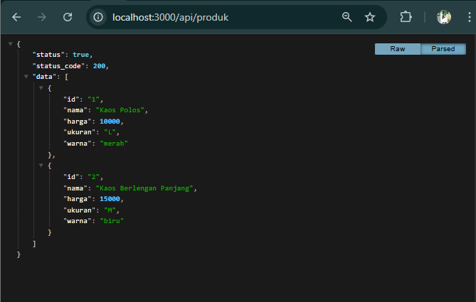

---

## Langkah 3 -  Fetch Data API di Frontend

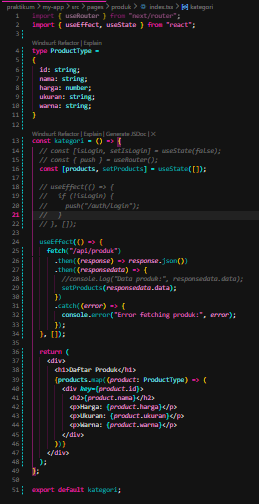

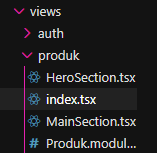

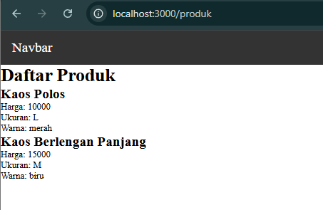

---

## Langkah 5 - Setup Firebase

Pada langkah ini dilakukan proses konfigurasi Firebase sebagai backend database. Pertama, membuka halaman Firebase Console dan melakukan login menggunakan akun Google. Selanjutnya dibuat project baru dengan memilih parent resource yang sesuai, kemudian menekan tombol create project dan menonaktifkan Google Analytics.

Setelah project berhasil dibuat, dilakukan penambahan aplikasi dengan memilih platform web dan melakukan proses register app hingga mendapatkan konfigurasi Firebase.

Tahap berikutnya adalah mengaktifkan Firestore Database dengan memilih menu Create Database. Mode rules diubah menjadi true agar database dapat diakses selama proses pengembangan, kemudian klik publish.

Setelah itu dibuat collection bernama products menggunakan auto-id. Di dalam collection tersebut ditambahkan beberapa field sesuai kebutuhan data produk, seperti nama produk, harga, dan deskripsi. Dengan demikian, database siap digunakan untuk menyimpan dan mengambil data produk secara dinamis.

---

## Langkah 6 - Install Firebase

Pada langkah ini dilakukan instalasi Firebase ke dalam project Next.js menggunakan perintah:

npm install firebase

Setelah instalasi berhasil, dibuat folder utils/db kemudian dibuat file firebase.ts untuk konfigurasi koneksi ke Firebase.

Selanjutnya, konfigurasi Firebase yang diperoleh dari Firebase Console (firebaseConfig) disalin ke dalam file firebase.ts. File ini berfungsi untuk menginisialisasi Firebase App dan menghubungkannya dengan Firestore Database agar dapat digunakan pada API maupun frontend.

Dengan langkah ini, project Next.js telah terintegrasi dengan layanan Firebase.

---

## Langkah 7 - Konfigurasi Environment Variable

Pada langkah ini dilakukan pengamanan kredensial Firebase agar tidak terlihat ketika project diunggah ke repository (misalnya GitHub).

Dibuat file bernama .env.local pada root project. Kemudian dimasukkan variabel environment seperti:

FIREBASE_API_KEY

FIREBASE_AUTH_DOMAIN

FIREBASE_PROJECT_ID

FIREBASE_STORAGE_BUCKET

FIREBASE_MESSAGING_SENDER_ID

FIREBASE_APP_ID

Nilai dari masing-masing variabel diisi sesuai dengan konfigurasi yang diperoleh dari Firebase Console tanpa menggunakan tanda koma atau tanda petik.

Tujuan penggunaan .env.local adalah untuk menjaga keamanan data sensitif seperti API Key dan Project ID agar tidak terekspos secara publik. File ini juga secara otomatis tidak ikut ter-push ke repository karena termasuk dalam file yang diabaikan oleh .gitignore.

---

## Langkah 8 -  Konfigurasi Firebase

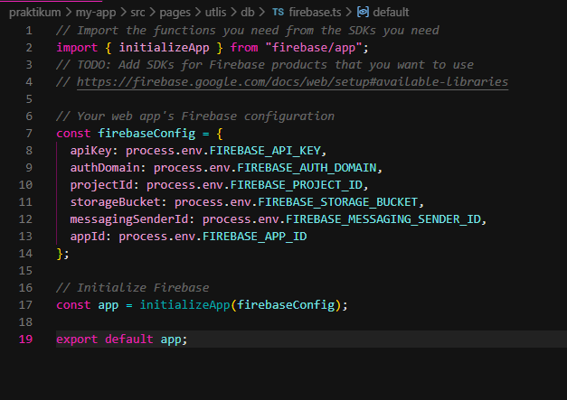

---

## Langkah 9 - Ambil Data dari Firestore

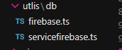

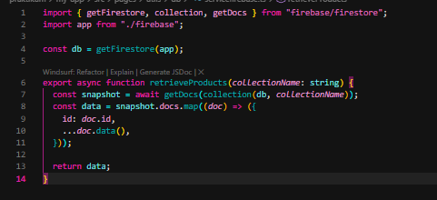

---

## Langkah 10 – API Mengambil Data Firebase

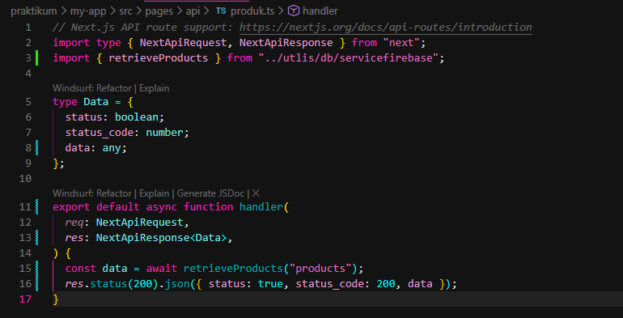

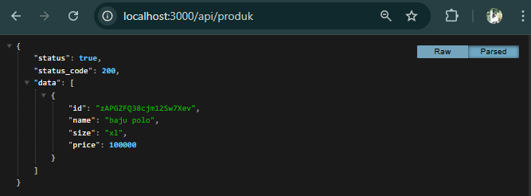

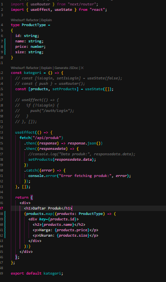

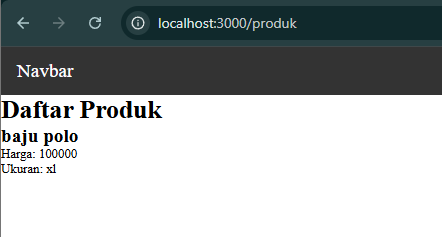

---

## Tugas Praktikum (Final Showcase)

Pada tahap tugas praktikum ini dilakukan pengembangan lanjutan terhadap integrasi Next.js dan Firebase Firestore. Seluruh tugas (Tugas 1, 2, dan 3) dikerjakan secara berurutan hingga menghasilkan tampilan akhir yang menampilkan data produk secara dinamis dari database.

Pertama, pada Tugas 1, ditambahkan minimal tiga data produk ke dalam collection products di Firebase Firestore. Data yang dimasukkan meliputi beberapa field seperti nama produk, harga, dan deskripsi. Setelah data ditambahkan, dilakukan pengujian melalui API dan halaman frontend untuk memastikan bahwa seluruh data berhasil ditampilkan secara dinamis pada halaman produk.

Selanjutnya pada Tugas 2, dilakukan penambahan field baru yaitu category pada setiap dokumen produk di Firestore. Setelah itu, struktur tipe data dan tampilan frontend diperbarui agar field category dapat ditampilkan bersama informasi produk lainnya. Hasilnya, setiap produk kini memiliki kategori yang terlihat di halaman website.

Kemudian pada Tugas 3, ditambahkan fitur tombol Refresh Data pada halaman produk. Tombol ini berfungsi untuk mengambil ulang data dari API menggunakan metode fetch tanpa perlu melakukan reload halaman secara keseluruhan. Implementasi ini menunjukkan bahwa data dapat diperbarui secara dinamis (client-side fetching) sehingga meningkatkan interaktivitas aplikasi.

Berdasarkan hasil akhir yang ditampilkan pada screenshot, seluruh data produk beserta field tambahan category berhasil ditampilkan, dan fitur refresh berfungsi dengan baik. Hal ini membuktikan bahwa integrasi antara Next.js API Routes dan Firebase Firestore telah berjalan dengan benar.

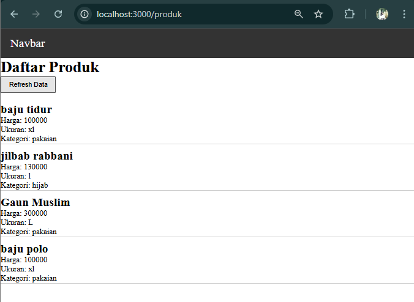

---

Pertanyaan Evaluasi

1. Apa fungsi API Routes pada Next.js?

API Routes pada Next.js berfungsi untuk membuat backend (endpoint API) langsung di dalam project, sehingga bisa mengelola data, menghubungkan ke database, dan mengirim response JSON tanpa server terpisah.

2. Mengapa .env.local tidak boleh di-push ke repository?

Karena berisi data sensitif seperti API key dan kredensial. Jika dipublikasikan, data tersebut bisa disalahgunakan

3. Apa perbedaan data statis dan data dinamis?

Data statis tetap dan ditulis langsung di kode, sedangkan data dinamis diambil dari database dan bisa berubah tanpa mengubah kode.

4. Mengapa Next.js disebut framework fullstack?

Karena Next.js bisa menangani frontend dan backend sekaligus dalam satu framework.