JOBSHEET PRAKTIKUM

Client Side Rendering & Data Fetching pada Next.js

Identitas

Nama: Nahdia Putri Safira

Kelas: TI3D

NIM: 2341720015

Program Studi: D4 Teknik Informatika

---

## Langkah 1 - Setup Project dan Endpoint API

Pada langkah ini, praktikan memastikan project Next.js dapat berjalan dengan menjalankan perintah npm run dev dan mengakses http://localhost:3000.

Selanjutnya, praktikan membuat endpoint API pada file pages/api/produk.ts yang terhubung dengan Firebase Firestore menggunakan fungsi retrieveProducts. Endpoint ini berfungsi untuk mengambil data produk dari collection products.

Endpoint dapat diuji melalui browser pada:

http://localhost:3000/api/produk

Jika berhasil, akan menampilkan data dalam format JSON.

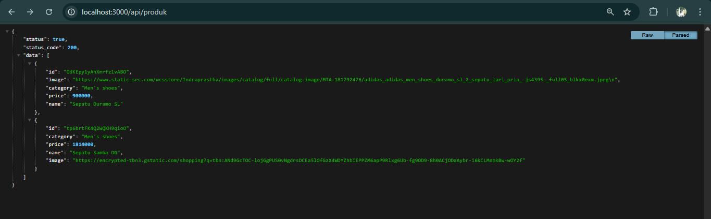

---

## Langkah 2 -  Implementasi CSR dengan useEffec

Pada tahap ini, praktikan mengimplementasikan Client Side Rendering menggunakan library SWR untuk mengambil data dari endpoint /api/produk.

Data fetching dilakukan di sisi client sehingga saat pertama kali halaman dimuat, akan muncul state loading sebelum data berhasil ditampilkan.

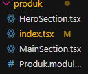

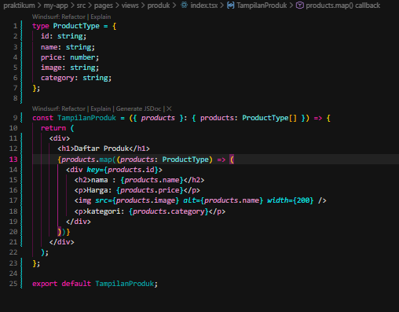

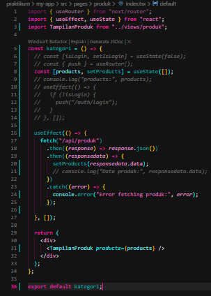

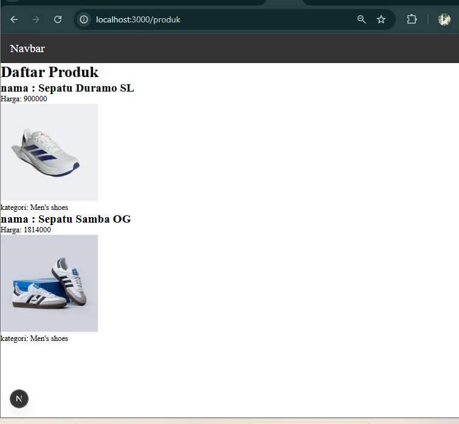

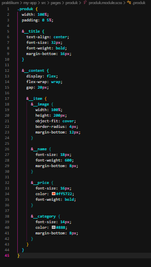

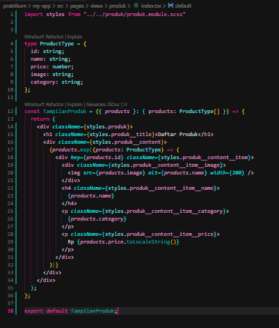

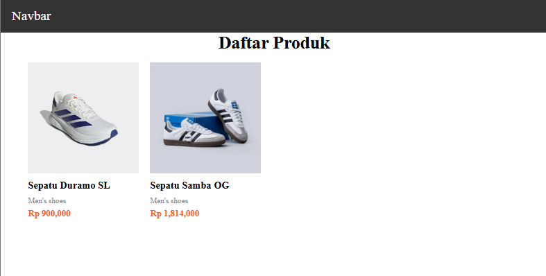

## Langkah 3 -  Implementasi Skeleton Loading

Untuk meningkatkan pengalaman pengguna (UX), praktikan menambahkan Skeleton Loading pada halaman produk.

Skeleton akan muncul saat data masih dalam proses pengambilan (isLoading = true) dan akan hilang setelah data berhasil dimuat.

Skeleton dibuat menggunakan:

Conditional rendering

Animasi CSS dengan @keyframes

Animasi dibuat agar skeleton terlihat berkedip (fade in-out), sehingga pengguna mengetahui bahwa data sedang diproses.

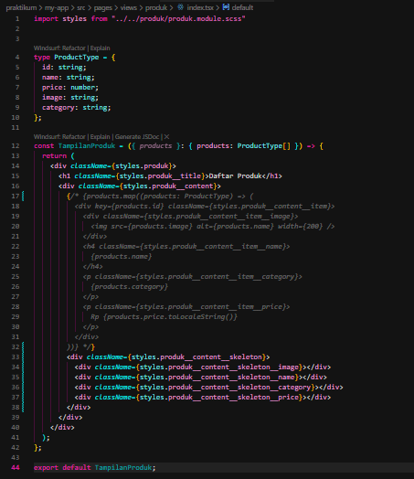

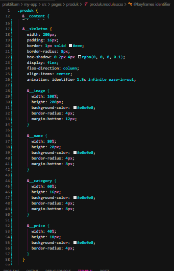

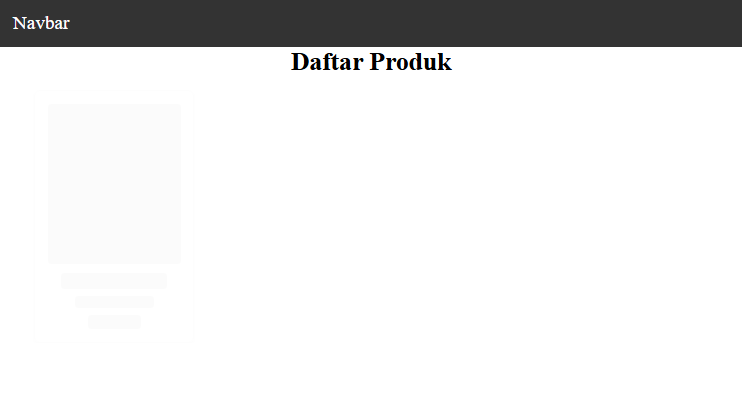

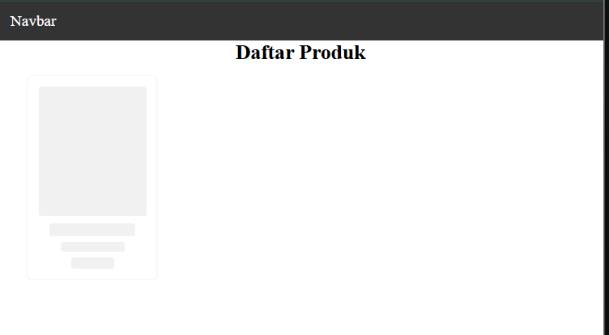

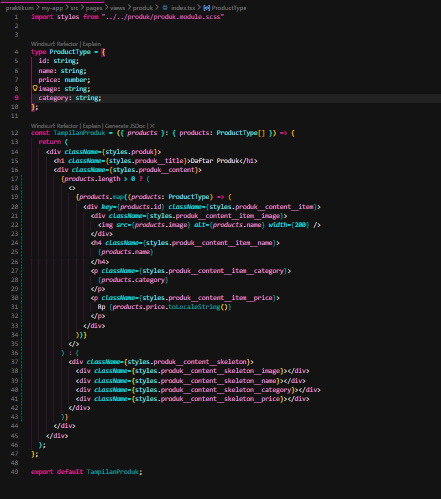

Jika dijalankan akan muncul skeletonnya terlebih dahulu setelah itu muncul gambar
dan informasinya

## Langkah 5 - Implementasi SWR

Install SWR terlebih dahulu

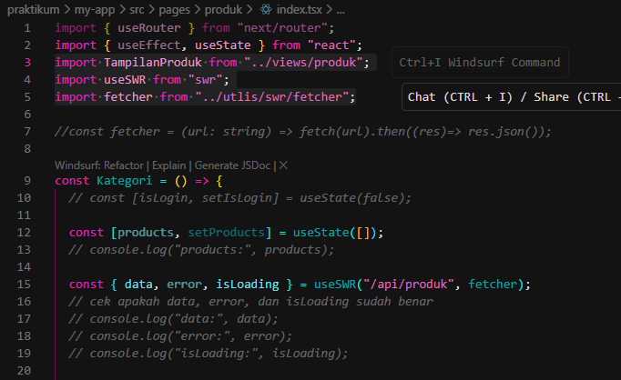

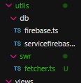

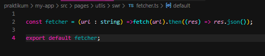

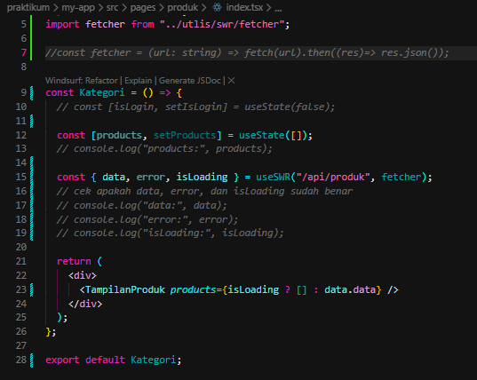

---

## Tugas Praktikum
Tugas 1 - Perbedaan CSR, SSR, dan SSG

Client Side Rendering (CSR)
Proses rendering dilakukan di browser setelah JavaScript dijalankan. Data diambil setelah halaman dimuat sehingga biasanya terdapat loading state.

Server Side Rendering (SSR)
Rendering dilakukan di server setiap kali ada request. Data sudah tersedia saat halaman dikirim ke browser sehingga lebih baik untuk SEO.

Static Site Generation (SSG)
Halaman dibuat saat proses build. Cocok untuk data yang jarang berubah dan menghasilkan performa sangat cepat.

Tugas 2 - Halaman Produk dengan Skeleton dan Animasi

Saya telah membuat halaman produk yang memiliki:

Skeleton loading saat data belum tersedia

Animasi berkedip pada skeleton

Animasi hover pada card produk

Layout responsif menggunakan Flexbox

(terdapat di langkah 3)

Halaman ini menggunakan Client Side Rendering dan mengambil data dari API secara dinamis.

Tugas 3 - Refactor useEffect menjadi SWR

Pada tahap ini, saya mengganti metode data fetching dari useEffect menjadi useSWR.

Keuntungan setelah refactor:

Kode lebih ringkas

Tidak perlu mengatur state loading secara manual

Mendapat fitur caching otomatis

Mendapat revalidation tanpa konfigurasi tambahan

(di langkah 4)

Dengan demikian, implementasi data fetching menjadi lebih optimal dan sesuai dengan konsep modern React.

---
## Pertanyaan Evaluasi

1. Apa itu Client Side Rendering?
Client Side Rendering adalah metode rendering dimana halaman dirender di browser setelah JavaScript dijalankan dan data diambil dari API.

2. Mengapa SWR lebih baik dibanding useEffect untuk data fetching?
Karena SWR menyediakan caching, revalidation, serta state loading dan error secara otomatis sehingga kode menjadi lebih sederhana.

3. Mengapa perlu skeleton loading?
Untuk meningkatkan UX agar pengguna tidak melihat halaman kosong saat data sedang dimuat.

4. Apa fungsi dynamic routing pada Next.js?
Untuk membuat halaman berdasarkan parameter URL sehingga satu file dapat menangani banyak variasi route.

---
Pada tahap ini, praktikan menguji implementasi dynamic routing dengan mengakses URL:

Jalankan http://localhost:3️000/produk/server

Route tersebut ditangani oleh file pages/produk/[id].tsx, di mana parameter server akan ditangkap sebagai nilai id menggunakan hook useRouter().

Saat halaman diakses, sistem akan menampilkan judul Halaman Produk Server serta tetap menampilkan daftar produk yang diambil secara dinamis menggunakan SWR. Untuk mencegah error saat proses initial render, ditambahkan pengecekan isReady agar parameter dari router dipastikan sudah tersedia sebelum digunakan.

Dengan demikian, halaman /produk/server berhasil menampilkan konten berdasarkan parameter URL dan menunjukkan bahwa fitur dynamic routing pada Next.js telah berjalan dengan baik.

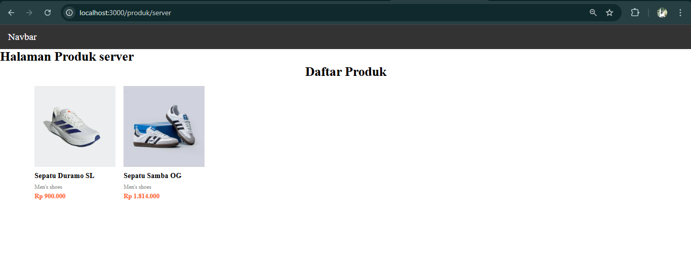
