JOBSHEET PRAKTIKUM

Server Side Rendering (SSR)

Identitas

Nama: Nahdia Putri Safira

Kelas: TI3D

NIM: 2341720015

Program Studi: D4 Teknik Informatika

---

## Bagian 1 - Setup Halaman SSR

1. Buat file baru pada pages/products/server.tsx

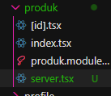

2. Modifikasi file server.tsx :

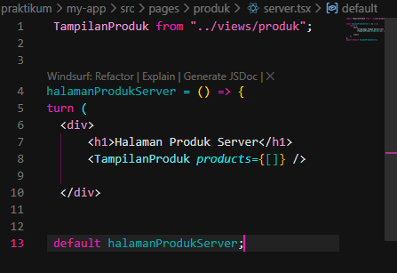

3. Jalankan browser : http://localhost:3000/produl/server

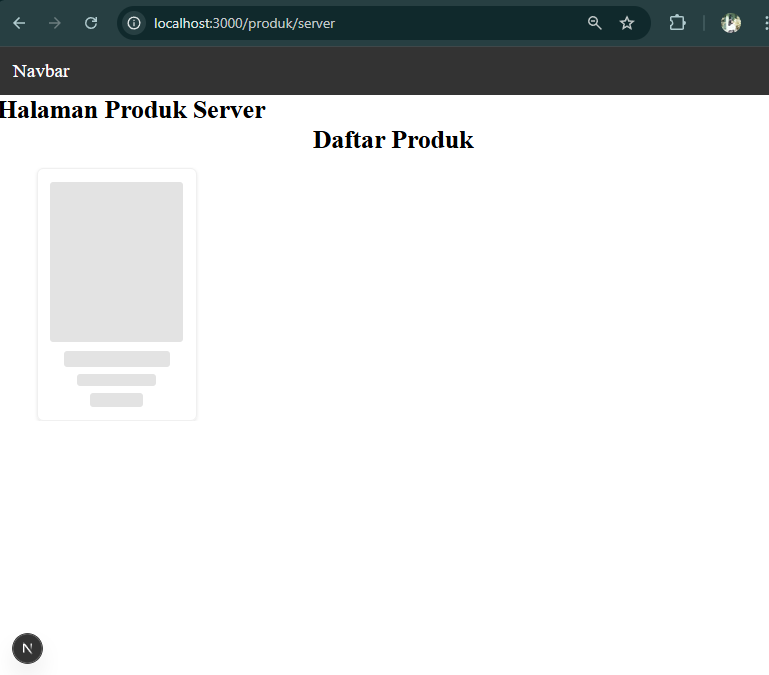

---

## Bagian 2 - Implementasi getServerSideProps pada server.tsx

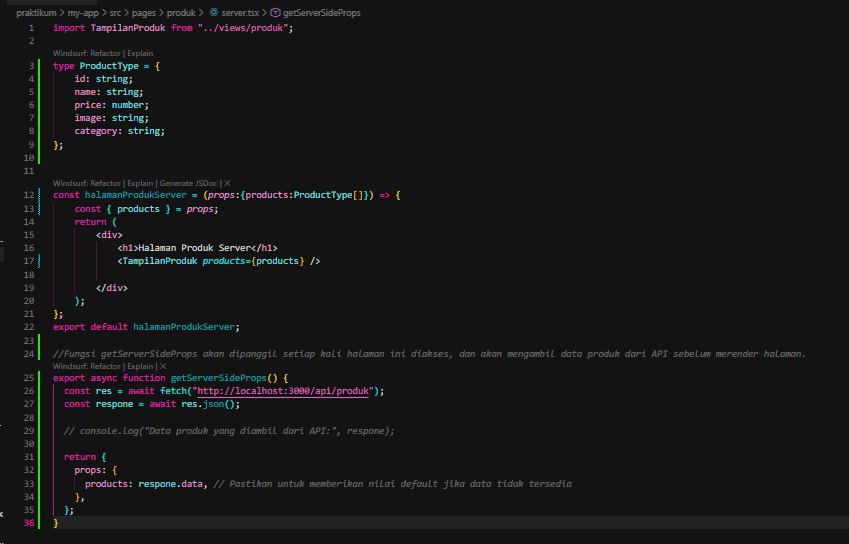

Jalankan browser : http://localhost:3000/produl/server

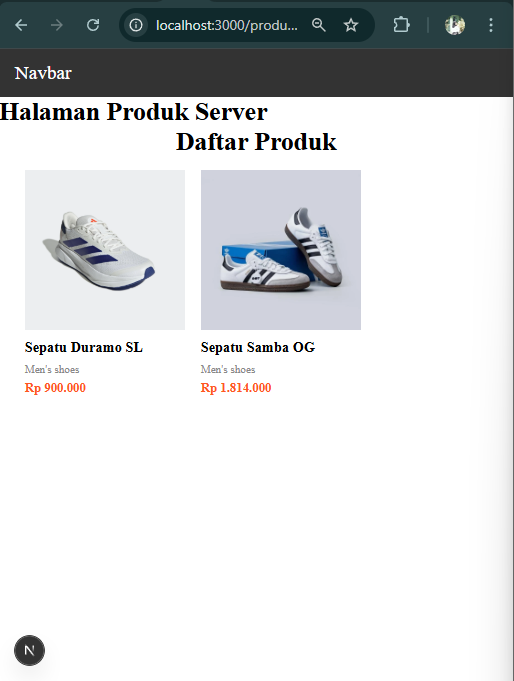

---

## Bagian 3 - Refactor Type (produk type)

1. Buat folder types pada folder pages dan buat file Product.type.ts

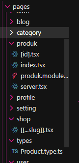

2. Modifikasi Product.type.ts

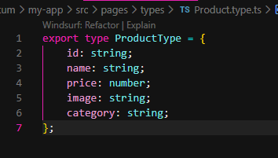

3. Setelah membuat file Product.type.ts maka mpdifikasi pada server.tsx menjadi

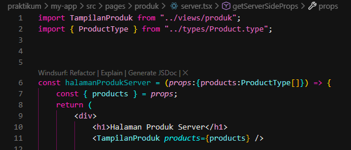

---

## Bagian 4 – Uji Perbedaan SSR vs CSR

1. Uji 1 - Skeleton

Pengujian ini dilakukan untuk melihat perbedaan tampilan saat halaman pertama kali dimuat pada Client Side Rendering (CSR) dan Server Side Rendering (SSR).

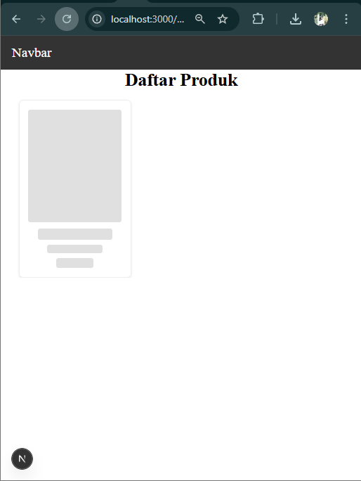

Pada halaman CSR, ketika halaman di-refresh akan muncul tampilan skeleton atau loading terlebih dahulu sebelum data produk ditampilkan. Hal ini terjadi karena proses pengambilan data dilakukan di sisi client setelah halaman berhasil dimuat di browser.

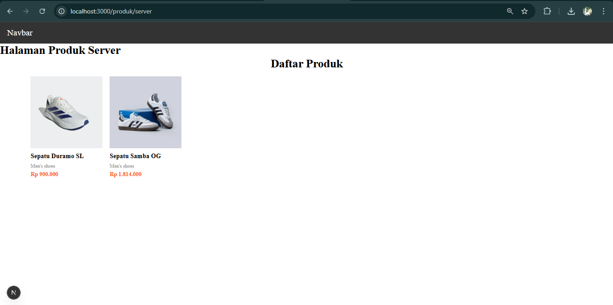

Sedangkan pada halaman SSR, ketika halaman di-refresh data produk langsung ditampilkan tanpa menampilkan skeleton terlebih dahulu. Hal ini karena data sudah diambil oleh server menggunakan getServerSideProps sebelum halaman dikirim ke browser.

Dari pengujian ini dapat disimpulkan bahwa CSR menampilkan skeleton karena data dimuat setelah halaman ditampilkan, sedangkan SSR langsung menampilkan data karena proses pengambilan data dilakukan di server.

2. Uji 2 - Network Tab

Pengujian ini dilakukan untuk melihat perbedaan proses pengambilan data antara CSR dan SSR melalui Network Tab pada DevTools browser.

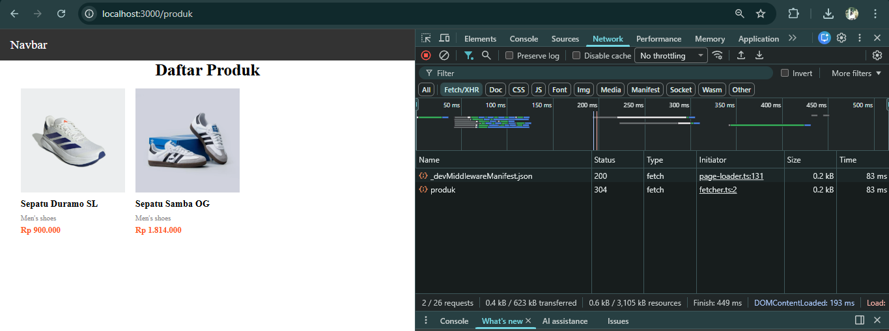

Pada halaman CSR, ketika halaman di-refresh terlihat adanya request API pada Network tab dengan endpoint produk. Hal ini menunjukkan bahwa browser melakukan permintaan data ke server setelah halaman dimuat. Proses ini merupakan karakteristik dari Client Side Rendering, di mana data diambil oleh browser menggunakan JavaScript.

Sedangkan pada halaman SSR, ketika halaman di-refresh tidak terlihat adanya request API pada Network tab. Hal ini karena proses pengambilan data sudah dilakukan di server menggunakan getServerSideProps sebelum halaman dikirim ke browser.

Dari hasil pengujian ini dapat disimpulkan bahwa pada CSR pengambilan data dilakukan oleh browser, sedangkan pada SSR pengambilan data dilakukan oleh server.

3. Uji 3 - Response HTML

Pengujian ini dilakukan untuk melihat perbedaan HTML yang diterima oleh browser pada halaman CSR dan SSR dengan menggunakan fitur View Page Source pada browser.

Pada halaman CSR, HTML awal yang diterima browser masih belum berisi data produk secara lengkap dan hanya menampilkan struktur dasar halaman atau skeleton. Data produk kemudian dimuat oleh JavaScript setelah halaman berhasil dimuat.

Sedangkan pada halaman SSR, HTML yang diterima browser sudah berisi data produk secara lengkap. Hal ini terjadi karena data telah diambil terlebih dahulu oleh server menggunakan getServerSideProps sebelum halaman dikirim ke browser.

Berdasarkan hasil pengujian tersebut dapat disimpulkan bahwa SSR mengirimkan HTML yang sudah lengkap, sedangkan CSR memuat data setelah halaman ditampilkan di browser.

---

## Tugas Praktikum (Individu)

Pada praktikum ini dibuat dua halaman yang menampilkan daftar produk dengan metode rendering yang berbeda, yaitu Client Side Rendering (CSR) dan Server Side Rendering (SSR).

1. 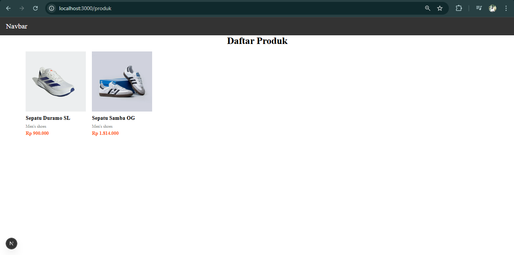

Halaman CSR dibuat pada route /produk. Pada halaman ini data produk diambil di sisi client menggunakan proses fetch setelah halaman dimuat di browser. Karena proses pengambilan data dilakukan di browser, maka saat halaman pertama kali dimuat akan muncul tampilan loading atau skeleton sebelum data produk ditampilkan

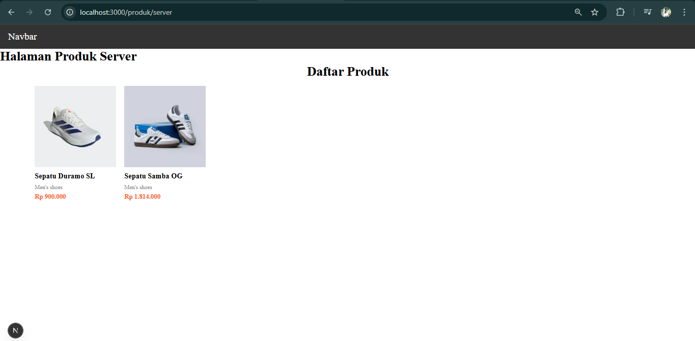 

Sedangkan halaman SSR dibuat pada route /produk/server. Pada halaman ini data produk diambil di sisi server menggunakan fungsi getServerSideProps. Data diambil terlebih dahulu oleh server sebelum halaman dikirim ke browser sehingga data produk dapat langsung ditampilkan ketika halaman dimuat.

2. Dokumentasi Hasil Pengujian

Dokumentasi hasil pengujian telah ditampilkan pada bagian Uji 1, Uji 2, dan Uji 3. Dokumentasi tersebut berupa screenshot tampilan halaman Client Side Rendering (CSR) dan Server Side Rendering (SSR), perbedaan yang terlihat pada Network tab, serta perbedaan source HTML yang diterima oleh browser.

Melalui dokumentasi tersebut dapat dilihat perbedaan proses pengambilan data antara CSR dan SSR, di mana pada CSR request API terlihat pada Network tab, sedangkan pada SSR data telah diambil oleh server sebelum halaman dikirim ke browser.

3. Analisis Perbedaan CSR dan SSR

Berdasarkan hasil pengujian yang telah dilakukan pada halaman Client Side Rendering (CSR) dan Server Side Rendering (SSR), dapat dilihat adanya perbedaan dalam proses pengambilan data serta cara halaman ditampilkan di browser.

Pada Client Side Rendering (CSR), proses pengambilan data dilakukan di sisi client atau browser setelah halaman berhasil dimuat. Ketika pengguna membuka atau melakukan refresh halaman, browser terlebih dahulu menerima HTML dasar dari server. Setelah itu, JavaScript yang berjalan di browser akan melakukan request API untuk mengambil data yang diperlukan. Karena proses pengambilan data dilakukan setelah halaman dimuat, maka biasanya akan muncul tampilan loading atau skeleton sebelum data sebenarnya ditampilkan kepada pengguna.

Selain itu, pada saat pengujian menggunakan Network tab di DevTools, terlihat adanya request API dengan endpoint produk. Hal ini menunjukkan bahwa browser melakukan permintaan data secara langsung ke server untuk mengambil data produk yang akan ditampilkan pada halaman. Proses ini merupakan karakteristik utama dari CSR, di mana sebagian besar proses rendering dan pengambilan data dilakukan oleh browser.

Berbeda dengan CSR, pada Server Side Rendering (SSR) proses pengambilan data dilakukan di sisi server sebelum halaman dikirim ke browser. Dalam praktikum ini, proses tersebut dilakukan menggunakan fungsi getServerSideProps yang disediakan oleh framework Next.js. Ketika pengguna membuka halaman SSR, server terlebih dahulu mengambil data dari API yang tersedia. Setelah data berhasil diperoleh, server akan membuat HTML yang sudah berisi data tersebut dan kemudian mengirimkannya ke browser.

Karena data sudah diproses di server, maka ketika halaman ditampilkan di browser data produk dapat langsung terlihat tanpa perlu menunggu proses loading atau menampilkan skeleton terlebih dahulu. Hal ini juga terlihat pada saat pengujian menggunakan Network tab, di mana tidak terlihat adanya request API dari browser untuk mengambil data produk. Hal tersebut terjadi karena seluruh proses pengambilan data sudah dilakukan di server sebelum halaman dikirimkan kepada pengguna.

Selain perbedaan dalam proses pengambilan data, perbedaan lain juga dapat dilihat pada response HTML yang diterima oleh browser. Pada CSR, HTML awal yang diterima browser biasanya masih belum berisi data produk secara lengkap karena data akan dimuat melalui JavaScript setelah halaman berhasil ditampilkan. Sedangkan pada SSR, HTML yang dikirim oleh server sudah berisi data produk secara lengkap sehingga browser dapat langsung menampilkan konten halaman tanpa perlu menunggu proses pengambilan data tambahan.

Dari hasil analisis tersebut dapat disimpulkan bahwa CSR dan SSR memiliki cara kerja yang berbeda dalam proses rendering halaman web. CSR lebih mengandalkan browser untuk mengambil data dan merender tampilan halaman, sedangkan SSR melakukan proses tersebut di server sebelum halaman dikirim ke browser. SSR memiliki kelebihan dalam hal kecepatan tampilan awal halaman serta lebih baik untuk kebutuhan Search Engine Optimization (SEO) karena mesin pencari dapat langsung membaca konten yang terdapat pada HTML. Sementara itu, CSR lebih sering digunakan pada aplikasi web yang membutuhkan interaksi tinggi dan perubahan data secara dinamis di sisi client.

--- 

## Studi Analisis

1. Mengapa SSR lebih baik untuk SEO?

Server Side Rendering (SSR) lebih baik untuk kebutuhan SEO karena halaman yang dikirim dari server sudah berisi HTML lengkap beserta data konten. Hal ini memudahkan mesin pencari seperti Google untuk membaca dan mengindeks isi halaman dengan lebih baik. Berbeda dengan Client Side Rendering (CSR) yang hanya mengirimkan HTML dasar dan memuat data menggunakan JavaScript setelah halaman dimuat. Akibatnya mesin pencari mungkin kesulitan membaca konten secara langsung karena data belum tersedia pada HTML awal.

2. Kapan sebaiknya menggunakan SSR?

SSR sebaiknya digunakan ketika aplikasi web membutuhkan performa awal yang cepat dan optimasi SEO yang baik. Contohnya pada website berita, blog, halaman produk e-commerce, atau website perusahaan yang ingin mudah ditemukan oleh mesin pencari. Dengan SSR, data sudah diproses di server sehingga pengguna dapat langsung melihat konten halaman tanpa harus menunggu proses pengambilan data di browser.

3. Apa kekurangan SSR dibanding CSR?

Meskipun memiliki beberapa kelebihan, SSR juga memiliki kekurangan dibandingkan CSR. Salah satu kekurangannya adalah beban kerja server menjadi lebih besar karena server harus memproses data dan membuat HTML setiap kali ada permintaan halaman dari pengguna. Selain itu, SSR juga dapat meningkatkan waktu respon server jika jumlah pengguna sangat banyak. Sementara pada CSR sebagian proses dilakukan di browser sehingga beban server menjadi lebih ringan.

4. Mengapa skeleton tidak muncul pada SSR?

Skeleton tidak muncul pada SSR karena proses pengambilan data sudah dilakukan di server sebelum halaman dikirim ke browser. Akibatnya HTML yang diterima oleh browser sudah berisi data lengkap sehingga halaman dapat langsung ditampilkan tanpa perlu menunggu proses pengambilan data tambahan. Berbeda dengan CSR di mana data diambil setelah halaman dimuat sehingga biasanya menampilkan skeleton atau loading terlebih dahulu.

