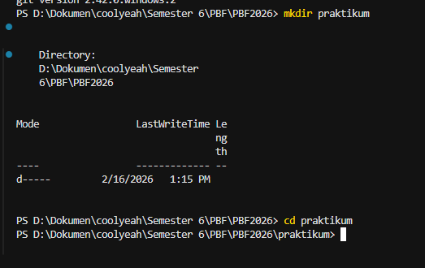
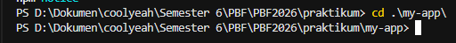
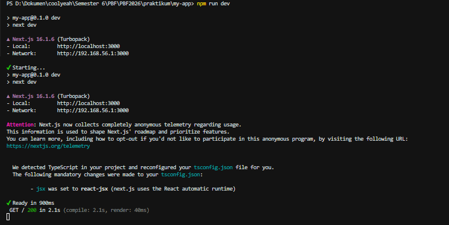
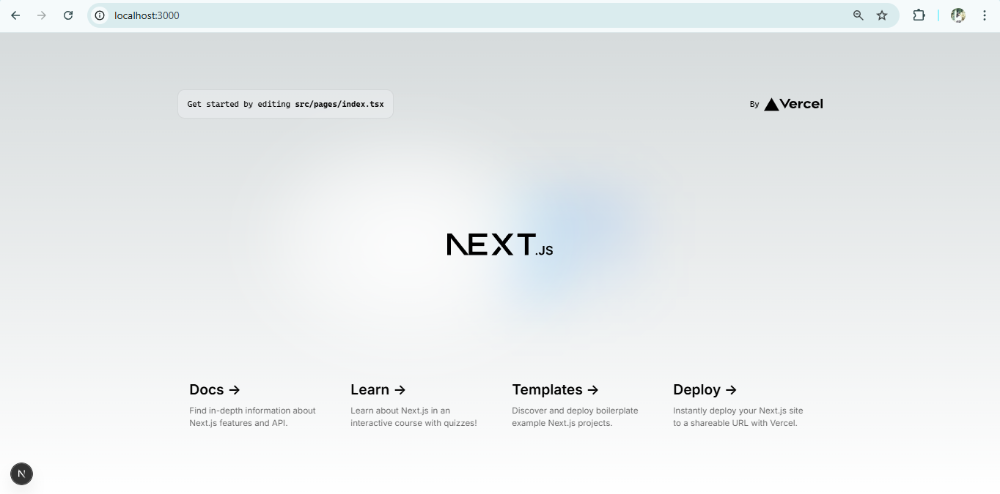
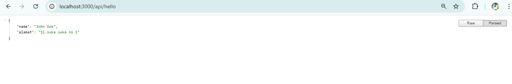
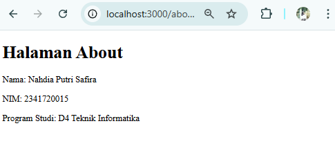

# JOBSHEET PRAKTIKUM
Setup Project Next.js menggunakan Pages Router

## Identitas
Nama: Nahdia Putri Safira
Kelas: TI3D
NIM: 2341720015
Program Studi: D4 Teknik Informatika

---

## Langkah 1 – Pengecekan Lingkungan
Melakukan pengecekan versi Node.js dan npm untuk memastikan environment sudah siap digunakan dalam pembuatan project Next.js.

 
---

## Langkah 2 - Membuat Project Next.js
Membuat project menggunakan perintah npx create-next-app@13.4.7 sesuai instruksi jobsheet.

---

## Langkah 3 -  Menjalankan Server Development
Menjalankan server menggunakan perintah npm run dev, kemudian membuka http://localhost:3000 di browser.

---

## Langkah 5 - Modifikasi Halaman Utama

---

## Langkah 6 - Modifikasi API
Jalankan browser dengan Alamat http://localhost:3000/api/hello

Tambahkan extensions chrome

Jalankan browser chrome
 

---

## Langkah 7 - Modifikasi Background

Hasil setelah adanya modifikasi

---

## Tugas 1 - Buat halaman baru about.js di folder pages, Tampilkan Nama Mahasiswa, NIM, dan Program Studi

## Tugas 2 - Tambahkan minimal 1 link navigasi dari halaman utama ke halaman about

setelah di klik linknya "ke halaman about"

---

## Pertanyaan Refleksi

1. Mengapa Pages Router disebut sebagai routing berbasis file?
Jawaban : Karena pada Pages Router di Next.js, sistem routing ditentukan berdasarkan struktur file di dalam folder pages/.
Setiap file yang dibuat di dalam folder tersebut otomatis menjadi sebuah route (URL), Jadi tidak perlu konfigurasi routing manual seperti di React biasa.

2. Apa perbedaan Next.js dengan React standar (CRA)?
Jawaban : React standar seperti Create React App hanya menyediakan library untuk membangun UI dan membutuhkan konfigurasi tambahan untuk routing, SEO, dan optimasi. Sedangkan Next.js Sudah memiliki routing otomatis (file-based routing), Mendukung Server-Side Rendering (SSR), Mendukung Static Site Generation (SSG), Optimasi performa dan SEO lebih baik, Sudah terkonfigurasi lebih lengkap sejak awal. Jadi Next.js lebih siap untuk pengembangan aplikasi skala produksi.

3. Apa fungsi perintah npm run dev?
Jawaban : Perintah npm run dev digunakan untuk menjalankan aplikasi dalam mode development (server pengembangan).

4. Apa perbedaan npm run dev dan run build ?
Jawaban : Perintah npm run dev digunakan untuk menjalankan aplikasi dalam mode development, yaitu saat proses pengembangan sedang berlangsung. Pada mode ini, aplikasi dijalankan di server lokal dan mendukung fitur hot reload sehingga setiap perubahan kode dapat langsung terlihat tanpa perlu me-restart server. Sedangkan npm run build digunakan untuk membangun (build) aplikasi dalam mode production. Perintah ini akan mengoptimasi dan menghasilkan file siap deploy yang memiliki performa lebih baik dan ukuran yang lebih efisien. Jadi, npm run dev digunakan saat proses pengembangan, sedangkan npm run build digunakan sebelum aplikasi dipublikasikan.
